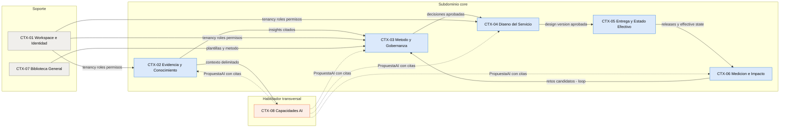
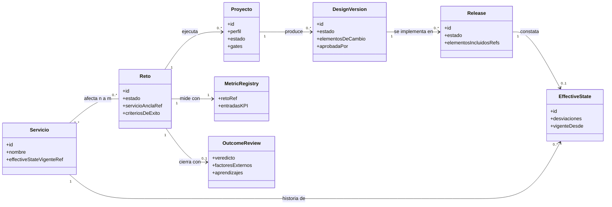
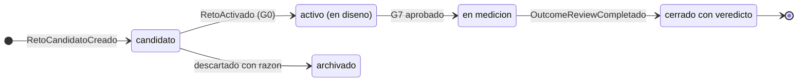
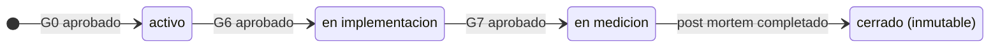
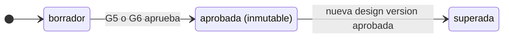
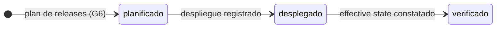

## Tabla de contenido

- [Resumen ejecutivo](#resumen-ejecutivo)
- [Contexto y alcance del modelo](#contexto-y-alcance-del-modelo)
  - [Fuente y método de derivación](#fuente-y-método-de-derivación)
  - [Qué es y qué no es este documento](#qué-es-y-qué-no-es-este-documento)
- [Lenguaje ubicuo](#lenguaje-ubicuo)
  - [Regla de canonicidad](#regla-de-canonicidad)
  - [Glosario canónico](#glosario-canónico)
- [Subdominios y clasificación estratégica](#subdominios-y-clasificación-estratégica)
- [Bounded contexts](#bounded-contexts)
  - [CTX-01 Workspace e Identidad](#ctx-01-workspace-e-identidad)
  - [CTX-02 Evidencia y Conocimiento](#ctx-02-evidencia-y-conocimiento)
  - [CTX-03 Método y Gobernanza](#ctx-03-método-y-gobernanza)
  - [CTX-04 Diseño del Servicio](#ctx-04-diseño-del-servicio)
  - [CTX-05 Entrega y Estado Efectivo](#ctx-05-entrega-y-estado-efectivo)
  - [CTX-06 Medición e Impacto](#ctx-06-medición-e-impacto)
  - [CTX-07 Biblioteca General](#ctx-07-biblioteca-general)
  - [CTX-08 Capacidades AI](#ctx-08-capacidades-ai)
- [Mapa de contextos](#mapa-de-contextos)
  - [Diagrama](#diagrama)
  - [Relaciones entre contextos](#relaciones-entre-contextos)
- [La cadena de trazabilidad como columna vertebral](#la-cadena-de-trazabilidad-como-columna-vertebral)
- [Agregados principales en detalle](#agregados-principales-en-detalle)
- [Máquinas de estado](#máquinas-de-estado)
- [Eventos de dominio](#eventos-de-dominio)
- [Decisiones de modelado transversales](#decisiones-de-modelado-transversales)
- [Limitaciones y temas abiertos](#limitaciones-y-temas-abiertos)
- [Próximos pasos](#próximos-pasos)

## Resumen ejecutivo

Este documento traduce el prediseño de producto v0.2 (`docs/00-fuente/prediseno-producto-v0.2.md`) a un modelo de dominio básico bajo Domain-Driven Design. Define el **lenguaje ubicuo canónico** (invariante I1 del prediseño: el vocabulario no se renombra), clasifica los subdominios en core, supporting y genéricos, y organiza el dominio en **ocho bounded contexts**: Workspace e Identidad, Evidencia y Conocimiento, Método y Gobernanza, Diseño del Servicio, Entrega y Estado Efectivo, Medición e Impacto, Biblioteca General y Capacidades AI. La columna vertebral del modelo es la **cadena de trazabilidad** evidencia → insight → decisión aprobada → design version → release → effective state → resultados → outcome review, que cruza cinco contextos por referencia y define qué agregados son inmutables una vez aprobados. El árbol de navegación (Cliente → Servicios → Retos → Proyectos) se modela explícitamente como **proyección de lectura** sobre un grafo de dominio con relaciones n:m, nunca como restricción del modelo de escritura. Las capacidades AI se modelan como un contexto habilitador que solo escribe en los demás a través del objeto `PropuestaAI` y del gate de curaduría humana, materializando el invariante I4 (la AI propone y cita; el humano aprueba).

## Contexto y alcance del modelo

### Fuente y método de derivación

Todo el contenido deriva del prediseño v0.2. La correspondencia entre secciones fuente y elementos del modelo es explícita para que la revisión pueda auditar la derivación:

| Elemento del modelo | Sección fuente del prediseño |
|---|---|
| Lenguaje ubicuo | §2, §3, §4, §5, §8, §9, §10 (vocabulario canónico transversal) |
| Árbol como proyección / grafo n:m | §2.1, §2.2 |
| Objetos de resultado y estados | §3.1, §3.2, §3.3, §3.4 |
| Segmentos, arquetipos, revisores AI | §4 |
| Etapas, gates, perfiles | §5 |
| Invariantes I1–I6 | §6 (formalizadas en `docs/03-invariantes/invariantes.md`) |
| Metric Registry y medición | §8 |
| Dimensiones de evidencia | §9 |
| Journey como grafo tipado | §10 |
| Bibliotecas | §11 |
| Importación | §12 |
| Propiedad y roles | §13 |

### Qué es y qué no es este documento

| Es | No es |
|---|---|
| Modelo estratégico (subdominios, contextos, mapa) y táctico básico (agregados, entidades, VOs, eventos) | Un esquema de base de datos ni un contrato de API |
| Vocabulario canónico compartido entre producto, ingeniería y boutique | Una especificación funcional (eso vive en `docs/05-specs/`) |
| Base para decidir límites de servicios/módulos y transacciones | Una decisión de despliegue (monolito modular vs. servicios queda abierta; ver ADR pendientes) |

> Principio rector: **el árbol sirve a los humanos; el grafo, a la trazabilidad y a los agentes** (prediseño §0.4). Todo lo que sigue respeta esa separación.

## Lenguaje ubicuo

### Regla de canonicidad

El invariante I1 del prediseño obliga a que el vocabulario de etapas y resultados sea canónico: no se renombra por cliente ni por deal. En consecuencia, los términos de la tabla siguiente son **los identificadores oficiales del dominio** en código, UI, documentación y conversación. Los términos que el prediseño usa en inglés (design version, release, effective state, outcome review, Metric Registry) se conservan en inglés: son parte del lenguaje ubicuo tal como lo fija la fuente. Modelos externos (IDEO, Double Diamond) se tratan como *crosswalk de presentación*, nunca como vocabulario interno.

### Glosario canónico

| Término | Contexto | Definición operativa |
|---|---|---|
| Workspace (Cliente) | CTX-01 | Espacio aislado propiedad de una organización cliente; raíz de tenancy de todos los objetos |
| Miembro / Rol | CTX-01 | Persona u agente con acceso al workspace y permisos derivados de su rol (§13.2) |
| Segmento | CTX-01 | Clasificación estable y transversal de los usuarios/clientes de la organización |
| Servicio | CTX-04 | Unidad primaria de valor: el servicio del cliente sobre el que se diseña; primitiva del producto |
| Servicio ancla | CTX-03 | Rol de navegación/responsabilidad principal de un reto sobre un servicio; no es restricción estructural |
| Reto (de diseño) | CTX-03 | Promesa medible de cambio sobre uno o más servicios, con criterios de éxito y ventanas de medición |
| Proyecto | CTX-03 | Ejecución de un reto a través de las etapas 0–7 con un perfil, gates y decisiones |
| Etapa (0–7) | CTX-03 | Unidad canónica de vocabulario y resultados del método; flexible en ejecución |
| Gate (G0–G7) | CTX-03 | Punto de decisión con criterios de suficiencia (evidencia, riesgos, decisiones) aprobado por humanos |
| Perfil | CTX-03 | Graduación de actividades y profundidad de un proyecto: rápido, estándar o profundo |
| No-aplicabilidad | CTX-03 | Declaración justificada y aprobada de que un criterio o actividad no aplica; queda auditada |
| Decisión | CTX-03 | Resolución aprobada (p. ej. pasa/muere, aprobación de diseño) trazable a insights y evidencia |
| Fuente | CTX-02 | Origen de evidencia: entrevista, documento, dataset, observación, artefacto importado |
| Evidencia | CTX-02 | Registro atómico con cinco dimensiones: proveniencia, método, calidad, derechos, lineage |
| Cita (fragmento) | CTX-02 | Localización exacta dentro de una fuente que respalda una afirmación |
| Insight | CTX-02 | Interpretación con afirmaciones soportadas por citas; puede registrar contradicciones |
| Arquetipo | CTX-03 | Perfil conductual/actitudinal emergente de la evidencia de un reto; mapea n:m a segmentos |
| Revisor AI | CTX-08 | Lente de revisión AI basada en un arquetipo; produce simulación etiquetada, nunca evidencia |
| Oportunidad (HMW) | CTX-04 | Pregunta "how might we" trazable a uno o más insights |
| Concepto | CTX-04 | Solución candidata con resultados de test y decisión pasa/muere |
| Journey | CTX-04 | Grafo tipado de fases, pasos, transiciones, actores, canales, touchpoints y relaciones |
| Blueprint | CTX-04 | Vista del mismo grafo con carriles frontstage/backstage y sistemas de soporte |
| Design version | CTX-04 | Propuesta de diseño aprobada (qué se decidió construir o cambiar); inmutable al aprobarse |
| Release | CTX-05 | Subconjunto de una design version efectivamente implementado y desplegado; puede ser parcial |
| Effective state | CTX-05 | Constatación de lo que quedó funcionando tras un release, con desviaciones y razones |
| Desviación | CTX-05 | Diferencia constatada entre lo aprobado y lo implementado, siempre con razón registrada |
| Criterio de éxito | CTX-06 | Compromiso medible del reto definido en etapa 0, con línea base, objetivo y ventana propia |
| Metric Registry | CTX-06 | Registro por reto de KPIs: definición, dueño del dato, fuente, baseline, frecuencia, snapshots |
| Snapshot | CTX-06 | Valor de un KPI recibido manualmente o por CSV, con fecha y origen |
| Ventana de medición | CTX-06 | Plazo de observación por criterio (referencia inicial: hasta seis meses) |
| Outcome review (post mortem) | CTX-06 | Evaluación de resultados al cierre de la ventana; emite el veredicto del reto |
| Veredicto | CTX-06 | Resultado del reto: logrado, parcialmente logrado, no logrado o no concluyente |
| Bandeja de importación | CTX-02 | Cola de material externo pendiente de extracción propuesta y curaduría humana |
| Curaduría | CTX-02 | Gate humano obligatorio: nada entra al grafo sin aprobación de una persona |
| Biblioteca del cliente | CTX-01 | Proyección de la memoria del workspace (no es un contexto aparte) |
| Biblioteca general | CTX-07 | Conocimiento metodológico de la boutique, sin datos de clientes |
| PropuestaAI | CTX-08 | Salida estructurada de una capacidad AI: contenido, citas, confianza, lineage, estado de revisión |
| Grounding | CTX-08 | Grado en que las citas sostienen lo afirmado; se mide, no se presume |
| Lineage | CTX-02/08 | Registro de transformaciones AI: modelo, prompt/configuración y versión |
| Portal | CTX-01/03 | Superficie del workspace donde el cliente comenta y aprueba gates, con auditoría |

## Subdominios y clasificación estratégica

La clasificación decide dónde se invierte diseño profundo (core) y dónde se adopta lo estándar (supporting/genérico). Se deriva directamente de la tesis de moat (§1.2): el diferencial es método + trazabilidad + memoria privada, no la generación de artefactos.

| Subdominio | Clasificación | Justificación (tesis §1) | Bounded contexts |
|---|---|---|---|
| Método ejecutable y gobernanza de gates | **Core** | "Método como código": doctrina que un chat no garantiza | CTX-03 |
| Trazabilidad decisión → release → resultado | **Core** | Capa de moat explícita; switching cost real | CTX-04, CTX-05, CTX-06 |
| Evidencia gobernada y grounding | **Core** | Invariante I3; la cita se verifica, no se presume | CTX-02 |
| Memoria privada por cliente (grafo del workspace) | **Core** | Cada reto arranca sobre la historia del propio cliente | CTX-01 (tenancy) + grafo de los demás |
| Identidad, roles y portal | Supporting | Necesario para gobernanza; sin diferencial propio | CTX-01 |
| Biblioteca metodológica general | Supporting | Habilitador; explícitamente fuera de la tesis de moat (§11) | CTX-07 |
| Capacidades AI (generación/asistencia) | **Habilitador transversal** | Capa comoditizada que no se cobra (§0.1); se gobierna, no se diferencia por sí sola | CTX-08 |
| Almacenamiento de archivos, transcripción, OCR | Genérico | Se compra o se usa infraestructura Whitespace | (infraestructura) |

> Nota estratégica: CTX-08 es deliberadamente **habilitador, no core**: la regla de las 200 palabras (§1.1) dice que si algo se replica con un prompt, no es feature. Lo core es la *gobernanza* de la AI (PropuestaAI, curaduría, grounding, presupuestos), no la generación.

## Bounded contexts

Cada contexto se describe con: responsabilidad, agregados (raíz en negrita), entidades y value objects relevantes, eventos que publica y reglas propias. Las referencias entre contextos son **por identidad** (IDs), nunca por composición de objetos ajenos.

### CTX-01 Workspace e Identidad

| Aspecto | Definición |
|---|---|
| Responsabilidad | Tenancy, membresía, roles y permisos, segmentos transversales, auditoría de acceso, ciclo de vida del dato (retención, exportación, borrado), portal como superficie de participación del cliente |
| Agregados | **Workspace** (raíz de tenancy; config de retención y presupuesto AI); **Miembro** (persona + rol); **Segmento** |
| Value objects | Rol (sponsor, stakeholder, lead-boutique, diseñador, admin-cliente, agente-AI), PolíticaRetención, RegistroAuditoría (append-only) |
| Eventos publicados | `WorkspaceCreado`, `MiembroInvitado`, `RolAsignado`, `SegmentoDefinido`, `ExportacionEjecutada`, `BorradoProgramado` |
| Reglas propias | Todo objeto del dominio pertenece a exactamente un workspace (I6). La "biblioteca del cliente" es una proyección de lectura sobre la memoria del workspace, no un almacén aparte. La organización cliente es propietaria; la boutique opera con rol, no con propiedad (§13.1) |

### CTX-02 Evidencia y Conocimiento

| Aspecto | Definición |
|---|---|
| Responsabilidad | Fuentes, evidencias con sus cinco dimensiones, citas verificables, insights con afirmaciones soportadas, bandeja de importación y curaduría |
| Agregados | **Fuente**; **Evidencia** (dimensiones + fragmentos); **Insight** (afirmaciones + citas + contradicciones); **ItemImportacion** (bandeja: material, candidatos propuestos, estado de curaduría) |
| Value objects | Proveniencia, Método, Calidad, Derechos, Lineage (los cinco ejes de §9); Cita (fuente + localización exacta); Afirmación |
| Eventos publicados | `FuenteRegistrada`, `EvidenciaRegistrada`, `EvidenciaCurada`, `InsightPropuesto`, `InsightValidado`, `ContradiccionDetectada`, `ItemImportado`, `ExtraccionPropuesta`, `CuraduriaAprobada`, `CuraduriaRechazada` |
| Reglas propias | Un insight sin ≥1 cita válida no puede validarse. La curaduría humana es transición obligatoria: `ExtraccionPropuesta` nunca produce objetos del grafo directamente. Los derechos de uso viajan con la evidencia y restringen su cita aguas abajo |

### CTX-03 Método y Gobernanza

| Aspecto | Definición |
|---|---|
| Responsabilidad | Retos, proyectos, etapas 0–7, gates de suficiencia, perfiles, no-aplicabilidades, decisiones y aprobaciones; arquetipos del reto; backlog de retos por servicio |
| Agregados | **Reto** (criterios de éxito, arquetipos, estado, servicios afectados con uno ancla); **Proyecto** (etapas, gates, perfil, decisiones, reaperturas); **Decisión** (puede modelarse como entidad dentro de Proyecto; se eleva a agregado si la concurrencia lo exige) |
| Value objects | CriterioDeÉxito (KPI, línea base, objetivo, ventana, fecha de post mortem), PerfilProyecto (rápido/estándar/profundo), ChecklistSuficiencia, Aprobación (quién, cuándo, rol, en el portal), NoAplicabilidad (justificación + aprobación), Reapertura (qué cambió, decisiones aguas abajo marcadas) |
| Entidades internas | Arquetipo (del reto; mapea n:m a segmentos; referencia evidencia que lo sostiene), EtapaInstancia, GateInstancia |
| Eventos publicados | `RetoCandidatoCreado`, `RetoActivado`, `G0Aprobado` … `G7Aprobado`, `GateRechazado`, `EtapaReabierta`, `DecisionAprobada`, `NoAplicabilidadAprobada`, `ArquetipoDefinido`, `RetoEnMedicion`, `RetoCerrado`, `RetoArchivado` |
| Reglas propias | Un gate solo lo aprueba un humano con el rol correcto (I4). Un arquetipo sin evidencia enlazada bloquea G2. Salidas de revisores AI no computan para G4/G5. La reapertura de una etapa marca para revisión las decisiones aguas abajo afectadas (I1) |

### CTX-04 Diseño del Servicio

| Aspecto | Definición |
|---|---|
| Responsabilidad | El servicio y su conocimiento estructurado: journeys y blueprints como grafos tipados, oportunidades, conceptos y design versions con su diff |
| Agregados | **Servicio** (identidad, estado vigente por referencia a effective state, KPIs asociados, backlog de retos por referencia); **JourneyGraph** (nodos y aristas tipadas, versión, tipo as-is/to-be); **Oportunidad**; **Concepto**; **DesignVersion** |
| Value objects | NodoJourney (tipo: fase, paso, touchpoint, actor, sistema, emoción, fricción…), AristaTipada (transición, dependencia, soporte, relación de evidencia/métrica/release), ElementoDeCambio (unidad del diff de una design version), ResultadoTest (evidencia de test con umbral) |
| Eventos publicados | `ServicioCreado`, `JourneyActualizado`, `ValidacionGrafoEjecutada`, `OportunidadPropuesta`, `ConceptoPasa`, `ConceptoMuere`, `DesignVersionBorrador`, `DesignVersionAprobada`, `DesignVersionSuperada` |
| Reglas propias | La fuente de verdad del journey es el modelo estructurado; Mermaid y demás vistas son renders derivados (§10). Toda oportunidad referencia ≥1 insight (G3). Una design version aprobada es inmutable; los cambios crean una nueva y marcan la anterior como superada |

### CTX-05 Entrega y Estado Efectivo

| Aspecto | Definición |
|---|---|
| Responsabilidad | Releases (parciales, múltiples), constatación del effective state, desviaciones con razón y conciliación contra la design version |
| Agregados | **Release** (subconjunto de elementos de una design version, estado, responsable, fechas); **EffectiveState** (constatación vigente por servicio, desviaciones) |
| Value objects | Desviación (elemento, qué quedó distinto, razón), Conciliación (mapa elemento → release → constatado) |
| Eventos publicados | `ReleasePlanificado`, `ReleaseDesplegado`, `ReleaseVerificado`, `EffectiveStateConstatado`, `DesviacionRegistrada` |
| Reglas propias | Un release referencia exactamente una design version aprobada y declara explícitamente qué elementos incluye (parcialidad explícita, §3.3). El effective state es la verdad operativa del servicio: el "estado vigente" que muestra CTX-04 es una referencia al effective state más reciente |

### CTX-06 Medición e Impacto

| Aspecto | Definición |
|---|---|
| Responsabilidad | Metric Registry por reto, baselines, snapshots manuales/CSV, ventanas, lectura contra criterios y outcome review con veredicto |
| Agregados | **MetricRegistry** (1 por reto; entradas KPI con los campos de §8.1); **OutcomeReview** (análisis, contribución y factores, aprendizajes, veredicto, retos candidatos generados) |
| Value objects | EntradaKPI (KPI, criterio, dueño del dato, fuente, dimensiones, baseline, frecuencia, enlace a dashboard externo, ventana), Snapshot (valor, fecha, origen), Veredicto (logrado / parcialmente logrado / no logrado / no concluyente) |
| Eventos publicados | `MetricRegistryAcordado`, `BaselineRegistrada`, `SnapshotRegistrado`, `VentanaCerrada`, `OutcomeReviewCompletado`, `RetoCandidatoPropuesto` |
| Reglas propias | La ventana se define en etapa 0 por criterio (I5). Sin ingesta continua: solo formulario, CSV o enlace externo. El outcome review no afirma causalidad salvo diseño experimental suficiente: registra contribución, asociación y factores externos. `RetoCandidatoPropuesto` cierra el loop hacia CTX-03 |

### CTX-07 Biblioteca General

| Aspecto | Definición |
|---|---|
| Responsabilidad | Conocimiento metodológico de la boutique: métodos, guías, plantillas, taxonomías, contenido público o licenciado; versionado del método propio |
| Agregados | **ContenidoMetodologico** (versionado); **Plantilla** |
| Eventos publicados | `MetodoActualizado`, `PlantillaPublicada` |
| Reglas propias | Prohibición estructural de contenido derivado de clientes (§11): este contexto no tiene referencias entrantes desde objetos de workspaces de clientes, solo salientes (una plantilla se usa en un proyecto; nunca un proyecto alimenta la biblioteca) |

### CTX-08 Capacidades AI

| Aspecto | Definición |
|---|---|
| Responsabilidad | Ejecución gobernada de las capacidades AI por etapa (§7): scoping sobre el grafo, generación de propuestas con citas, revisores AI por arquetipo, gates auto-verificados en modo asistente, métricas de grounding, presupuestos y degradación segura |
| Agregados | **PropuestaAI** (tipo, contenido estructurado, citas, confianza, lineage, estado: propuesta → corregida/aceptada/rechazada, destino en el grafo); **SesionRevisorAI** (arquetipo base, hallazgos etiquetados como simulación, preguntas de test derivadas); **EvaluacionGrounding** (muestras, fidelidad de citas, afirmaciones no soportadas, correcciones) |
| Value objects | Lineage (modelo, prompt/config, versión), AlcanceDeContexto (nodos y relaciones del grafo accesibles + permisos aplicados), PresupuestoAI |
| Eventos publicados | `PropuestaAIGenerada`, `PropuestaAICorregida`, `PropuestaAIAceptada`, `PropuestaAIRechazada`, `RevisionArquetipoCompletada`, `EvaluacionGroundingRegistrada`, `PresupuestoAIExcedido`, `DegradacionAIActivada` |
| Reglas propias | Este contexto **nunca escribe directamente** en los demás: toda salida es una `PropuestaAI` que otro contexto acepta mediante acción humana (patrón anti-corrupción invertido: los demás contextos consumen propuestas, no comandos). Los hallazgos de `SesionRevisorAI` quedan etiquetados como simulación y excluidos del cómputo de suficiencia de G4/G5. Si la AI no está disponible, todos los flujos de los demás contextos operan manualmente (I4) |

## Mapa de contextos

### Diagrama

Guía de lectura: las flechas sólidas del núcleo siguen la cadena de trazabilidad (§3.2 del prediseño) y el retorno `CTX06 → CTX03` es el loop cerrado del §3.4; las flechas punteadas desde CTX-08 indican que la AI **solo propone** (el contexto receptor decide con curaduría o aprobación humana); CTX-01 provee tenancy y permisos a todos (se dibujan tres aristas representativas para legibilidad); CTX-07 solo tiene aristas salientes, materializando la prohibición de contenido derivado de clientes.

### Relaciones entre contextos

| Relación | Patrón DDD | Detalle |
|---|---|---|
| CTX-01 → todos | Shared kernel mínimo | Identidad de workspace, miembro y rol; todos los agregados llevan `workspaceId` |
| CTX-02 → CTX-03 | Customer/Supplier | Método consume insights y evidencia para checklists de suficiencia; contrato: cita verificable |
| CTX-03 → CTX-04 | Customer/Supplier | Las decisiones aprobadas habilitan crear/aprobar design versions (G5/G6) |
| CTX-04 → CTX-05 | Customer/Supplier | Release solo referencia design versions aprobadas; conformista con el vocabulario de elementos |
| CTX-05 → CTX-06 | Customer/Supplier | La lectura de snapshots se ancla a fechas de release y effective state |
| CTX-06 → CTX-03 | Published events | `RetoCandidatoPropuesto` alimenta el backlog del servicio (pipeline embebido §2.2) |
| CTX-07 → CTX-03/04 | Open Host (solo lectura) | Plantillas y método; sin flujo inverso por diseño |
| CTX-08 ↔ resto | ACL vía `PropuestaAI` | La AI lee con `AlcanceDeContexto` (scoping por nodos y permisos) y escribe solo propuestas |

## La cadena de trazabilidad como columna vertebral

La cadena (§3.2) es la estructura que más restricciones impone al modelo: define qué referencias son obligatorias y qué objetos se congelan.

```mermaid
flowchart LR
  EV["Evidencia<br/>(5 dimensiones)"] --> IN["Insight<br/>(afirmaciones + citas)"]
  IN --> DE["Decision aprobada<br/>(gate humano)"]
  DE --> DV["Design version<br/>(inmutable al aprobar)"]
  DV --> RL["Release<br/>(parcial, multiple)"]
  RL --> ES["Effective state<br/>(desviaciones con razon)"]
  ES --> SN["Snapshots<br/>(Metric Registry)"]
  SN --> OR["Outcome review<br/>(veredicto)"]
  OR -.->|retos candidatos| RC["Backlog del servicio"]

  classDef frozen fill:#dbe9fb,stroke:#2a78d6,color:#0b0b0b
  class DE,DV,OR frozen
```

Reglas de referencia (el diff de primera clase de §3.2 debe poder responderse navegando estas aristas):

| Pregunta del diff | Camino en el modelo |
|---|---|
| Qué se decidió y con qué evidencia | Decisión → Insights → Citas → Evidencias/Fuentes |
| Qué parte se implementó | DesignVersion.elementos ↔ Release.elementosIncluidos |
| Qué quedó distinto y por qué | EffectiveState.desviaciones (elemento + razón) |
| Qué resultados se observaron | CriterioDeÉxito → EntradaKPI → Baseline + Snapshots |
| Qué se aprendió y qué reto sigue | OutcomeReview.aprendizajes → RetoCandidatoPropuesto |

## Agregados principales en detalle

Modelo de clases de los agregados que sostienen la cadena (multiplicidades del grafo n:m incluidas):

Decisiones tácticas por agregado:

| Agregado | Límite transaccional | Inmutabilidad | Notas |
|---|---|---|---|
| Reto | Criterios, arquetipos y estado cambian juntos | Criterios de éxito se congelan al aprobar G0 (cambios = reapertura trazada de etapa 0) | El backlog del servicio es proyección de retos por estado |
| Proyecto | Gates, decisiones y reaperturas | Inmutable al pasar a cerrado (§3.3): consulta y auditoría | Las reaperturas nunca reescriben historia: agregan |
| DesignVersion | Elementos de cambio + aprobación | Inmutable al aprobar; cambios → nueva versión | El diff contra effective state vigente se calcula, no se almacena a mano |
| Release | Elementos incluidos + estado | Parcialidad explícita obligatoria | Varios releases por design version |
| EffectiveState | Constatación + desviaciones | Cada constatación es un registro nuevo (historia) | "Vigente" = el más reciente por servicio |
| MetricRegistry | Entradas KPI + snapshots | Snapshots append-only | 1:1 con reto; se puebla en G6 |
| OutcomeReview | Veredicto + análisis | Inmutable al completarse | Cierra el reto; genera candidatos |
| PropuestaAI | Contenido + estado de revisión | El contenido original propuesto se conserva aunque se corrija (para medir corrección humana, §9) | Lineage obligatorio |

## Máquinas de estado

Estados según §3.3 del prediseño. Los nombres de estado son canónicos.

Notas de transición: el paso `A → M` del reto y `PI → PM` del proyecto son el mismo hecho de negocio (G7: releases conciliados, effective state constatado, medición operando); un reto cerrado puede **originar** candidatos nuevos pero no reabrirse: el trabajo posterior es un reto nuevo pre-poblado desde la memoria del workspace (§3.4).

## Eventos de dominio

Catálogo consolidado (los publicadores están en cada contexto). Los eventos son la base de la auditoría (§14) y de las proyecciones (árbol de navegación, biblioteca del cliente, backlog).

| Evento | Publicador | Consumidores principales | Propósito |
|---|---|---|---|
| `EvidenciaCurada` | CTX-02 | CTX-03 (suficiencia), CTX-08 (contexto) | Habilita citas aguas abajo |
| `InsightValidado` | CTX-02 | CTX-03, CTX-04 | Alimenta G2 y oportunidades |
| `G0Aprobado`…`G7Aprobado` | CTX-03 | CTX-04, CTX-05, CTX-06, auditoría | Ordenan decisiones; disparan transiciones |
| `DecisionAprobada` | CTX-03 | CTX-04, auditoría | Eslabón decisión de la cadena |
| `DesignVersionAprobada` | CTX-04 | CTX-05, CTX-03 | Congela la DV; habilita releases |
| `ReleaseDesplegado` | CTX-05 | CTX-06 | Ancla temporal para lectura de snapshots |
| `EffectiveStateConstatado` | CTX-05 | CTX-04 (estado vigente), CTX-06 | Verdad operativa del servicio |
| `SnapshotRegistrado` | CTX-06 | CTX-03 (salud del reto) | Medición operando |
| `VentanaCerrada` | CTX-06 | CTX-03, portal | Dispara el post mortem |
| `OutcomeReviewCompletado` | CTX-06 | CTX-03 (cierre + candidatos), CTX-01 (ciclo comercial §13) | Cierra el loop |
| `PropuestaAIGenerada/Corregida/Aceptada/Rechazada` | CTX-08 | CTX destino, EvaluacionGrounding | Gobierno AI y métricas de corrección |
| `EtapaReabierta` | CTX-03 | CTX-04, CTX-06 | Marca decisiones aguas abajo para revisión |
| `ExportacionEjecutada` | CTX-01 | — | Ciclo de continuidad/no-continuidad (§13.1) |

## Decisiones de modelado transversales

### Árbol como proyección de lectura

El árbol Cliente → Servicios → Retos → Proyectos es una **read model** construida desde eventos, con el servicio ancla como criterio de ubicación primaria de cada reto. El modelo de escritura no valida jerarquía: valida pertenencia al workspace y las relaciones n:m del grafo. Consecuencia: mover la "ubicación" de un reto en el árbol es cambiar su servicio ancla (un atributo), nunca re-parentar datos.

### Grafo n:m e identidad

Todas las relaciones del grafo (§2.2) se modelan como aristas tipadas con metadatos (quién la creó, cuándo, con qué propuesta AI si aplica). Esto permite la consultabilidad prometida ("qué pasos del journey dependen del sistema X", "qué pasos afectó RL-1") y el scoping de agentes con `AlcanceDeContexto`.

### Inmutabilidad y auditoría

Tres familias de objetos se congelan: decisiones y aprobaciones de gate, design versions aprobadas y proyectos/retos cerrados con su outcome review. La mutación se sustituye por **sucesión** (nueva versión) o **anotación** (desviaciones, reaperturas). La auditoría es un flujo append-only de eventos con actor y rol.

### Tenancy como invariante estructural

`workspaceId` es parte de la identidad de todo agregado; no existe consulta ni contexto AI que cruce workspaces (I6). La biblioteca general (CTX-07) vive fuera de los workspaces de clientes y solo se lee desde ellos.

## Limitaciones y temas abiertos

| Tema | Estado | Dónde se decide |
|---|---|---|
| Monolito modular vs. servicios por contexto | Propuesto: monolito modular en MVP | `docs/06-diseno-tecnico/` (stack fijado); ADR "Stack del MVP" al iniciar el scaffolding |
| Persistencia del grafo (grafo nativo vs. relacional con tabla de aristas) | Abierto | Spec `SPEC-02` propone criterios; decisión en ADR futuro |
| Decisión como entidad de Proyecto vs. agregado propio | Propuesto: entidad de Proyecto en MVP | Revisar si la concurrencia de aprobación lo exige |
| Modelado de "Sistema/Canal/Touchpoint/Actor" como catálogo del servicio | Propuesto: entidades de CTX-04 referenciadas por nodos de journey | Refinar en SPEC-05 |
| Versionado del JourneyGraph (snapshot por design version vs. versión continua) | Propuesto: snapshot congelado al aprobar la DV | Refinar en SPEC-05/06 |

## Próximos pasos

1. Validar este modelo contra las specs funcionales (`docs/05-specs/`) y ajustar agregados donde la operación real lo contradiga — dueño: producto + ingeniería.
2. Decidir persistencia del grafo y topología de despliegue (ADR nuevo) — dueño: ingeniería.
3. Derivar el esquema de datos del MVP únicamente de los agregados marcados como MVP en `SPEC-*` — dueño: ingeniería.
4. Revisar el lenguaje ubicuo con la boutique piloto y congelar la v1 del glosario — dueño: boutique + producto.
