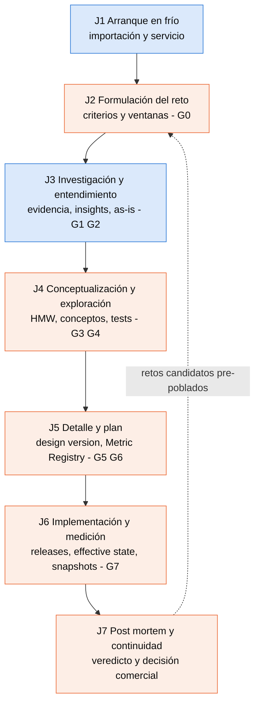
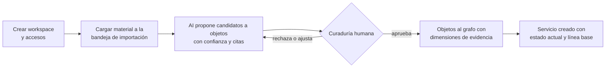
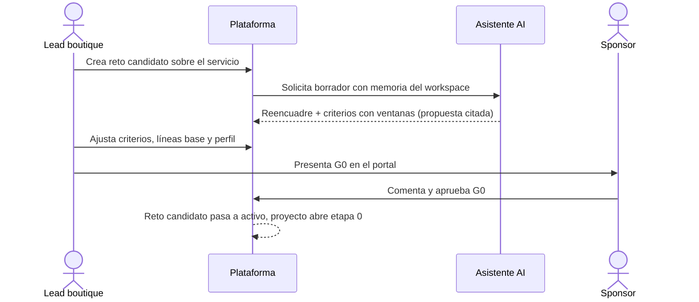
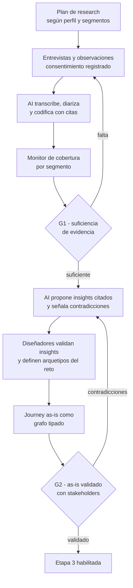
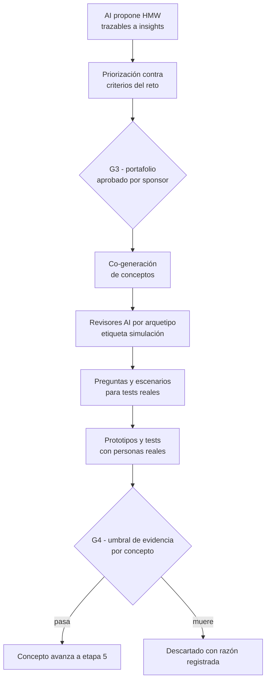
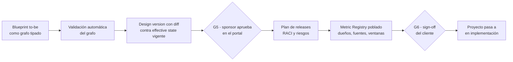
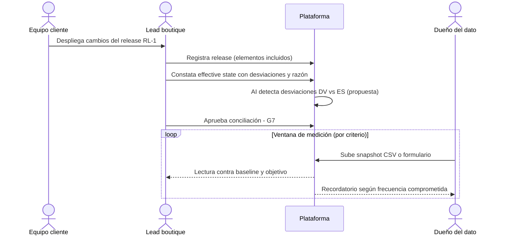
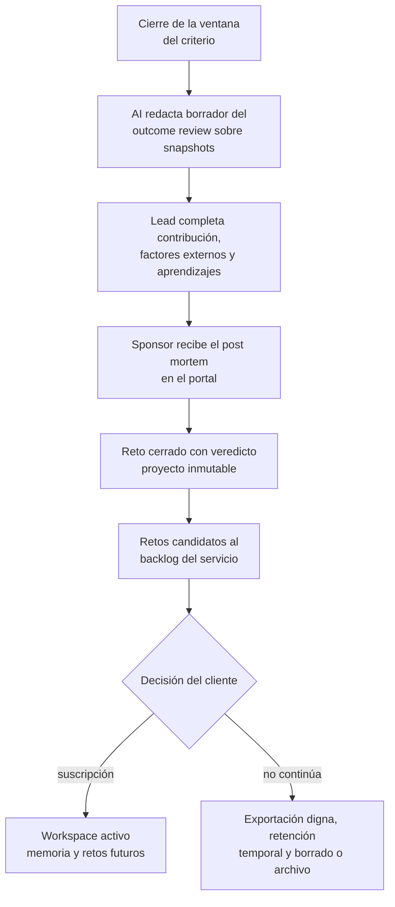
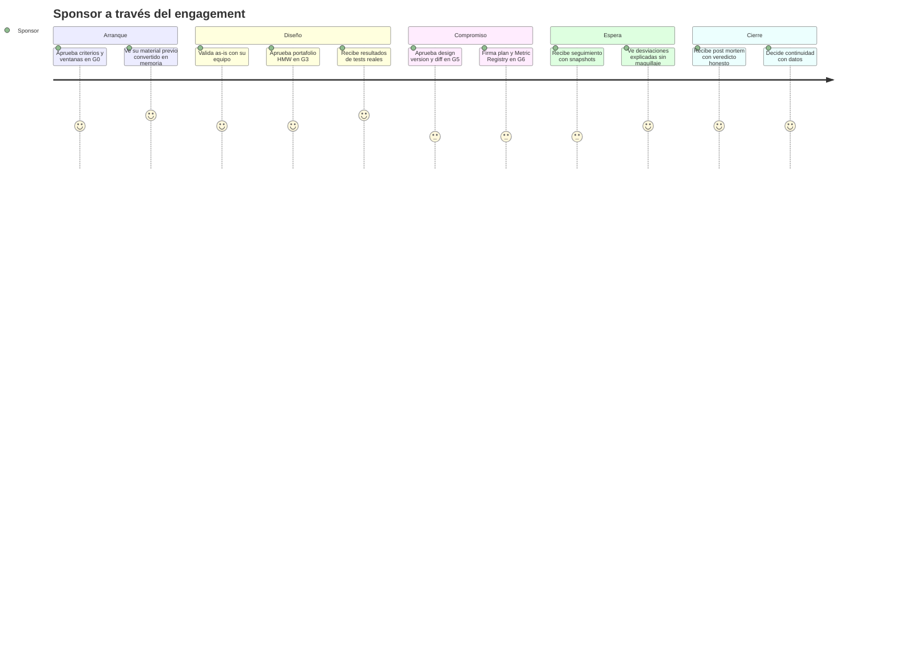

## Tabla de contenido

- [Resumen ejecutivo](#resumen-ejecutivo)
- [Aclaración de vocabulario](#aclaración-de-vocabulario)
- [Actores](#actores)
- [El loop completo](#el-loop-completo)
- [J1 — Arranque en frío e importación](#j1--arranque-en-frío-e-importación)
- [J2 — Formulación del reto y G0](#j2--formulación-del-reto-y-g0)
- [J3 — Investigación y entendimiento](#j3--investigación-y-entendimiento)
- [J4 — Conceptualización y exploración](#j4--conceptualización-y-exploración)
- [J5 — Detalle de solución y plan](#j5--detalle-de-solución-y-plan)
- [J6 — Implementación y medición](#j6--implementación-y-medición)
- [J7 — Post mortem y continuidad](#j7--post-mortem-y-continuidad)
- [La experiencia del sponsor de extremo a extremo](#la-experiencia-del-sponsor-de-extremo-a-extremo)
- [Matriz de cobertura](#matriz-de-cobertura)
- [Próximos pasos](#próximos-pasos)

## Resumen ejecutivo

Estos siete journeys describen cómo las personas usan la plataforma a lo largo de un engagement completo, desde la importación del material previo del cliente hasta el post mortem y la decisión de continuidad. Están construidos sobre el ejemplo trabajado del prediseño (§19, Banco Andino) para que cada paso sea concreto y trazable a la fuente. Cada journey declara los objetos del dominio que toca (ver `docs/01-ddd/domain-model.md`), los gates que atraviesa, la capacidad AI mínima del MVP que lo asiste (§7) y las fricciones previsibles con su mitigación. La regla transversal es la del método: los gates ordenan decisiones, no encadenan el trabajo — varios journeys se solapan en el tiempo (J3 y J4 comparten semanas; J6 corre durante meses de ventana de medición).

## Aclaración de vocabulario

En este documento, **journey** significa *recorrido de un usuario de la plataforma* (el sentido UX habitual). El **objeto de dominio "Journey"** — el grafo tipado del servicio del cliente (§10 del prediseño) — se especifica en `docs/05-specs/SPEC-05-journeys-tipados-mermaid.md`. Aparece aquí solo como uno de los artefactos que los usuarios crean y validan (en J3 el as-is; en J5 el to-be).

## Actores

Roles según §13.2 del prediseño; los journeys los combinan:

| Actor | Organización | Participa en | Responsabilidad en gates |
|---|---|---|---|
| Sponsor | Cliente | J2, J4 (decisiones), J5, J7 | Aprueba G0, G3, G5 y G6; recibe impacto y post mortem |
| Stakeholders | Cliente | J3 (validación as-is), J4 (tests, talleres) | Validan as-is (G2); comentan en el portal |
| Admin del cliente | Cliente | J1, J7 | Gestiona accesos; ejecuta continuidad o exportación |
| Dueño del dato | Cliente | J2 (compromiso de baseline), J5 (firma del registry), J6 (snapshots) | Aporta baseline y snapshots del Metric Registry |
| Lead de la boutique | Boutique | Todos | Presenta gates; responde por el método; opera el workspace |
| Diseñadores | Boutique | J1, J3, J4, J5 | Producen artefactos con cadena de evidencia |
| Agentes AI | Plataforma | Todos (asistencia) | Proponen y citan; auto-verifican checklists; nunca aprueban |

## El loop completo

Guía de lectura: azul = journeys conducidos por la boutique; naranja = journeys donde el cliente tiene el rol decisivo (aprobar, aportar datos, decidir continuidad). La arista punteada J7 → J2 es el pipeline embebido (§2.2): los retos candidatos del post mortem pre-pueblan la etapa 0 del siguiente engagement con memoria intra-cliente (§3.4).

## J1 — Arranque en frío e importación

| Campo | Detalle |
|---|---|
| Actores | Lead de la boutique (conduce), diseñadores, admin del cliente (accesos y material) |
| Disparador | Engagement firmado; workspace creado a nombre de la organización cliente |
| Objetivo | Workspace operativo: servicio creado con su estado actual descrito y curado desde el material previo |
| Objetos | Workspace, Miembro/Rol, Segmento, Fuente, ItemImportacion, Evidencia, Servicio |
| Gate | Curaduría humana (SYS-16): nada entra al grafo sin aprobación |
| AI del MVP | Extracción propuesta desde documentos y audio con mapeo al grafo, nivel de confianza y curaduría (§7 Importación) |

Flujo:

Ejemplo §19: el banco aporta el estudio CX 2024 (PDF) y el funnel (hoja de cálculo); se crea "Apertura de cuenta nómina digital" con línea base de abandono 62% en verificación de identidad. Fricciones: material heredado caótico (mitigación: la bandeja acepta todo y la curaduría decide qué describe el estado actual y qué queda como histórico, §12.1); prompt injection en archivos (tratamiento como contenido no confiable, §14).

## J2 — Formulación del reto y G0

| Campo | Detalle |
|---|---|
| Actores | Lead (presenta), sponsor (aprueba), dueño del dato (compromiso de baseline) |
| Objetivo | Reto formalizado con criterios de éxito medibles, línea base y **ventana de medición por criterio**; perfil del proyecto elegido |
| Objetos | Reto, CriterioDeÉxito, Proyecto, Aprobación |
| Gate | **G0**: el sponsor aprueba reto, criterios y ventanas en el portal; línea base registrada o plan para obtenerla |
| AI del MVP | Borrador de reto: reencuadre + criterios de éxito medibles con ventana por criterio (§7 etapa 0) |

Ejemplo §19: R-01 "Reducir el abandono de apertura digital del 62% al 40%"; tasa de abandono con ventana de 6 meses y snapshots mensuales por CSV (propietario: gerente de canales); NPS del flujo con ventana de 3 meses. Fricción principal: sponsors que quieren "empezar a diseñar ya" sin criterios medibles — el G0 es precisamente la promesa medible que el post mortem evaluará (simetría §3.4), y el perfil rápido existe para calibrar profundidad sin saltarse la promesa.

## J3 — Investigación y entendimiento

| Campo | Detalle |
|---|---|
| Actores | Diseñadores (ejecutan), stakeholders (validan as-is), lead (G1/G2) |
| Objetivo | Evidencia suficiente según perfil; insights con citas; arquetipos del reto; journey as-is validado |
| Objetos | Fuente, Evidencia, Insight, Arquetipo, JourneyGraph (as-is) |
| Gates | **G1** (evidencia suficiente para decidir; segmentos priorizados cubiertos o N/A) y **G2** (insights y arquetipos con evidencia enlazada; contradicciones resueltas o explícitas; as-is validado con el cliente) |
| AI del MVP | Transcripción, diarización y codificación con citas exactas (etapa 1); propuesta de insights citando fragmentos con contradicciones señaladas (etapa 2) |

Ejemplo §19: 12 entrevistas, cobertura de tres segmentos verificada en G1; insight I-07 ("la verificación pide documentos que el usuario no tiene a mano en el móvil", 7 fragmentos citados); arquetipos "el apurado de RR. HH." (→ empleados) y "el desconfiado digital" (→ independientes). Fricciones: entrevistas sin consentimiento registrado bloquean derechos de uso (SYS-14); arquetipo intuido sin evidencia no pasa G2 (SYS-15) — la plataforma muestra qué le falta en el asistente de gate.

## J4 — Conceptualización y exploración

| Campo | Detalle |
|---|---|
| Actores | Equipo de diseño, sponsor (G3), stakeholders (tests y talleres), revisores AI (simulación) |
| Objetivo | Portafolio de oportunidades aprobado; conceptos explorados con test real y decisión pasa/muere |
| Objetos | Oportunidad (HMW), Concepto, ResultadoTest, Decisión, SesionRevisorAI |
| Gates | **G3** (cada oportunidad trazable a ≥1 insight) y **G4** (evidencia de test por concepto que avanza; lo descartado con razón; los revisores AI no computan) |
| AI del MVP | Generación y priorización de oportunidades HMW trazables (etapa 3); revisión adversarial con revisores AI por arquetipo etiquetada como simulación + borrador de diseño de tests (etapa 4) |

Ejemplo §19: HMW-02 trazable a I-07; dos conceptos; el revisor del "desconfiado digital" señala riesgo de exclusión (simulación → origina una pregunta del test); test real con 8 usuarios y umbral 6/8: pasa "verificación diferida", muere "pre-carga por convenio" con razón. Fricción central y deliberada: la tentación de usar la simulación AI como validación — bloqueada por diseño (ADR-0009, SYS-20): el checklist de G4 solo cuenta evidencia de test real.

## J5 — Detalle de solución y plan

| Campo | Detalle |
|---|---|
| Actores | Diseñadores (blueprint y specs), lead (presenta), sponsor (aprueba G5 y G6), dueño del dato (firma el Metric Registry) |
| Objetivo | Design version completa y consistente aprobada; plan de releases con responsables; Metric Registry poblado y firmado |
| Objetos | JourneyGraph (to-be), Blueprint, DesignVersion, ElementoDeCambio, MetricRegistry, Release (planificados) |
| Gates | **G5** (cobertura journey ↔ blueprint ↔ requisitos; piezas críticas validadas; aprobación del cliente) y **G6** (cada elemento asignado a release con dueño y fecha; Metric Registry acordado; sign-off) |
| AI del MVP | Validación automática del grafo (pasos sin evidencia, transiciones rotas, huecos frontstage/backstage) + render Mermaid (etapa 5); borrador del Metric Registry y del plan de releases (etapa 6) |

Ejemplo §19: DV-1 con 4 cambios (3 touchpoints modificados + 1 proceso backstage nuevo), diff explicado contra el estado actual; dos releases planificados; Metric Registry firmado. Fricción: el diff es la conversación difícil ("esto cambia y esto no") — por eso es objeto de primera clase y no una diapositiva (ADR-0004).

## J6 — Implementación y medición

| Campo | Detalle |
|---|---|
| Actores | Equipo del cliente (implementa), lead (concilia y constata), dueño del dato (snapshots), sponsor (recibe seguimiento) |
| Objetivo | Releases registrados y conciliados; effective state constatado con desviaciones explicadas; medición operando durante la ventana |
| Objetos | Release, EffectiveState, Desviación, Snapshot |
| Gate | **G7**: releases conciliados contra la design version; effective state constatado; medición operando → proyecto y reto pasan a "en medición" |
| AI del MVP | Detección de desviaciones (effective state vs. design version) + borrador narrativo del post mortem sobre snapshots deterministas (etapa 7) |

Ejemplo §19: RL-1 despliega 3 de 4 cambios (backstage aplazado a RL-2 por dependencia del área de riesgo); ES-1 constata además un paso adicional exigido por cumplimiento (desviación con razón); snapshots mensuales 55%, 49%, 46%, 44%. Fricción crítica del producto: **el cliente no aporta snapshots** → post mortem "no concluyente" (riesgo §18); mitigación: dueño y frecuencia comprometidos en G6, recordatorios, y el % de retos con veredicto con datos es métrica de salud (§17).

## J7 — Post mortem y continuidad

| Campo | Detalle |
|---|---|
| Actores | Lead (prepara), sponsor (recibe y decide), admin del cliente (ejecuta continuidad o exportación) |
| Objetivo | Outcome review con veredicto honesto; aprendizajes y retos candidatos; decisión comercial de continuidad |
| Objetos | OutcomeReview, Veredicto, Reto (candidatos nuevos), ExportaciónEjecutada (si aplica) |
| Gate | Cierre del reto con veredicto (logrado / parcialmente logrado / no logrado / no concluyente); proyecto a cerrado e inmutable |
| AI del MVP | Borrador narrativo del post mortem sobre snapshots deterministas (etapa 7); semilla de retos candidatos desde la memoria del workspace (etapa 0 del siguiente ciclo) |

Ejemplo §19: veredicto **parcialmente logrado** (44% vs. objetivo 40%), contribución del rediseño + factor externo (campaña comercial) + hipótesis del elemento aplazado; candidatos R-02 (completar backstage) y R-03 (abandono pymes 55%). Nota comercial: la suscripción es hipótesis por validar (ADR-0002/0014); la exportación digna es requisito para que no contratar no sea traumático (§18).

## La experiencia del sponsor de extremo a extremo

Vista de la experiencia emocional del rol que aprueba y paga, para diseñar los momentos de contacto del portal (escala 1–5):

Los dos momentos de puntuación 3 son los de mayor riesgo de abandono del portal (aprobar compromisos y esperar resultados): ahí se concentran las notificaciones, los recordatorios al dueño del dato y la legibilidad del diff — si el sponsor aprueba por correo/PDF fuera de la plataforma, perdemos la métrica de adopción del portal (§17) y la auditoría del gate.

## Matriz de cobertura

Correspondencia journeys × etapas × gates × capacidad AI mínima (todas las capacidades de §7 quedan cubiertas por al menos un journey):

| Journey | Etapas | Gates | Roles decisivos | AI mínima MVP |
|---|---|---|---|---|
| J1 | (pre-0) Importación | Curaduría | Lead, admin cliente | Extracción propuesta con curaduría |
| J2 | 0 | G0 | Sponsor | Borrador de reto y criterios con ventanas |
| J3 | 1–2 | G1, G2 | Diseñadores, stakeholders | Transcripción/codificación; insights citados |
| J4 | 3–4 | G3, G4 | Sponsor, equipo | HMW trazables; revisores AI + diseño de tests |
| J5 | 5–6 | G5, G6 | Sponsor, dueño del dato | Validación de grafo + Mermaid; borrador Metric Registry |
| J6 | 7 | G7 | Equipo cliente, dueño del dato | Detección de desviaciones |
| J7 | PM | Veredicto | Sponsor, admin cliente | Borrador del outcome review |
| Transversal | — | Todos | Lead | Gates auto-verificados en modo asistente |

## Próximos pasos

1. Validar J2, J5 y J7 (los journeys del sponsor) con la boutique piloto antes de diseñar el portal en detalle — dueño: producto.
2. Derivar de cada journey los casos de aceptación de su spec correspondiente (`docs/05-specs/`) — dueño: producto + ingeniería.
3. Prototipar en el mockup (`docs/07-mockups/`) los momentos de puntuación 3 del sponsor (aprobación de G5/G6 y espera de medición) — dueño: diseño.
4. Definir el playbook de recordatorios al dueño del dato (frecuencia, tono, canal) como parte de SPEC-07 — dueño: boutique.
