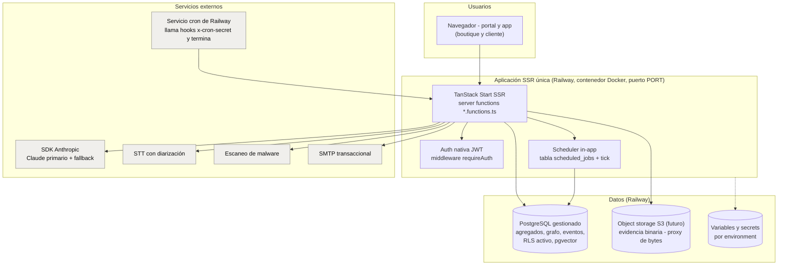
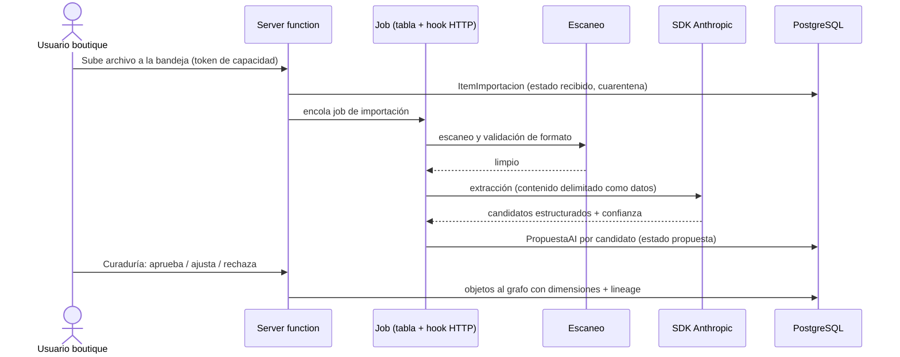

## Tabla de contenido

- [Resumen ejecutivo](#resumen-ejecutivo)
- [Alcance y relación con el resto del paquete](#alcance-y-relación-con-el-resto-del-paquete)
- [Stack técnico](#stack-técnico)
  - [Principios heredados del stack interno](#principios-heredados-del-stack-interno)
  - [Stack fijado](#stack-fijado)
- [Principios técnicos](#principios-técnicos)
- [Arquitectura de referencia](#arquitectura-de-referencia)
  - [Vista de contenedores](#vista-de-contenedores)
  - [Módulos y bounded contexts](#módulos-y-bounded-contexts)
  - [Flujos clave](#flujos-clave)
- [Capa de datos](#capa-de-datos)
  - [Multi-tenancy y autorización](#multi-tenancy-y-autorización)
  - [El grafo sobre relacional](#el-grafo-sobre-relacional)
  - [Migraciones, eventos y proyecciones](#migraciones-eventos-y-proyecciones)
  - [Archivos y evidencia binaria](#archivos-y-evidencia-binaria)
  - [Correo transaccional](#correo-transaccional)
- [Trabajos asíncronos y scheduler](#trabajos-asíncronos-y-scheduler)
- [Capa AI](#capa-ai)
  - [Orquestación del pipeline PropuestaAI](#orquestación-del-pipeline-propuestaai)
  - [Proveedores, modelos y BYOAI](#proveedores-modelos-y-byoai)
  - [Cuotas, evaluaciones y degradación](#cuotas-evaluaciones-y-degradación)
- [Render Mermaid y vistas](#render-mermaid-y-vistas)
- [Seguridad aterrizada](#seguridad-aterrizada)
- [Observabilidad](#observabilidad)
- [Estrategia de pruebas y CI](#estrategia-de-pruebas-y-ci)
- [Despliegue, entornos y flujo de ramas](#despliegue-entornos-y-flujo-de-ramas)
- [Decisiones técnicas abiertas](#decisiones-técnicas-abiertas)
- [Próximos pasos](#próximos-pasos)

## Resumen ejecutivo

El MVP se construye como **una sola aplicación full-stack SSR** sobre el stack estándar interno de Whitespace, ya probado en producción: **Bun** como único runtime y gestor de paquetes, **TanStack Start** (React 19 + Vite) con **server functions tipadas** extremo a extremo como única capa de lógica de negocio, **PostgreSQL accedido directamente** (cliente `postgres`, sin ORM) y **fuertemente multi-tenant: RLS activo desde el día 1** (rol de aplicación no privilegiado + contexto de tenant por transacción) **más la autorización de tenant/rol re-aplicada en cada server function** — dos capas independientes verificadas por una suite de tests contra base real —, un **scheduler in-app** sin infraestructura de colas (tabla de jobs + tick + claim latch, con un disparador HTTP externo —un servicio cron de Railway que llama el hook y termina— como respaldo para trabajos pesados), y despliegue en **Railway**: servicio Docker + PostgreSQL gestionado del propio proyecto, con environments `dev`/`stg`/`production` sobre las ramas `dev`/`stg`/`main`. La capa AI corre sobre el **SDK de Anthropic** con política de modelos primario/fallback centralizada en constantes, **BYOAI por workspace** (coherente con la propiedad del cliente, ADR-0011) y **cuotas fail-safe** por workspace. La estructura interna del monolito se alinea 1:1 con los ocho bounded contexts del modelo de dominio, y las invariantes SYS-* se convierten en checks gating de CI (incluida la suite de autorización contra Postgres real, la batería "AI off" y un smoke E2E con Playwright contra el build de producción). El **design system es propio — «El arco del loop»** (definido por el fundador, sep-2026): firma cromática de 7 hues oklch que mapean los journeys J1–J7, Figtree + IBM Plex Mono, tokens versionados como fuente de verdad en `src/styles/tokens/` y el handoff completo en `.claude/skills/designio-design/`.

## Alcance y relación con el resto del paquete

| Este documento define | No define (vive en) |
|---|---|
| Topología, stack fijado, persistencia, pipeline AI, seguridad técnica, pruebas, despliegue | Modelo de dominio (`01-ddd`), reglas de negocio (`03-invariantes`), comportamiento funcional (`05-specs`) |
| Cómo se hace cumplir técnicamente cada SYS-* | El contenido de los checklists de gates (biblioteca metodológica) |
| Stack fijado, principios heredados y design system («El arco del loop») | El contenido metodológico de los checklists (biblioteca de la boutique) |

## Stack técnico

### Principios heredados del stack interno

El stack no es una lista de librerías: es un conjunto de **patrones operativos ya pagados en producción** por Whitespace. Los que este producto hereda tal cual:

1. **Un runtime, un gestor**: Bun para todo (install, dev, build, test, servidor de producción); lockfile único; sin npm/pnpm.
2. **Server functions como única frontera de negocio**: módulos `*.functions.ts` que solo exportan server functions, detrás de un middleware de autenticación; esquemas compartidos en módulos puros (`*.schemas.ts`); **split server/client defendido en tres capas** (reglas ESLint, tripwire de runtime server-only, y un check de CI que inspecciona el bundle real del navegador).
3. **Autorización en dos capas, con RLS activo**: el patrón interno de referencia re-aplica tenant/rol server-side con las políticas RLS como definición de paridad; este producto lo **endurece por decisión del fundador** — al ser fuertemente multi-tenant (workspaces propiedad de clientes distintos), las políticas RLS están **activas desde el día 1** (rol de aplicación no privilegiado + contexto por transacción) y, además, cada server function re-aplica tenant/rol con helpers `SECURITY DEFINER`. Una **suite de autorización dedicada verifica ambas capas contra un Postgres real en CI**. Regla de oro intacta: jamás confiar en input del cliente para autorización — solo en el `userId` del JWT verificado.
4. **Límites fail-safe**: toda cuota o control de abuso cae a su default seguro ante configuración inválida; un valor mal puesto nunca desactiva un límite.
5. **Degradación segura por diseño**: sin SMTP el correo es no-op con logging; sin AI disponible todo flujo sigue operable a mano (I4); sin bucket el storage local sirve en desarrollo.
6. **Contenido externo = no confiable**: comparaciones timing-safe para secretos, tokens de capacidad de alcance mínimo para rutas públicas, bounds de tamaño/profundidad en contenido persistido que alimenta al LLM.
7. **Supply chain guardada**: audit de dependencias como gate, cuarentena de 24 h para paquetes recién publicados, overrides de parches en transitivas sensibles y escaneo de secretos sobre todo el historial.
8. **Configuración solo por entorno**: sin ramas `if (env === …)` en código; capacidades dormidas pero reactivables por configuración.

### Stack fijado

Stack del MVP, fijado al estándar interno de Whitespace, con el **design system propio «El arco del loop»** ya definido e integrado (handoff v1 versionado en `.claude/skills/designio-design/`).

| Ámbito | Elección |
|---|---|
| Runtime y gestor | **Bun** (versión fijada —pinned—, línea 1.3.x); lockfile `bun.lock` |
| Lenguaje | **TypeScript estricto** (`strict: true`, `any` prohibido en código nuevo); alias `@/*` → `src/*` |
| Framework | **TanStack Start** (SSR + server functions + streaming) sobre **TanStack Router** (rutas file-based) y **Vite** |
| UI | **React 19** + **TanStack Query** (estado asíncrono; near-real-time por **polling**, sin WebSockets) |
| Estilos / componentes | **Tailwind CSS v4** como base + **design system propio «El arco del loop»** (handoff v1 en `.claude/skills/designio-design/`; tokens como CSS variables en `src/styles/tokens/`, fuente de verdad): Figtree + IBM Plex Mono, arco cromático J1–J7 en oklch, primitivas propias (Button, Chip, JourneyBadge, Card, Tabs, …); Radix UI se incorpora cuando lleguen primitivas complejas (dialogs, menús) |
| Formularios / validación | react-hook-form + **Zod** (los mismos esquemas se reutilizan server-side; todo input externo se parsea antes de tocar lógica) |
| Base de datos | **PostgreSQL 15** (Postgres gestionado de Railway en nube; Docker en local/CI) + extensión **pgvector** (adición de este producto para búsqueda semántica intra-workspace) |
| Acceso a datos | Cliente **`postgres`** (pool único configurado por `DATABASE_URL`, **rol de aplicación no privilegiado**); **RLS activo** con contexto de tenant por transacción; **sin ORM**: SQL etiquetado en módulos `*-queries.ts` por contexto |
| Migraciones | SQL **forward-only** aplicadas en orden de nombre, exactamente una vez, con ledger (`schema_migrations`); aplicadas en el arranque del contenedor |
| Autenticación | **Nativa**: bcrypt + **JWT stateless** en cookie `HttpOnly`/`Secure`/`SameSite=Lax`; invitaciones, verificación y recovery por email (JWT de un solo uso); **IAP de Google como defensa en profundidad opcional** (dormida, reactivable por configuración) |
| Jobs y cadencias | **Scheduler in-app** (tabla `scheduled_jobs` + tick auto-throttleado + claim latch atómico) con hooks HTTP `x-cron-secret` timing-safe; disparo inmediato vía hook interno y un **servicio cron de Railway** (comando corto que invoca el hook y termina) como backstop de puntualidad |
| Almacenamiento de archivos | Object storage **compatible S3** (R2/S3; se contrata cuando llegue la evidencia binaria) con doble backend (bucket en nube / filesystem local); acceso por **tokens de capacidad JWT por objeto**; la app **proxya los bytes** (sin URLs públicas del bucket) |
| Correo | SMTP con nodemailer; **no-op con logging** si faltan credenciales |
| LLM | **SDK de Anthropic**; política de modelos **primario/fallback centralizada en constantes** (hoy: `claude-sonnet-5` con fallback `claude-sonnet-4-6`); **BYOAI por workspace** con fallback a la key del entorno |
| STT / diarización | Servicio gestionado (selección con prueba de diarización en español en el scaffolding) |
| Testing | **Vitest** en tres estratos (unit puro, componentes, y **suite de autorización contra Postgres real**) + **Playwright** (smoke E2E contra el build de producción) |
| CI/CD | **GitHub Actions** con checks gating (ver [Estrategia de pruebas y CI](#estrategia-de-pruebas-y-ci)); despliegue automático de **Railway** al hacer push a la rama de cada environment |
| Nube | **Railway** (elección operativa del fundador, sep-2026): servicio web por Dockerfile (respeta `PORT`, healthcheck `/healthz` en `railway.json`), PostgreSQL del proyecto, variables/secrets por environment, servicio cron para backstops; runbook en [`despliegue-railway.md`](despliegue-railway.md) |

## Principios técnicos

Derivados de ADRs e invariantes; gobiernan cualquier decisión de implementación:

| # | Principio | Origen |
|---|---|---|
| P1 | Tenancy estructural en dos capas: `workspace_id` en la identidad de todo dato de cliente, **RLS activo** (rol no privilegiado + contexto por transacción) como piso de base de datos, y re-chequeo de tenant/rol en cada server function; ambas capas verificadas por suite contra base real en CI | SYS-01/02, ADR-0008 |
| P2 | El modelo de escritura es el grafo + agregados; el árbol y el backlog son proyecciones reconstruibles | ADR-0003 |
| P3 | Estados por máquina explícita; inmutabilidad por sucesión (DV, proyectos cerrados) y append-only (snapshots, auditoría) | ADR-0004, SYS-05/08/23 |
| P4 | Un solo camino de escritura AI: `PropuestaAI`; lineage obligatorio; paridad manual de todo flujo | ADR-0012, SYS-19/21 |
| P5 | Contenido externo = datos no confiables en todo prompt y todo parser; límites y cuotas fail-safe | SPEC-09, SYS-16 |
| P6 | Los checklists de invariantes son pruebas de CI, no documentación | `03-invariantes` §Verificación |
| P7 | Optimizar para un piloto: una sola app desplegable, simple y extraíble > distribuido y prematuro | ADR-0014 |

## Arquitectura de referencia

### Vista de contenedores



Notas: **una sola aplicación desplegable** (P7) que renderiza el frontend, ejecuta las server functions y expone las rutas de API (adjuntos con proxy, hooks de jobs, streaming AI). No hay Redis ni broker de colas: las cadencias las lleva el scheduler in-app y los trabajos pesados on-demand (transcripción, extracción, escaneo) se encolan en la misma tabla de jobs y se disparan de inmediato vía el hook interno (con el servicio cron de Railway como barrido de respaldo), para no depender del tráfico. El "tiempo real" del portal (comentarios, aprobaciones, snapshots) es polling con TanStack Query; el streaming SSE se reserva para superficies AI conversacionales si el MVP las necesita.

### Módulos y bounded contexts

Correspondencia 1:1 con `docs/01-ddd/domain-model.md`, como módulos de `src/lib/` dentro de la única app; cada módulo posee sus tablas, sus `*-queries.ts` y sus `*.functions.ts` (sin joins entre módulos fuera de IDs):

| Módulo | Contexto | Contenido principal |
|---|---|---|
| `src/lib/workspace` | CTX-01 | Tenancy, miembros/roles, segmentos, auditoría, exportación |
| `src/lib/evidencia` | CTX-02 | Fuentes, evidencias, citas, insights, bandeja de importación |
| `src/lib/metodo` | CTX-03 | Retos, proyectos, etapas, gates, decisiones, arquetipos |
| `src/lib/servicio` | CTX-04 | Servicios, catálogo, journeys tipados, oportunidades, conceptos, design versions |
| `src/lib/entrega` | CTX-05 | Releases, effective states, conciliación |
| `src/lib/medicion` | CTX-06 | Metric Registry, snapshots, outcome reviews |
| `src/lib/biblioteca` | CTX-07 | Contenido metodológico (fuera del scope de workspaces de cliente) |
| `src/lib/ai` | CTX-08 | PropuestaAI, revisores, evals de grounding, cuotas, scoping |

### Flujos clave

Flujo 1 — importación con curaduría (SPEC-03, P5):



Flujo 2 — aprobación de gate (SPEC-04, SYS-12/18): la server function valida el checklist contra objetos → registra `Aprobación` con actor humano y rol (JWT verificado) → evento `GxAprobado` en la misma transacción → las proyecciones (árbol, backlog) se actualizan. El asistente de gate (CT) es una server function de solo lectura que produce un reporte; el principal `agente-AI` carece del scope `gate:approve` a nivel de permisos.

## Capa de datos

### Multi-tenancy y autorización

**Decisión (fundador, sep-2026): RLS full desde el principio.** El producto es fuertemente multi-tenant — cada workspace pertenece a una organización cliente distinta (ADR-0011) y el invariante I6 exige aislamiento verificable — así que el aislamiento no descansa solo en disciplina de aplicación:

- **Capa 1 — RLS activo**: la app se conecta con un **rol no privilegiado** (nunca superusuario ni owner de las tablas); toda tabla de datos de cliente tiene **políticas RLS activas** que exigen `workspace_id` igual al contexto de la transacción. Cada request de negocio abre una transacción (`sql.begin`) que fija el contexto con `SET LOCAL` (`app.user_id`; las políticas resuelven membresía vía helpers `SECURITY DEFINER`: `is_workspace_member`, `workspace_role`, `objeto_workspace_id`, …). Una query sin contexto devuelve **cero filas** por construcción.
- **Capa 2 — re-chequeo server-side**: cada server function valida además tenant/rol para sus reglas de negocio (p. ej. "solo el sponsor aprueba G5"), con el `userId` del JWT verificado. La capa de aplicación nunca asume que RLS la exime de autorizar.
- **Verificación**: la **suite de autorización** (un archivo por superficie, contra Postgres real con migraciones aplicadas) prueba ambas capas en CI, incluida la negativa: acceso cruzado entre dos workspaces sintéticos = cero filas y `404` sin filtración de existencia (SYS-01/02).
- **Operaciones fuera de RLS** (migraciones, jobs de sistema, export completo) usan un rol administrativo separado, con auditoría; jamás la conexión de la app.
- `src/lib/biblioteca` (CTX-07) vive en esquema separado sin `workspace_id` (contenido no-cliente), con lectura pero sin referencias entrantes desde workspaces (SYS-03).

### El grafo sobre relacional

Relacional con tablas de nodos y aristas tipadas (P7: el volumen del MVP es de miles de nodos, no millones); SQL directo en `*-queries.ts`:

```sql
-- Esbozo ilustrativo (el esquema real se deriva de los agregados)
create table nodo (
  id uuid primary key,
  workspace_id uuid not null,
  tipo text not null,           -- catalogo cerrado por contexto (paso, touchpoint, ...)
  agregado_id uuid not null,    -- dueno del nodo (p.ej. journey al que pertenece)
  atributos jsonb not null default '{}',
  creado_por uuid not null,
  creado_en timestamptz not null default now()
);

create table arista (
  id uuid primary key,
  workspace_id uuid not null,
  tipo text not null,           -- transicion, soporta, evidencia_de, mide, afecta, ...
  origen_id uuid not null references nodo(id),
  destino_id uuid not null references nodo(id),
  atributos jsonb not null default '{}',
  propuesta_ai_id uuid null,    -- lineage si la creo una propuesta aceptada
  creado_por uuid not null,
  creado_en timestamptz not null default now()
);
```

- Los **agregados** (Reto, Proyecto, DesignVersion, Release, MetricRegistry…) son tablas propias con sus VOs en columnas/jsonb validado con Zod; el grafo enlaza identidades, no sustituye a los agregados.
- Las consultas predefinidas (RF-02.6) se implementan como CTEs recursivas acotadas por tipo de arista; si el rendimiento lo exigiera, se materializa antes que cambiar de motor.
- `pgvector` para búsqueda semántica dentro del workspace (scoping y Q&A futuro), siempre bajo los mismos checks de tenant.

### Migraciones, eventos y proyecciones

- Migraciones SQL **forward-only con ledger**, aplicadas en orden de nombre exactamente una vez, ejecutadas por el entrypoint del contenedor al arrancar (patrón heredado). El seed local crea el workspace demo con los datos del ejemplo §19.
- Tabla `evento_dominio` **append-only** (workspace, tipo, payload, actor, rol, timestamp) escrita en la misma transacción que el cambio de estado; es a la vez **auditoría** (RF-01.6) y fuente de **proyecciones**.
- Proyecciones del MVP (árbol de navegación, backlog de retos, tablero de conciliación, seguimiento de impacto): recalculadas de forma síncrona al confirmar la transacción (volumen de piloto) detrás de una interfaz que permita moverlas a jobs después; idempotentes y reconstruibles desde cero (P2).

### Archivos y evidencia binaria

- **Doble backend heredado**: bucket S3-compatible en nube (credenciales por variables de entorno) / filesystem en local; claves prefijadas por workspace.
- Acceso autorizado con **JWT cortos de capacidad por objeto**; la app **proxya los bytes** por sus rutas de upload/download y nunca expone URLs del bucket.
- Pipeline de entrada: cuarentena → escaneo/validación (RF-09.8) → almacenamiento definitivo → derivados (preview, OCR, transcripción) como objetos ligados a la fuente con lineage. Metadatos (Postgres) y bytes (store) con durabilidades distintas: huérfanos marcados solo ante ausencia comprobada, nunca por fallo transitorio.
- La exportación (SYS-04) empaqueta datos (JSON por catálogo de objetos) + archivos + auditoría, verificada contra manifiesto.

### Correo transaccional

SMTP con nodemailer para invitaciones, aprobaciones pendientes, recordatorios al dueño del dato (RF-07.4) y avisos del portal; **sin credenciales el envío es no-op con logging** (dev y CI nunca rompen por correo); `APP_BASE_URL` parametriza los links absolutos por entorno.

## Trabajos asíncronos y scheduler

Sin broker de colas: el patrón heredado es una tabla `scheduled_jobs` con cadencia y estado por job, un **tick barato** enganchado al request middleware (auto-throttleado, ≤1 intento/min por instancia) y un **claim latch atómico** (lease con `running_since`) para que múltiples instancias no ejecuten doble.

| Tipo de trabajo | Ejemplos en este producto | Mecanismo |
|---|---|---|
| Cadencias | Recordatorios de snapshots (RF-07.4), cierre de ventanas (`VentanaCerrada`), evals de grounding programadas, purga/retención | Scheduler in-app + hook HTTP de backstop (`x-cron-secret` timing-safe) vía el servicio cron de Railway |
| On-demand pesado | Transcripción/diarización, extracción de importación, escaneo, generación de propuestas largas | Fila en la misma tabla + **disparo inmediato**: la server function invoca el hook de jobs tras encolar (fire-and-forget) y el servicio cron de Railway barre pendientes/reintentos con backoff |
| Síncrono | Validación de grafo, checklists de gate, render Mermaid | En la server function (rápidos y deterministas) |

El backstop externo es un **servicio cron aparte** en el proyecto de Railway, no un schedule sobre el servicio `app`: el cron de Railway ejecuta el start command del servicio programado y **exige que el proceso termine** (no hace llamadas HTTP por sí mismo), así que su comando es un one-shot que invoca el hook `x-cron-secret` (p. ej. `curl -fsS`) y sale.

Limitación honesta heredada: con scale-to-zero, un job de cadencia sin backstop corre en el primer request posterior; por eso los trabajos con puntualidad dura (recordatorios comprometidos en G6) llevan siempre el disparador externo.

## Capa AI

### Orquestación del pipeline PropuestaAI

Implementación del pipeline único (SPEC-08) en `src/lib/ai`:

| Paso | Implementación |
|---|---|
| Scoping | Resolver `AlcanceDeContexto` con las consultas de SPEC-02 (subgrafo por reto + permisos del solicitante); serialización compacta con IDs estables |
| Generación | SDK de Anthropic con **salida estructurada validada por Zod** (esquema por capacidad C0–CI); material externo delimitado como datos (P5); ejecución en server function (rápidas) o job (largas), con timeouts y reintentos |
| Persistencia | `propuesta_ai` (tipo, contenido, citas, confianza, lineage: modelo + versión de prompt/config + alcance usado) y `llamada_ai`, el libro de llamadas al proveedor (uso, costo y latencia). Se separan porque el costo es de la LLAMADA, no de cada propuesta: una devuelve un lote, y una negativa del proveedor o una salida fuera de contrato son llamadas pagadas de las que no nace ninguna propuesta. Cada propuesta apunta a su llamada (FK), así que no hay gasto sin registrar ni propuesta sin gasto |
| Revisión | UI de revisión por capacidad (aceptar/corregir/rechazar por elemento); la corrección conserva el original (SYS-17) |
| Materialización | Handlers por tipo que crean objetos de dominio firmados por el humano aceptante |
| Medición | Métricas por propuesta (aceptación, edición, costo) + evals muestrales de grounding |

Los **prompts y esquemas son artefactos versionados** en el repo, referenciados por versión en el lineage; cambiarlos exige pasar la suite de evals (regresión). Contenido persistido que alimente al LLM (evidencia importada, historial de propuestas) lleva **bounds de tamaño y profundidad** y política de retención, porque es input no confiable.

### Proveedores, modelos y BYOAI

- **Política de modelos centralizada en constantes de código** (no en env vars), con **primario y fallback por superficie** — patrón heredado: hoy `claude-sonnet-5` como primario y `claude-sonnet-4-6` como fallback ante model-unavailable, degradando una vez por operación. La asignación por capacidad (C0–CI) es configuración: codificación/extracción pueden usar el modelo más rápido disponible; síntesis (insights, revisores, post mortem) el más capaz.
- **BYOAI por workspace**: la organización cliente puede configurar su propia API key de Anthropic (coherente con propiedad y condiciones de datos, ADR-0011/RF-09.9), con fallback a la key del entorno. El lineage registra qué key y modelo sirvió cada propuesta.
- STT con diarización como servicio gestionado; salida normalizada a fragmentos con hablante + offsets (RF-03.7).

### Cuotas, evaluaciones y degradación

- **Presupuestos independientes y fail-safe por workspace** (patrón heredado): cuota diaria de llamadas AI con **reserva contra contador antes de llamar** al proveedor (429 al agotar), techo de tokens por operación y truncado de contexto con reserva de completion. Un valor inválido cae al default, nunca desactiva el tope (RF-08.5).
- Evals de grounding en CI + corrida programada (dataset propio creciente): fidelidad de citas, afirmaciones no soportadas, formato válido, comparadas contra línea base (regresión, RF-09.10).
- Degradación: fallo del proveedor o cuota agotada ⇒ bandera "AI no disponible" y paridad manual de todo flujo (SYS-21); los jobs AI no urgentes reintentan.

## Render Mermaid y vistas

- El código Mermaid se **genera en servidor** desde el grafo (función pura grafo → texto por vista) y se renderiza en cliente con la librería Mermaid empaquetada (sin CDN en runtime del producto).
- El generador impone reglas de seguridad sintáctica (IDs alfanuméricos, labels saneados) para que ningún contenido de usuario rompa el render o inyecte directivas.
- Export: PNG/SVG desde el render + el código como artefacto de solo lectura (criterio 1 de SPEC-05).
- La vista blueprint por carriles es un componente propio (tabla alineada por paso), no Mermaid, según RF-05.4.

## Seguridad aterrizada

Mapeo de §14/SPEC-09 a mecanismos concretos del stack:

| Requisito | Mecanismo |
|---|---|
| Aislamiento tenants (RF-09.1) | **RLS activo** (rol no privilegiado + contexto por transacción) + re-chequeo server-side; suite de autorización contra Postgres real en CI verificando ambas capas |
| Permisos por objeto (RF-09.2) | Middleware `requireAuth` (JWT verificado) + helpers de rol por objeto en cada server function; denegación por defecto; el principal `agente-AI` sin scopes de aprobación |
| Autenticación | bcrypt + JWT en cookie HttpOnly/Secure/SameSite=Lax; recovery de un solo uso; respuestas anti-enumeración; IAP opcional dormido para perímetro adicional |
| Rutas públicas | Solo por **tokens de capacidad** de alcance mínimo (compartir en solo-lectura, opt-out), con `noindex`/`no-referrer` y navegación que no muta |
| No confiable (RF-09.7) | Parsers con validación de formato; prompts con delimitación estricta; sin herramientas de escritura expuestas a contenido externo; bounds en contenido persistido |
| Malware (RF-09.8) | Cuarentena + escaneo previo a preview/AI |
| Cifrado y secretos (RF-09.6) | TLS extremo a extremo; cifrado at-rest del Postgres gestionado; **variables/secrets de Railway por environment** (sin key files en el repo); secretos de cron comparados timing-safe |
| Ciclo de vida (RF-09.4/5) | Consentimiento como dato bloqueante en `evidencia`; export por manifiesto; borrado con verificación (incluye derivados y embeddings); retención de contenido AI |
| Auditoría (RF-09.13) | `evento_dominio` append-only sin permiso de borrado a nivel de rol de base |
| Supply chain | Audit de dependencias como gate de CI; cuarentena de 24 h para versiones recién publicadas; overrides de transitivas sensibles; escaneo de secretos sobre todo el historial |

## Observabilidad

- Logs estructurados (Cloud Logging) con `workspace_id`, actor y módulo — nunca contenido sensible de evidencia.
- Métricas AI (costo, latencia, error, aceptación por capacidad y por workspace, RF-08.9) como contadores propios en base — los mismos que aplican las cuotas — expuestos en un panel interno; las métricas de producto (§17) se derivan de datos de dominio.
- Trazas en flujos con proveedor externo (importación, generación, STT) para diagnóstico de latencia; alertas mínimas sobre tasa de error del servicio y fallos de jobs.

## Estrategia de pruebas y CI

P6: las invariantes son pruebas. Estratos heredados + baterías propias de este producto:

| Nivel | Qué cubre | Ejemplos ligados a invariantes |
|---|---|---|
| Unit puro (sin DB) | Máquinas de estado, validaciones de agregados, generador Mermaid | SYS-05 (DV inmutable), SYS-07 (desviación con razón), SYS-24 (veredicto cerrado) |
| Componentes | Superficies UI críticas (checklist de gate, curaduría, registry) | Etiquetado de simulación AI visible (SYS-20) |
| **Autorización (contra Postgres real)** | Un archivo por superficie: RLS activo (cero filas sin contexto) + tenant/rol por server function | SYS-01/02, SYS-12, SYS-18 — **bloqueante** |
| Integración | Flujos por jobs con proveedores simulados; export por manifiesto | Importación completa (SYS-16), recordatorios, SYS-04 |
| **"AI off"** | Loop completo con AI deshabilitada | SYS-21 — **bloqueante** |
| Evals AI | Grounding con regresión | SYS-17 / RF-09.10 — bloqueante para cambios de prompts |
| E2E smoke (Playwright) | Build de producción real en navegador real: login, guard, loop feliz del ejemplo §19 | Hidratación y split server/client vivos |

Checks gating de CI (GitHub Actions, Bun con versión fijada, mínimo privilegio), heredando el patrón interno: **Typecheck** (`tsc --noEmit`), **Tests** (Vitest + Postgres de servicio con migraciones, incluye authz y "AI off"), **Lint** (ESLint flat, solo correctness; formato con Prettier local, fuera del gate), **Client bundle** (ningún módulo server-only alcanza el bundle del navegador), **E2E smoke**, **Dependency audit** y **Secret scanning** (historial completo). Un test omitido no es un check verde: las omisiones se declaran.

## Despliegue, entornos y flujo de ramas

- **Local**: modo híbrido recomendado (Postgres en Docker + `bun run dev` con hot reload) o todo-en-contenedores; seed con el workspace demo del ejemplo §19; correos/tokens a logs; bypass de auth solo-desarrollo jamás disponible en nube.
- **Nube (Railway)**: imagen Docker (base Bun alpine, `--frozen-lockfile`, build de producción; el entrypoint aplica migraciones y el server respeta `PORT`) desplegada automáticamente al hacer push a la rama de cada environment (ramas `dev`/`stg`/`main` → environments `dev`/`stg`/`production`), con healthcheck `/healthz` gating el rollout — un fallo de migración bloquea el deploy. Configuración en `railway.json`; runbook completo en [`despliegue-railway.md`](despliegue-railway.md).
- **Flujo de ramas heredado**: promoción lineal **`agents → dev → stg → main`**, sin desarrollo directo en ramas de ambiente; las features nacen en ramas `claude/<topic>-<short-id>` desde `agents` y entran por squash-merge secuencial. (Este repo ya sigue la convención: `agents` es la rama default.)
- **Entornos**: `dev` y `stg` con datos sintéticos (§19); `prod` solo para el piloto real. Configuración exclusivamente por variables de entorno (plantilla `.env.local.example`); backups automáticos de base y storage con prueba de restauración documentada.
- Feature flags mínimos: `ai_enabled` (global y por workspace) y capacidades C0–CI conmutables.

## Decisiones técnicas abiertas

| Decisión | Opciones | Criterio de cierre |
|---|---|---|
| Iconografía del design system | Lucide (stroke 1.75, 16/20px) propuesto en el handoff, pendiente de confirmación del fundador | Primera superficie que necesite iconos |
| Ergonomía del contexto RLS con el pool | `sql.begin` + `SET LOCAL` por request vs. helper de contexto propio; costo de la transacción por lectura | Prueba técnica en el scaffolding (la decisión de RLS activo ya está tomada) |
| Ejecución de trabajos pesados | Hook en la misma instancia vs. segundo servicio worker en Railway con la misma imagen | Duración real de transcripciones del piloto |
| Proveedor STT | Según prueba de diarización en español | Scaffolding (SPEC-03) |
| Motor de reglas de checklists (datos vs. código) | Checklists como datos versionados en `biblioteca` | Definición metodológica de la boutique |
| Render Mermaid en servidor para exports | Cliente-only vs. render headless para PDF/actas | Necesidad real de exports en el piloto |

## Próximos pasos

1. ~~Definir el design system propio~~ — **hecho**: «El arco del loop» (handoff v1 en `.claude/skills/designio-design/`, tokens en `src/styles/tokens/`); queda confirmar la iconografía (Lucide propuesto).
2. Emitir el ADR "Stack del MVP" formalizando la tabla de [Stack fijado](#stack-fijado) — dueño: ingeniería.
3. Scaffolding de la app única con los ocho módulos, migración `00-init` con **RLS activo y rol de aplicación no privilegiado desde el primer esquema**, `evento_dominio`, la suite de autorización y el CI con los checks gating desde el día 1 — dueño: ingeniería (tras aprobar este paquete).
4. Prueba técnica de las consultas (a)–(f) de SPEC-02 sobre el esquema nodo/arista con datos del ejemplo §19, y de la ergonomía/costo del contexto RLS por transacción — dueño: ingeniería.
