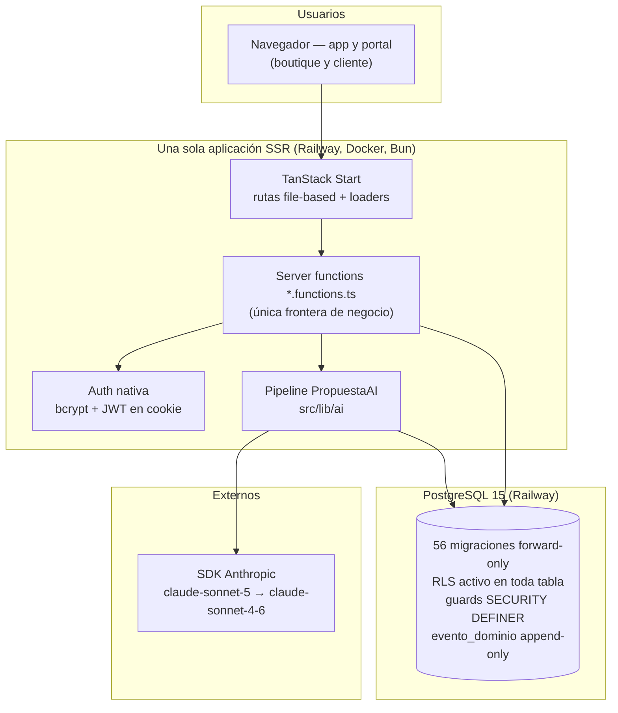
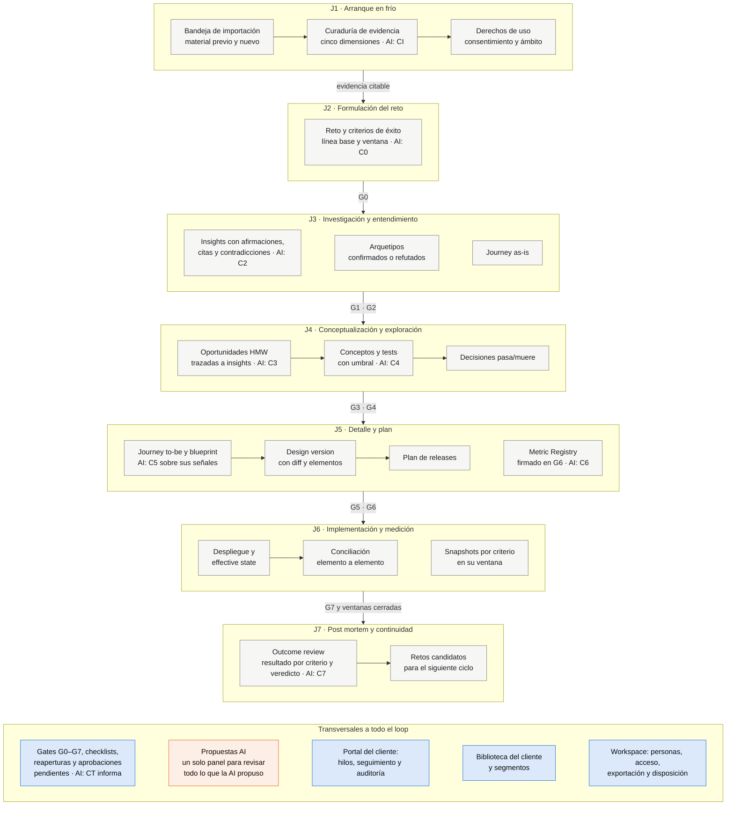
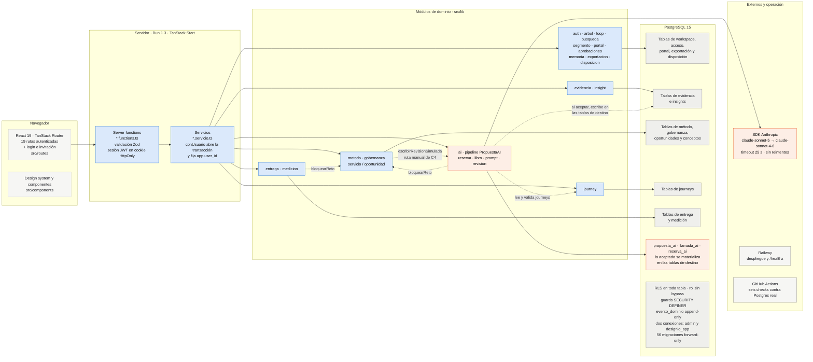

<!-- DESIGNIO-COMPLETE — documento consolidado, canónico y derivado del código y del paquete de diseño. -->
<!-- Fuente: repositorio jtrujillo-ws/designio-app, rama agents (punta 80a976a, 2026-09-06). -->

# Designio — Documentación completa de la plataforma

> Referencia canónica de **Designio**, la plataforma B2B AI-native de service design de Whitespace,
> derivada del código del repositorio `jtrujillo-ws/designio-app` y de su paquete de diseño (`docs/`).
>
> Audiencia: producto, boutique operadora, ingeniería, comercial y revisores de seguridad y
> cumplimiento. Debe dar a cualquier lector una idea clara de **qué es Designio, qué incluye hoy,
> qué está en vuelo y qué está diseñado pero todavía no construido**.
>
> Fuente de verdad: el código en la rama `agents` (integración) a fecha 2026-09-06, punta `80a976a`
> (tras fusionar [#39](https://github.com/jtrujillo-ws/designio-app/pull/39),
> [#43](https://github.com/jtrujillo-ws/designio-app/pull/43),
> [#45](https://github.com/jtrujillo-ws/designio-app/pull/45),
> [#46](https://github.com/jtrujillo-ws/designio-app/pull/46),
> [#47](https://github.com/jtrujillo-ws/designio-app/pull/47),
> [#49](https://github.com/jtrujillo-ws/designio-app/pull/49),
> [#50](https://github.com/jtrujillo-ws/designio-app/pull/50),
> [#51](https://github.com/jtrujillo-ws/designio-app/pull/51),
> [#48](https://github.com/jtrujillo-ws/designio-app/pull/48) y
> [#52](https://github.com/jtrujillo-ws/designio-app/pull/52)). Donde el paquete de diseño y el código
> difieren, **gana el código** y la diferencia se anota en el apéndice 94.
>
> Generado: 2026-09-05 — rama `claude/designio-doc-sequentia-base-j0y13b`.

---

## Cómo está organizado este documento

El documento sigue los **destinos del lateral del workspace 1:1**: cada destino del lateral
(Loop, Bandeja de importación, Aprobaciones, Evidencia, Insights, Biblioteca, Journeys, Versions y
releases, Propuestas AI, Personas, Segmentos, Exportación, Disposición, Auditoría) tiene su capítulo,
y las pantallas de detalle (proyecto, journey, design version) cuelgan del capítulo que las abre; el
destino «Operación de la capa AI» (#52) cuelga del capítulo 10, porque lee el mismo libro. Los
capítulos van en el orden del loop; el lateral, desde #51, agrupa esos mismos destinos por clase
(lo que espera, material y razonamiento, diseño y entrega, gobierno), sin quitar ni añadir ninguno.
Tiene cuatro partes:

1. **Visión general** (`00`) — qué es Designio, para quién, el loop J1–J7, la cadena de trazabilidad,
   la arquitectura funcional y el estado del producto de un vistazo.
2. **Catálogo funcional** (`01`–`17`) — capacidad por capacidad, en lenguaje llano y sin citas
   `archivo:línea`. Cada capítulo cierra con **qué impone la base**, **permisos**, **estado** y
   **fuente** (spec y requisitos `RF-xx.y`). Es la parte más larga, a propósito.
3. **Referencia técnica** (`20`–`26`) — arquitectura, modelo de datos, capa AI, seguridad,
   despliegue, design system y pruebas, con referencias a archivos del repo.
4. **Hoja de ruta y apéndices** (`30`, `90`–`94`) — qué está en vuelo y qué falta, mapa de rutas y
   server functions, glosario, invariantes con su estado de enforcement, cronología de PRs y notas de
   discrepancia entre documentos y código.

### Leyenda de estado

Cada capacidad lleva una de estas marcas. Son las únicas cuatro y se aplican por fila, no por
capítulo:

| Marca | Significado |
|---|---|
| **Construido** | Existe en la rama `agents`, con migración, server function, pantalla y pruebas |
| **En vuelo** | Existe en un PR abierto contra `agents` que todavía no se ha fusionado (hoy: ninguno; #39, #43, #45, #46, #47, #49, #50, #51, #48 y #52 se fusionaron entre el 2026-09-05 y el 2026-09-06) |
| **Diseñado** | Está especificado en el paquete de diseño (`docs/05-specs/`, `docs/06-diseno-tecnico/`) pero no hay código que lo materialice |
| **Fuera del MVP** | Excluido explícitamente por ADR-0014 o por la spec correspondiente |

### Orden de lectura sugerido

| Si eres… | Lee |
|---|---|
| Comercial o sponsor de un cliente | `00`, `01` (Loop), `05` (Proyecto y gates), `09` (Medición), `30` (Hoja de ruta) |
| Lead o diseñador de la boutique | `00` y todo el catálogo `01`–`17` |
| Ingeniería | `20`–`26` y apéndices `90`, `92`, `94` |
| Seguridad y cumplimiento | `00` §Propiedad, `16`, `17`, `23`, apéndice `92` |

---

## Convenciones

- **Workspace** = tenant. Todo objeto del dominio pertenece a exactamente un workspace y el
  `workspace_id` es parte de su identidad (SYS-01). El workspace es **propiedad de la organización
  cliente**; la boutique lo opera; Whitespace es el proveedor tecnológico (ADR-0011).
- **Vocabulario canónico** (invariante I1): etapas 0–7, gates G0–G7, journeys J1–J7 y los términos
  en inglés heredados del prediseño se usan tal cual: *design version, release, effective state,
  outcome review, Metric Registry*. Ningún deal ni cliente los renombra.
- **Códigos**: retos `R-nn`, proyectos `P-nn`, design versions `DV-n`, releases `RL-n`, effective
  states `ES-n`. Los tres últimos los asigna la base al insertar.
- **Roles** de la matriz fija: `sponsor`, `stakeholder`, `admin-cliente`, `lead-boutique`,
  `disenador` y `agente-ai` (este último solo para actores de plataforma, nunca invitable).
- **Capacidades AI**: `C0`–`C7` (una por etapa), `CT` (asistente de gates, transversal) y `CI`
  (extracción de importación). La AI **propone y cita**; el humano **acepta y firma**; nada del
  dominio nace de la AI sin ese acto (I4, SYS-19).
- **Dos conexiones a la base**: la administrativa (migraciones, seed, superusuario) y la de
  aplicación (`designio_app`, rol no privilegiado con RLS activo). El tráfico de la app usa solo la
  segunda.
- Las rutas de la app se citan por su path de TanStack Router (`/app`, `/proyecto/$proyectoId`, …).
  Las server functions por su nombre exportado (`aprobarGateDeProyecto`, …).
- Idioma: todo en español (código, comentarios, UI, commits), salvo el vocabulario canónico.

---

# 00 — Visión general de la plataforma

## Qué es Designio

Designio es el **sistema de registro del método de service design** para el contexto de una
boutique: una aplicación completa, standalone y multi-tenant donde un engagement de meses con un
cliente vive con **estado, estructura, gobernanza multiusuario, trazabilidad hasta resultados y
memoria privada por cliente**. Se construye sobre las capacidades AI-native del stack interno de
Whitespace (ADR-0001) y se vende como **servicio con aplicación**: la boutique ejecuta el
engagement y la plataforma va incluida en el fee (ADR-0002).

La tesis se resume en una regla de backlog (prediseño §1.1): **si una capacidad se replica con un
prompt de 200 palabras en Claude, no es feature, es costo**. Designio construye solo lo que exige
estado, estructura, permisos, medición o memoria gobernada. La generación de artefactos es la capa
comoditizada: se usa, no se cobra.

Cinco ideas sostienen el producto:

| Idea | Qué significa en la plataforma |
|---|---|
| **Método como código** | Etapas 0–7 canónicas en vocabulario y resultados, flexibles en ejecución; gates G0–G7 de **suficiencia** (evidencia, riesgos, decisiones), no de presencia de artefactos; aprobados por humanos con el rol correcto |
| **Árbol simple sobre grafo rico** | El cliente navega Cliente → Servicios → Retos → Proyectos; debajo, el dominio es un grafo n:m que sostiene trazabilidad, consulta y scoping de la AI |
| **Trazabilidad decisión → resultado** | Cadena evidencia → insight → decisión → design version → release → effective state → snapshots → outcome review, navegable en ambos sentidos |
| **Medición temporal y honesta** | Metric Registry firmado en G6, snapshots manuales o CSV, ventana por criterio, post mortem con veredicto de cuatro valores y sin causalidad automática |
| **La AI propone, el humano aprueba** | Pipeline único `PropuestaAI` con citas verificables y lineage; sin AI todo flujo sigue disponible a mano, con una excepción hoy declarada: los criterios de éxito de un reto nuevo solo entran desde la interfaz por C0 mientras J2 no tenga pantalla (ver `05` y `10`) |

Lo que Designio **no es**, por diseño (prediseño §21): no es un canvas ni "un Miro peor"; no es una
plataforma de telemetría u operación continua; no aprende de otros clientes; no presenta revisores
AI como investigación con usuarios; no afirma causalidad sobre KPIs; y no afirma que la boutique sea
dueña del conocimiento del cliente.

## Quién usa Designio

| Rol | Organización | Qué hace en la plataforma | Qué aprueba |
|---|---|---|---|
| **Sponsor** | Cliente | Recorre el árbol, lee el loop, comenta en el portal, recibe seguimiento y post mortem | Gates **G0, G3, G5, G6**; firma el Metric Registry (G6) |
| **Stakeholder** | Cliente | Valida el as-is, participa en tests, comenta; puede ser **propietario del dato** y cargar snapshots | — |
| **Admin del cliente** | Cliente | Gestiona accesos de su organización, define segmentos, da de alta servicios, concede derechos de uso, exporta, acuerda y ejecuta la disposición | Derechos de uso; acuerdos de disposición |
| **Lead de la boutique** | Boutique | Opera el workspace: cura evidencia, formula retos, presenta gates, aprueba design versions, planifica releases, constata effective states, redacta el outcome review | Gates **G1, G2, G4, G7**; design versions; insights; derechos |
| **Diseñador** | Boutique | Cura evidencia, propone y valida insights, edita journeys y blueprints, pide y revisa propuestas AI | Insights |
| **Agente AI** | Plataforma | Propone y cita a través de `PropuestaAI`; informa qué falta en un gate | **Nada**: carece del permiso de aprobar o publicar (SYS-18) |

Un usuario es global (una cuenta por correo) y puede ser miembro de varios workspaces con roles
distintos. El **workspace activo** viaja en la URL (`?ws=`), se puede compartir por enlace y
cambiarlo remonta toda la pantalla para que ningún estado de un cliente se pinte sobre otro.

## El loop del método: siete journeys, ocho etapas, ocho gates

La pantalla principal de Designio es el **loop J1–J7**: el recorrido completo de un engagement,
desde la importación del material previo hasta el post mortem, cuyo cierre alimenta el siguiente
ciclo (J7 → J2 vía retos candidatos). El estado de cada journey **se deriva de los gates** del
proyecto en curso; nunca se declara a mano.

| Journey | Etapas | Gates | Quién aprueba (y quién participa) | Qué se produce | Pantalla donde se trabaja |
|---|---|---|---|---|---|
| **J1** Arranque en frío | pre-0 | Curaduría humana | Lead y diseñador curan; lead o admin del cliente crean el servicio y conceden derechos | Evidencia curada con cinco dimensiones; servicio creado | Bandeja de importación |
| **J2** Formulación del reto | 0 | **G0** | Aprueba el sponsor; el lead formula el reto y sus criterios | Reto con criterios de éxito, línea base y ventana por criterio; perfil del proyecto | Proyecto |
| **J3** Investigación y entendimiento | 1–2 | **G1 G2** | Aprueba el lead (G1 y G2); diseñadores curan y stakeholders aportan material | Evidencia, insights con citas, arquetipos, journey as-is | Insights |
| **J4** Conceptualización y exploración | 3–4 | **G3 G4** | Aprueba el sponsor (G3) y el lead (G4); el equipo explora y prueba | Oportunidades HMW trazables, conceptos, tests, decisiones pasa/muere | Oportunidades |
| **J5** Detalle y plan | 5–6 | **G5 G6** | Aprueba el sponsor (G5 y G6, y firma el Metric Registry); el dueño del dato se compromete con cada KPI | Design version con diff, plan de releases, Metric Registry firmado | Design versions |
| **J6** Implementación y medición | 7 | **G7** | Aprueba el lead (G7, tras constatar); el equipo del cliente implementa y el dueño del dato carga snapshots | Releases, effective state con desviaciones, snapshots | Design versions / Proyecto |
| **J7** Post mortem y continuidad | PM | Veredicto | Lead redacta y completa el review; el sponsor lo recibe y decide la continuidad | Outcome review con veredicto; retos candidatos; suscripción o exportación | Proyecto |

Las etapas y sus gates, tal como el código los fija (`src/lib/metodo/metodo.plantillas.ts`):

| # | Etapa (nombre canónico) | Pregunta que cierra | Gate y quién lo aprueba |
|---|---|---|---|
| 0 | Definición del objeto y del reto | ¿Sobre qué intervenimos y para qué? | **G0** · sponsor |
| 1 | Investigación | ¿Qué evidencia tenemos? | **G1** · lead |
| 2 | Análisis y entendimiento | ¿Qué significa? | **G2** · lead |
| 3 | Conceptualización | ¿Dónde jugamos? | **G3** · sponsor |
| 4 | Exploración de soluciones | ¿Qué podría funcionar? | **G4** · lead |
| 5 | Detalle de solución | ¿Cómo funciona exactamente? | **G5** · sponsor |
| 6 | Plan de implementación | ¿Quién hace qué y cuándo? | **G6** · sponsor |
| 7 | Seguimiento de implementación | ¿Qué se implementó realmente? | **G7** · lead |
| PM | Post mortem | ¿Qué resultado tuvo? | Veredicto del outcome review (cierra reto y proyecto) |

Cada proyecto elige un **perfil** (rápido, estándar, profundo) que gradúa qué ítems del checklist
de cada gate aplican, jamás los nombres ni los resultados canónicos.

## La cadena de trazabilidad

```mermaid
flowchart LR
  EV["Evidencia<br/>(5 dimensiones + derechos)"] --> IN["Insight<br/>(afirmaciones + citas + contradicciones)"]
  IN --> DE["Decisión aprobada<br/>(gate humano)"]
  DE --> DV["Design version<br/>(inmutable al aprobar)"]
  DV --> RL["Release<br/>(parcial, múltiple)"]
  RL --> ES["Effective state<br/>(desviaciones con razón)"]
  ES --> SN["Snapshots<br/>(Metric Registry)"]
  SN --> OR["Outcome review<br/>(veredicto)"]
  OR -.->|retos candidatos| RC["Backlog del servicio"]
  classDef frozen fill:#dbe9fb,stroke:#2a78d6,color:#0b0b0b
  class DE,DV,OR frozen
```



Las aristas de esa cadena hasta el effective state existen hoy en la base como tablas o columnas
con FK; el tramo effective state → snapshots **no** es una FK: los snapshots cuelgan de la entrada
KPI y, a través de ella, del criterio de éxito, y su relación con los releases es temporal (por
fechas), todavía sin marcas de release sobre la serie (ver `09`). Cada eslabón está protegido por
una política RLS y un guard: un insight solo se valida si **cada afirmación no marcada como
hipótesis** cita evidencia con **derechos vigentes** (una hipótesis se valida sin cita, ver `04`);
una decisión solo enlaza insights **validados**; una design version se **congela** al
aprobarse junto al snapshot de su journey; un release declara **exactamente** qué elementos
incluye; una desviación exige **razón**; G7 no pasa con elementos en estado desconocido; y el
outcome review dicta un veredicto del catálogo cerrado.

## Arquitectura funcional de alto nivel



No hay broker de colas, Redis, object storage ni worker aparte: el MVP es **una app desplegable**
(principio P7), los adjuntos viven en Postgres (`bytea`) y los trabajos son síncronos dentro de la
server function. El scheduler in-app y el object storage están diseñados pero no construidos (ver
`30`).

## Los ocho bounded contexts y dónde viven en el código

| Contexto (DDD) | Responsabilidad | Módulos reales en `src/lib/` | Estado |
|---|---|---|---|
| CTX-01 Workspace e Identidad | Tenancy, usuarios, roles, segmentos, portal, auditoría, exportación, disposición, biblioteca del cliente | `auth`, `arbol`, `segmento`, `portal`, `exportacion`, `disposicion`, `memoria`, `aprobaciones`, `busqueda`, `workspace` (schemas) | Construido |
| CTX-02 Evidencia y Conocimiento | Fuentes, evidencia, derechos, bandeja, insights, citas, contradicciones | `evidencia`, `insight` | Construido |
| CTX-03 Método y Gobernanza | Retos, proyectos, etapas, gates, checklists, decisiones, arquetipos, reaperturas | `metodo` (+ `gobernanza`), `loop` | Construido |
| CTX-04 Diseño del Servicio | Servicio, catálogo, journeys tipados, oportunidades, conceptos, design versions | `journey`, `servicio` (oportunidades), design versions en `entrega`; conceptos en `metodo/gobernanza` | Construido; el concepto tiene modelo, políticas y puerta de G4 en la base, y desde #48 sus revisiones simuladas (C4) se leen y se escriben a mano desde la pantalla del proyecto, pero todavía no hay server function ni pantalla que cree o decida el concepto |
| CTX-05 Entrega y Estado Efectivo | Releases, effective state, constataciones, conciliación | `entrega` | Construido |
| CTX-06 Medición e Impacto | Metric Registry, snapshots, outcome review | `medicion` | Construido |
| CTX-07 Biblioteca General | Conocimiento metodológico de la boutique | `biblioteca` (solo schemas; los checklists viven en `metodo.plantillas.ts`) | Diseñado |
| CTX-08 Capacidades AI | PropuestaAI, llamadas, reservas, capacidades | `ai` | Construido para CI, C0, CT, C2, C3, C4, C5, C6, C7 (queda C1) |

## Mapa de módulos y componentes funcionales

Dos mapas, para dos lectores. El **funcional** dice qué hace la plataforma y en qué orden, con el
vocabulario del método y sin nombres de código; el **técnico** dice con qué piezas está construida y
cómo se llaman entre sí. La tabla que los sigue lleva cada componente a su capítulo.

### Mapa funcional: qué hace Designio, siguiendo el loop

Cada fila es un journey del loop, de arriba abajo; dentro de cada fila, lo que esa etapa produce.
Las flechas son el flujo del trabajo entre etapas, con el gate que hay que aprobar para pasar. Las
capacidades AI van anotadas en la pieza sobre la que **proponen** (una persona acepta, corrige o
rechaza; la AI nunca decide). La fila final son las capacidades que acompañan a todo el loop.



Lo que el mapa funcional no dibuja y conviene saber: el post mortem cierra el reto y sus retos
candidatos reabren el ciclo en J2; los criterios de éxito de J2 son el contrato que el Metric
Registry de J5 promete medir y el post mortem de J7 lee; los conceptos y tests de J4 existen en la
base pero todavía sin pantalla (ver `05`); el asistente de gates **CT** informa sobre cualquier gate
y no aprueba ninguno; y el veredicto del post mortem lo dicta el lead, el sponsor lo recibe.

### Mapa de componentes técnicos: con qué está construido

Las capas de la solución, de izquierda a derecha en el sentido de un request. Las flechas sólidas
son llamadas; las punteadas, las dependencias en tiempo de ejecución entre módulos de dominio y la
escritura de la AI en las tablas de destino, que solo ocurre cuando una persona acepta. La
propiedad de las tablas es **lógica**: cada módulo es dueño de las suyas, pero hay escritores
cruzados y la guía de abajo los enumera.



Guía de lectura del mapa técnico. La **propiedad de las tablas** es lógica y por módulo, y los
datos se relacionan por identidad (ids y FKs compuestas con `workspace_id`), nunca por composición
de objetos ajenos; pero quien busque **quién escribe en una tabla** debe contar tres cosas más: al
aceptar una propuesta, `ai.servicio.ts` inserta directamente en `evidencia` y `derecho_uso` (CI),
`criterio_exito` (C0), `insight`, `afirmacion`, `cita` y `contradiccion` (C2), `oportunidad` y
`oportunidad_insight` (C3), `entrada_kpi` (C6) y `revision_simulada`, `hallazgo_simulado`,
`hallazgo_simulado_evidencia` y `pregunta_de_test` (C4, por `escribirRevisionSimulada`), y actualiza
`outcome_review` (C7); todos los servicios insertan en `evento_dominio`; y las proyecciones
(Aprobaciones, Biblioteca, la exportación bajo RLS) leen lo que otros poseen. En **tiempo de
ejecución** hay seis dependencias entre módulos de dominio: `ai` llama a `bloquearReto` de `metodo`,
a `leerJourneyCompleto`, `leerJourneysCompletos` y `validarJourney` de `journey`, y a
`patronDeBusqueda` de `busqueda` (una función exportada desde su archivo de esquemas, con la que el
panel filtra propuestas por texto: cambiar el escapado de la búsqueda cambia ese filtro); `metodo`
(gobernanza) llama en sentido contrario a `escribirRevisionSimulada` de `ai` para la ruta manual de
C4 y valida con `ContenidoRevisionSimuladaSchema` de `ai.contenido`; `entrega` llama a
`bloquearReto` de `metodo`; y `loop` lee las aprobaciones pendientes con `gatesAbiertos`,
`gatesDelRol`, `conteoDeOtrosPendientes` y `rolEnWorkspace` de `aprobaciones` (los dos van en la
misma caja del diagrama). Además, todos los servicios llaman a `exigirCuentaActiva` de `auth`; dos módulos
reutilizan la sanitización de `evidencia` (`segmento` y `exportacion`); y las **constantes de rol**
viajan entre módulos como comportamiento, no solo como tipo: `ROLES_CURADORES` (definida en
`evidencia`) decide en `ai` quién pide una generación y en `loop` a quién se le promueve la bandeja;
`ROLES_DERECHOS` (`evidencia`) fija en `aprobaciones` quién decide derechos pendientes; y
`ROLES_AUDITORIA` (`portal`) y `ROLES_DISPOSICION` (`disposicion`) deciden en `loop` qué destinos
ve cada rol y con qué rótulo, y `ROLES_OBSERVABILIDAD_AI` (definida en `ai.roles.ts`, un módulo sin
Zod, como alias de `ROLES_AUDITORIA`) decide en `loop` quién ve la operación de la capa AI: desde #52
un censo del grafo de módulos impide que el lateral vuelva a alcanzar `ai.schemas` o `ai.contenido`.
Cambiar una de esas listas cambia esos módulos. El resto de esquemas
Zod y tipos se importan libremente entre módulos como contratos compartidos. El detalle de tablas por
contexto está en `21` y el de la capa AI en `22`.

### Componentes funcionales, de la pantalla a la tabla

| Componente funcional | Pantalla | Módulo | Tablas principales | Capítulo |
|---|---|---|---|---|
| Loop del método, árbol, buscador, alta de servicio | `/app` | `arbol`, `loop`, `busqueda` | `servicio`, `reto`, `proyecto`, `gate_instancia` | 01 |
| Bandeja de importación y curaduría | `/importacion` | `evidencia` | `item_importacion`, `archivo_importado`, `consentimiento_item`, `evidencia` | 02 |
| Evidencia y derechos de uso | `/evidencia` | `evidencia` | `evidencia`, `derecho_uso`, `fuente` | 03 |
| Insights, citas y contradicciones | `/insights` | `insight` | `insight`, `afirmacion`, `cita`, `contradiccion` | 04 |
| Retos, criterios, etapas, gates, checklist | `/proyecto/$id` | `metodo` | `reto`, `criterio_exito`, `etapa_instancia`, `gate_instancia`, `checklist_item` | 05 |
| Decisiones, arquetipos, reaperturas, conceptos y sus revisiones simuladas | `/proyecto/$id` | `metodo/gobernanza` | `decision`, `decision_insight`, `arquetipo`, `reapertura_etapa`, `concepto`, `concepto_evidencia` (solo lectura desde la pantalla), `revision_simulada`, `hallazgo_simulado`, `hallazgo_simulado_evidencia`, `pregunta_de_test` | 05 |
| Portafolio de oportunidades HMW | `/oportunidades` | `servicio/oportunidad` | `oportunidad`, `oportunidad_insight` | 06 |
| Journeys, blueprints, validación, snapshot | `/journeys`, `/journey/$id` | `journey` | `journey`, `journey_nodo`, `journey_arista`, `journey_nodo_evidencia`, `journey_snapshot`, `catalogo_journey` | 07 |
| Design versions, diff, releases, effective state, conciliación | `/design-versions`, `/design-version/$id` | `entrega` | `design_version`, `elemento_cambio`, `release`, `release_elemento`, `effective_state`, `constatacion` | 08 |
| Metric Registry, snapshots, outcome review | `/proyecto/$id` (sección medición) | `medicion` | `metric_registry`, `entrada_kpi`, `snapshot`, `outcome_review`, `resultado_criterio` | 09 |
| Propuestas AI (CI, C0, CT, C2, C3, C4, C5, C6, C7) | `/propuestas` | `ai` | `propuesta_ai`, `llamada_ai`, `reserva_ai` | 10 |
| Operación de la capa AI (coste, latencia, error y aceptación por capacidad) | `/observabilidad-ai` | `ai` (`ai.observabilidad.ts`) | `llamada_ai`, `reserva_ai`, `propuesta_ai` (solo lectura) | 10 |
| Aprobaciones pendientes por rol | `/aprobaciones` | `aprobaciones` (proyección) | lee `gate_instancia`, `derecho_uso`, `insight`, `design_version` | 11 |
| Hilos del portal y auditoría | `/proyecto/$id`, `/design-version/$id`, `/auditoria` | `portal` | `hilo_comentario`, `comentario`, `evento_dominio` | 12 |
| Biblioteca del cliente | `/biblioteca` | `memoria` (proyección) | lee `arquetipo`, `insight`, `decision`, `reto`, `segmento` | 13 |
| Segmentos | `/segmentos` | `segmento` | `segmento`, `arquetipo_segmento`, `evidencia_segmento` | 14 |
| Acceso, sesión, invitaciones, miembros | `/login`, `/invitacion/$token`, `/personas` | `auth` | `usuario`, `miembro` | 15 |
| Exportación (archivo y entregable) | `/exportacion` | `exportacion` | todo el catálogo; `exportacion_registro` | 16 |
| Disposición acordada | `/disposicion` | `disposicion` | `acuerdo_disposicion`, `constancia_disposicion`, `workspace` (lápida) | 17 |

## Seis cosas que distinguen a Designio de una herramienta genérica de diseño

1. **Los gates son de suficiencia y los decide un humano**, y la base sabe decir qué falta
   (`gate_faltas_para_aprobar`): no hay teatro documental ni auto-aprobación.
2. **Los derechos de uso viajan con la evidencia y bloquean aguas abajo**: una entrevista sin
   consentimiento existe, se ve, y no se puede citar en un insight, en un checklist, en un snapshot
   de journey ni exportar como entregable, con el motivo a la vista.
3. **El diff es un objeto, no una diapositiva**: design version, release, effective state y
   conciliación son cuatro objetos encadenados y el diff se calcula en una sola sentencia.
4. **El journey es un grafo tipado**, no un dibujo: Mermaid, tabla y carriles son tres lecturas de la
   misma proyección; la validación emite nueve señales y no puede discrepar del diagrama.
5. **La medición termina en un veredicto honesto**: cuatro valores, "no concluyente" incluido; los
   snapshots son append-only y la ventana la fija el calendario de la base, no quien llama.
6. **La AI deja libro de costos y lineage**: cada llamada al proveedor es una fila con su desenlace,
   tokens, costo y modelo; cada propuesta conserva su contenido original aunque se corrija; sin
   proveedor la plataforma funciona igual y lo dice (con la excepción de J2 anotada arriba).

## Estado del producto de un vistazo (2026-09-06)

| Bloque | Construido | En vuelo | Diseñado, pendiente |
|---|---|---|---|
| Workspace, auth, roles, portal, auditoría | ✔ | | Correo saliente real (hoy el enlace de invitación se muestra en pantalla), notificaciones |
| Árbol, servicios, segmentos, búsqueda, biblioteca del cliente | ✔ | | Servicios afectados adicionales de un reto en la UI |
| Bandeja, evidencia, adjuntos, derechos de uso | ✔ | | Escaneo de malware, object storage, transcripción y diarización (C1) |
| Insights, citas, contradicciones | ✔ | | Clustering (fuera del MVP) |
| Método: proyectos, etapas, gates, checklists, decisiones, arquetipos, reaperturas | ✔ | | **Pantalla de J2**: crear un reto, definir criterios a mano y activarlo con perfil existen como server functions pero ninguna pantalla las llama todavía (los criterios entran hoy por C0 o por seed). **Pantalla de la etapa 4**: el concepto, su evidencia de test, su umbral, su N/A y su veredicto existen en la base con políticas y puerta de G4 (#46), pero ninguna server function ni pantalla los crea o decide; mientras no exista, G4 aprueba como antes cuando el reto no tiene conceptos, y una decisión `pasa-muere` no puede registrarse desde la interfaz porque exige elegir un concepto. Las **revisiones simuladas** de cada concepto (C4, #48) sí se leen y se escriben a mano desde la etapa 4 |
| Oportunidades HMW (con borrador AI de preguntas trazadas a insights, C3) y G3 sobre el portafolio | ✔ | | Serializar la carrera entre validar un insight y persistir un lote de C3 (deuda anotada en #45; C2 la comparte) |
| Journeys, catálogo, Mermaid, carriles, validación, snapshot | ✔ | | Vista timeline y por actor |
| Design versions, elementos, diff, releases, effective state, conciliación, G7 | ✔ | | Detección AI de desviaciones como discrepancias propuestas (RF-06.8); C7 solo lee las ya registradas dentro del borrador del post mortem (discrepancia 20) |
| Metric Registry (con borrador AI de entradas KPI, C6), snapshots, outcome review (con borrador AI de la narrativa, C7), veredicto | ✔ | | Recordatorios por cadencia, series ancladas a fechas de release |
| Pipeline PropuestaAI, presupuesto, degradación, consentimiento, operación de la capa AI (RF-08.9) | ✔ (CI, C0, CT, C2, C3, C4, C5, C6, C7; cuadro de coste, latencia, error y aceptación por capacidad) | | C1 (transcripción), plan de releases asistido; BYOAI con secret manager; evals de grounding programadas |
| Exportación (archivo y entregable), disposición acordada | ✔ | | Exportación de adjuntos por object storage |
| Despliegue Railway, CI de seis checks, suite authz contra Postgres real | ✔ | | E2E Playwright, scheduler y cron, backups verificados |

El detalle de cada fila está en el capítulo correspondiente y en la hoja de ruta (`30`).

---

# Catálogo funcional

Recorre los destinos del lateral del workspace en el orden del loop. Cada capítulo describe qué se puede hacer, qué impone la
base (porque en Designio "lo que la base rechaza, la pantalla no lo ofrece"), quién puede hacerlo, en
qué estado está y de qué spec sale.

---

# 01 — Loop del método (pantalla principal)

**Ruta**: `/app` (la raíz `/` redirige aquí; sin sesión, a `/login`). **Estado: Construido.**

Es la pantalla de entrada del workspace y la que da nombre al design system. Sigue la "dirección 3a"
del handoff: un **lateral en negro violeta** que navega el árbol y un contenido que narra el loop.

## Lo que se ve

| Zona | Contenido |
|---|---|
| **Lateral** | Marca tipográfica `designio.`; selector de **workspace activo** (una fila por membresía; cambiarlo remonta la pantalla); árbol **Cliente → Servicios → Retos → Proyectos** con el estado de cada reto pintado con el color del journey en que está (`J2`… `J7`, `cerrado`, o punteado para candidatos nacidos del post mortem); fila «+ Nuevo servicio» que abre un formulario en el sitio; y los destinos del workspace agrupados por clase desde [#51](https://github.com/jtrujillo-ws/designio-app/pull/51): **«Te espera»** arriba del árbol con exactamente los destinos que tienen contador (Aprobaciones con lo pendiente del rol, Bandeja con lo sin curar; a cero el bloque no existe y la fila vuelve a su estante), dos estantes de consulta siempre visibles, **«Material y razonamiento»** (Bandeja, Aprobaciones cuando no esperan, Evidencia, Insights, Oportunidades HMW, Segmentos) y **«Diseño y entrega»** (Journeys, Versions y releases, Propuestas AI con el sufijo «propone», Biblioteca), y **«Gobierno del workspace»** plegado en una fila que cuenta lo que el rol ve (Personas, Exportación, Disposición y, para los roles que las ven, Auditoría y, desde #52, Operación de la capa AI), con una nota que nombra solo esos destinos y la preferencia de abierto o cerrado recordada en el navegador por usuario y workspace |
| **Topbar** | Buscador del workspace (busca de verdad: servicios, retos, proyectos, journeys, design versions, evidencia e insights, hasta 5 por clase y 20 en total, mínimo 2 caracteres) y salida de sesión. No repite marca, cliente ni usuario: esos son del lateral |
| **Cabecera de arco** | Servicio seleccionado (estado de ruta `?servicio=`), reto y proyecto actuales, cifras del reto (criterios, gates cerrados, release vivo) y la barra del arco J1→J7 |
| **Spotlight** | El journey **en curso** con su descripción, el gate abierto y el enlace a la pantalla donde se trabaja; con el loop cerrado enseña J7 hecho |
| **Te toca a ti** | Lo que espera **a quien mira**, según su rol: gates que puede aprobar, derechos pendientes, insights por validar, design versions en borrador. Una aprobación que espera al sponsor no aparece como tarea del lead |
| **Siete tarjetas J1–J7** | Estado (hecho, en curso, próximo) derivado de los gates; cada tarjeta enlaza a su pantalla; si el servicio aún no tiene proyecto, la tarjeta lo dice en vez de fingir un enlace |

## Cómo se agrupa el lateral

Regla pura (`src/lib/loop/lateral.ts`), compartida entre cliente y servidor y probada sin pintar
nada: la bandeja solo cuenta para quien la cura (lead y diseñador), así que a un sponsor no se le
promueve a «Te espera»; el filtrado por rol es el de siempre (Auditoría solo para
`ROLES_AUDITORIA`, Operación de la capa AI solo para `ROLES_OBSERVABILIDAD_AI`, que es la misma lista; Disposición se enseña a todos y solo cambia el rótulo a «Constancias que
conservas» para quien no decide la disposición); ningún destino se pierde ni se repite al agrupar.
En el riel estrecho cada fila es su abreviatura de tres letras y los estantes los separa un
hairline. El árbol pinta sus cuatro niveles (ADR-0003): cada proyecto del reto cuelga como subfila
con el proyecto actual destacado. Fuente: handoff «Loop · impacto visual», turno 4a.

## Cómo se deriva el estado del loop

Regla pura (`src/lib/loop/loop-estado.ts`), probada sin base de datos:

- **J1** está hecho cuando existe el servicio y hay evidencia curada (o algún gate ya aprobado).
- **J2** ⇐ G0. **J3** ⇐ G1 y G2. **J4** ⇐ G3 y G4. **J5** ⇐ G5 y G6.
- **J6** ⇐ G7 **y** el post mortem ya se puede abrir (reto en medición, registry firmado, ninguna
  ventana abierta). Entre G7 y ese momento, J7 no puede empezar y no se marca en curso.
- **J7** ⇐ outcome review completado.
- El primer journey no hecho es el que está en curso; los siguientes son próximos.

El **proyecto actual** de un servicio es el del primer reto activo o en medición con un proyecto que
no esté pausado ni cerrado; si no hay ninguno, el primero que exista. La cabecera, el spotlight y la
marca del reto en el árbol eligen con la misma función.

## Alta de servicio desde la app

Quien arranca el engagement (lead de la boutique o admin del cliente) crea el servicio desde la
fila «+ Nuevo servicio» del lateral: nombre y descripción, activo y firmado por quien lo crea. La
política `servicio_insert` lo impone en la base.

## Permisos

Todo miembro ve el loop de su workspace. Los contadores y «Te toca a ti» se calculan por rol. Solo
lead y admin del cliente dan de alta servicios.

## Fuente

SPEC-02 (árbol como proyección, RF-02.1/02.2), SPEC-04 (estado por gates), handoff del design
system («Loop · impacto visual», dirección 3a). PRs [#32](https://github.com/jtrujillo-ws/designio-app/pull/32),
[#36](https://github.com/jtrujillo-ws/designio-app/pull/36), [#37](https://github.com/jtrujillo-ws/designio-app/pull/37), [#38](https://github.com/jtrujillo-ws/designio-app/pull/38).

---

# 02 — Bandeja de importación (J1, arranque en frío)

**Ruta**: `/importacion`. **Estado: Construido** (versión manual con extracción AI opcional).

Resuelve el arranque en frío: el material previo del cliente entra por la bandeja, y **nada es
evidencia hasta que una persona lo aprueba** con sus cinco dimensiones (SYS-16).

## Lo que se puede hacer

- **Registrar un ítem**: pegar texto (hasta 100.000 caracteres) o una referencia, con título y tipo
  de fuente (`documento`, `entrevista`, `observacion`, `dataset`, `enlace`, `nota`).
- **Adjuntar los originales**: hasta 10 archivos por ítem, de 5 MiB cada uno, guardados en la base
  con nombre saneado y extensión coherente con su tipo MIME; descarga con proxy de bytes desde la
  app, nunca por URL pública. (El tope de 25 MiB es otro: es lo que cabe en un paquete de
  exportación, ver `16`.)
- **Registrar consentimiento** de las personas cuando el tipo de fuente lo exige (entrevista,
  observación): versionado, con la marca de si autoriza el procesamiento externo por AI. Sin ese
  consentimiento no se puede pedir la extracción AI del ítem (RF-09.5).
- **Pedir a la AI una extracción propuesta (CI)**: candidatos a evidencia con título, resumen,
  recolección, fecha con su localización o el motivo de que no haya, confianza, confidencialidad,
  si describe el estado actual y hasta seis citas literales al material. Se revisan en Propuestas AI.
- **Curar**: aprobar con las cinco dimensiones (proveniencia, método, calidad, derechos, lineage) o
  rechazar. La aprobación crea la evidencia **y su registro de derechos** en la misma transacción.
- La **cola de revisión** ordena lo más dudoso primero (confianza ascendente) y pagina por keyset.

## Qué impone la base

- Todo texto importado se trata como **no confiable**: se rechazan caracteres de control y
  *overrides* bidireccionales (`texto_importado_limpio`, `sin_overrides_bidi`); lo heredado sucio
  tiene salida de saneado.
- Un ítem aprobado o rechazado **se sella**: no se le adjuntan ni retiran archivos después.
- La evidencia nace **siempre** con derechos `pendiente`: la curaduría no concede nada y no se
  fabrica consentimiento a partir de metadatos. Conceder o denegar es un acto aparte, de lead o admin
  del cliente, en la pantalla de evidencia.
- El escaneo de malware y el object storage (RF-09.8, diseño técnico) están **diseñados** y no
  construidos: hoy el adjunto vive en Postgres y no se escanea.

## Permisos

**Registrar** un ítem lo puede hacer cualquier miembro del workspace (la política `item_insert`
admite todo rol salvo `agente-ai`, y el formulario se muestra a todos); **curar** (aprobar o
rechazar) solo los **roles curadores**: lead de la boutique y diseñador. La ruta la abre
cualquier miembro, pero las **filas** de la bandeja las filtra RLS (`item_select`): un miembro ve
los ítems que él mismo registró y los que ya tienen evidencia cuyo material puede ver
(`material_evidencia_visible`); un sponsor o stakeholder no ve, por tanto, la cola pendiente del
workspace, solo sus propios envíos. El contenido del material sigue además la regla de derechos
(`material_item_visible`).

## Fuente

SPEC-03 (RF-03.1 a RF-03.5), SPEC-09 (RF-09.5, RF-09.7). PRs [#6](https://github.com/jtrujillo-ws/designio-app/pull/6),
[#15](https://github.com/jtrujillo-ws/designio-app/pull/15), [#22](https://github.com/jtrujillo-ws/designio-app/pull/22).

---

# 03 — Evidencia y derechos de uso

**Ruta**: `/evidencia` (admite `?destacar=<id>` para aterrizar en una evidencia concreta).
**Estado: Construido.**

La evidencia curada del workspace y **el acto de conceder o denegar sus derechos de uso**. Los
derechos nacen pendientes; hasta que alguien los concede con una base documental, la evidencia
existe pero **no se cita en un gate ni sale en un entregable** (SYS-14).

## Modelo de evidencia

| Eje | Campos registrados |
|---|---|
| Proveniencia | Tipo de fuente, **fecha calendárica obligatoria** (`DimensionesEvidenciaSchema` y el formulario de curaduría la exigen), localización. Solo el **borrador de CI** puede traer la fecha ausente con el motivo de no haberla encontrado en el material; aceptarlo exige que el revisor la complete al corregir, así que ninguna evidencia curada persiste una ausencia de fecha |
| Método | Método de recolección, directa o derivada, segmentos cubiertos |
| Calidad | Confianza (alta, media, baja), evidencias que la corroboran, evidencias que la contradicen |
| Derechos | Consentimiento, confidencialidad (interna, cliente, restringida) y el registro `derecho_uso` |
| Lineage | Modelo y versión de prompt, solo cuando una transformación AI la tocó |

## Derechos de uso

- Estados: `pendiente` → `concedido` o `denegado`. Un derecho concedido se puede **revocar** (pasa
  a `denegado`, con su base documental) y uno denegado se puede **volver a conceder**: los derechos
  no son de sentido único. Lo que no existe es la vuelta a `pendiente`, que significa
  «nadie ha decidido todavía» y solo se nace en él.
- Ámbitos: `interno`, `cliente`, `publico`. Cada uso aguas abajo pregunta por el ámbito que necesita.
- **Vigencia temporal**: los derechos pueden vencer, y todo predicado de uso mira la fecha **de la
  base**, no la del proceso.
- La **base documental** del permiso la escribe quien lo concede; nadie la deduce.
- Deciden derechos el lead de la boutique y el admin del cliente.

## Dónde bloquean los derechos

Citar en un insight, validar un insight, enlazar evidencia a un nodo del journey, congelar el
snapshot del journey, sostener un arquetipo, cumplir un ítem de checklist, aprobar un gate que se
apoya en ese razonamiento, y exportar en ámbito entregable. En todos los casos el bloqueo **se
explica** con la dimensión que falta (`evidencia_motivo_bloqueo`), y la lista de superficies de
enlace se censa en pruebas: ninguna tabla que referencie evidencia queda "sin guard ni motivo".

## Permisos

Todo miembro ve la lista. El material (texto y adjunto) solo se muestra si `material_evidencia_visible`
lo permite. Conceden o deniegan lead y admin del cliente.

## Fuente

SPEC-03 (RF-03.6, RF-03.10), ADR-0010. PRs [#15](https://github.com/jtrujillo-ws/designio-app/pull/15) y la serie de
migraciones «derechos-*» (2026-09-02).

---

# 04 — Insights y citas

**Ruta**: `/insights` (admite `?destacar=<id>`). **Estado: Construido.**

Un insight es una interpretación sostenida por **afirmaciones**, cada una con **citas verificables**
a evidencia, y con las **contradicciones** a la vista, igual de grandes que el apoyo.

## Lo que se puede hacer

- **Proponer** un insight (título, resumen) — a mano, o aceptando una propuesta C2.
- **Afirmar**: añadir afirmaciones, marcando cuáles son **hipótesis** (extrapolación) y cuáles no.
- **Citar** evidencia por afirmación: evidencia, fragmento literal y localización exacta (página,
  párrafo u offset temporal).
- **Anotar contradicciones**: evidencia que va en contra del insight, con descripción; una por
  evidencia.
- **Validar** el insight propuesto (lead o diseñador): pasa de `propuesto` a `validado`. No existe
  un estado de descarte: un insight que no se sostiene simplemente no se valida y queda como
  propuesto (el CHECK de `insight.estado` admite solo esos dos valores).

## Qué impone la base

- No se valida un insight sin afirmaciones, ni con una afirmación **no marcada como hipótesis**
  que carezca de cita **con derechos vigentes** para el ámbito (`insight_validar_guard`, `validar
  mira derechos vivos`). **Excepción declarada**: la exigencia es por afirmación, así que un insight
  cuyas afirmaciones son todas hipótesis se valida sin ninguna cita; la pantalla habilita «Validar»
  con la misma regla. SYS-15 («insight validado con ≥1 cita») queda por tanto **parcial** (apéndice
  92).
- Solo un insight **validado** puede enlazarse a una decisión, a una oportunidad o cumplir un
  checklist; un insight propuesto "bien citado" no atraviesa el gate.
- El insight es inmutable en su texto tras validarse; su **respaldo** no lo es: si los derechos de
  una cita vencen, el razonamiento que lo usa deja de ser usable y el gate lo dice.
- Si nació de una propuesta AI, `propuesta_ai_id` guarda el lineage.

## Permisos

Miembros leen y **cualquier miembro registra contradicciones**, también contra un insight ya
validado: la política `contradiccion_insert` solo exige membresía y la pantalla ofrece «Registrar
contradicción» sin mirar el rol (RF-03.9: el descubrimiento incómodo llega tarde por definición y
nunca se oculta ni bloquea). Proponen, afirman, citan y validan lead y diseñador.

## Fuente

SPEC-03 (RF-03.9), SYS-15. PRs [#10](https://github.com/jtrujillo-ws/designio-app/pull/10), [#35](https://github.com/jtrujillo-ws/designio-app/pull/35).

---

# 05 — Proyecto: método, gates, gobernanza y medición

**Ruta**: `/proyecto/$proyectoId`. **Estado: Construido.** Es la pantalla donde se ejecuta el método
de un reto: etapas 0–7, gates G0–G7 con su checklist, decisiones, arquetipos, reaperturas, y el
seguimiento de impacto del reto (Metric Registry y post mortem) **dentro del proyecto**, no en un
módulo aparte (ADR-0007).

## Retos y criterios de éxito (etapa 0, J2)

- Un **reto** cuelga de un servicio ancla, tiene código `R-nn`, título, descripción, origen
  (`post-mortem`, `hallazgo-medicion`, `peticion-cliente`), métrica objetivo declarada y estado
  (`candidato` → `activo` → `en-medicion` → `cerrado`, o `archivado`).
- Se crea como **candidato** (lead o diseñador) y se **activa con un perfil**, lo que abre un proyecto `P-nn`
  con sus ocho etapas, ocho gates y el checklist del perfil. **Estado: construido en servidor, sin
  pantalla**: las server functions `crearRetoCandidato`, `definirCriterio`, `editarCriterioDeReto` y
  `activarRetoConPerfil` existen y están probadas, pero ninguna ruta ni componente las llama
  todavía; hoy un reto y su proyecto nacen del seed o de una llamada directa, y la pantalla del
  proyecto solo muestra los criterios existentes. Es el hueco visible del flujo J2 (ver `30`).
- Cada **criterio de éxito** registra KPI, definición, línea base (valor y fecha), objetivo y
  **ventana de medición en días**. Desde la app los criterios entran hoy aceptando propuestas de la
  AI (C0); la definición y edición manual existen como server functions sin pantalla.
- **G0 congela los criterios**: después de aprobado no se editan ni se añaden (`reto_admite_criterios`);
  el cambio es una reapertura trazada de la etapa 0.

## Etapas, gates y checklist

- Las ocho etapas existen siempre, con nombre canónico atado por CHECK; su estado es informativo. El
  estado que gobierna es el de los **gates**.
- Cada gate tiene un **rol aprobador** fijo (sponsor para G0/G3/G5/G6; lead para el resto) y un
  **checklist de suficiencia** instanciado según el perfil. Un ítem admite exactamente tres estados:
  **cumplido** (enlazando un objeto real: evidencia curada, insight validado o decisión vigente),
  **pendiente** o **N/A** con justificación y aprobación. No hay cuarto estado (SYS-11).
- **Aprobar un gate** exige checklist sin pendientes, el rol correcto, y que la base no encuentre
  faltas: `gate_faltas_para_aprobar` devuelve la lista de motivos con código (criterios sin ventana
  en G0, razonamiento sin respaldo, concepto que avanza sin evidencia de test o sin umbral alcanzado
  en G4, design version sin congelar en G5, registry sin firmar en G6, conciliación incompleta en
  G7…). La pantalla **invoca** ese predicado en lugar de reproducirlo, así
  que el botón no se ofrece cuando la base lo va a rechazar, y no se esconde cuando sí procedía.
- **G5 certifica vigencia, no existencia**: si un derecho venció entre enlazar y aprobar, G5 no pasa.
- **G6** exige el Metric Registry firmado y pasa el proyecto a `en-implementacion`. La columna
  `aprobado_sin_registry` es solo una **marca de compatibilidad** para los G6 que ya estaban
  aprobados cuando llegó la exigencia: los gates nuevos nacen con ella en falso y el rol de
  aplicación no puede cambiarla. **G7** exige conciliación
  completa; aprobarlo cierra el gate y su etapa, y es un acto posterior del lead, **abrir la
  medición** (ver `09`), el que pasa reto y proyectos a `en-medicion` y exige G7 aprobado. Los gates de un proyecto que ya firmó G6 o G7 no se reevalúan: el ciclo siguiente va en
  otro proyecto.
- El **asistente de gates (CT)** informa qué falta citando los ítems del checklist por su id; es
  informativo y **no puede aprobar** (RF-08.4, SYS-18).

## Gobernanza: decisiones, arquetipos, reaperturas

- **Decisiones** (`pasa-muere`, `diseno`, `alcance`, `otra`) se aprueban en un gate y enlazan los
  insights validados que las sostienen. Una decisión es inmutable; si una reapertura la afecta pasa a
  **revisión** y hay que **revalidarla**. Desde #46 una decisión `pasa-muere` **decide sobre un
  concepto** del reto (`decision.concepto_id`, obligatorio para ese tipo y prohibido para los demás;
  un guard comprueba que el concepto sea del reto del proyecto); el formulario ofrece los conceptos
  del reto y, si no hay ninguno, lo dice y no deja registrarla.
- **Arquetipos** del reto: definición, mapeo n:m a segmentos, evidencia enlazada y veredicto
  `hipotesis` → `confirmado` o `refutado` con razón. La evidencia es obligatoria para **confirmar**
  (`arquetipo_veredicto_guard`), no para refutar: un arquetipo refutado sin evidencia es válido.
  G2 exige que ningún arquetipo siga en hipótesis y que los **confirmados** conserven evidencia con
  derechos vigentes; un arquetipo refutado dispara una señal en el journey que lo use.
- **Reabrir una etapa** registra motivo y cambios, marca los insights afectados y las decisiones
  aguas abajo, y nunca borra historia (SYS-10). No se reabre un proyecto cerrado.

## Conceptos y resultados de test (etapa 4, G4)

**Estado: construido en la base, sin pantalla** — PR [#46](https://github.com/jtrujillo-ws/designio-app/pull/46)
«El concepto existe, y no avanza sin haberse probado». La etapa 4 era la única sin su objeto; el PR
añade las tablas `concepto` y `concepto_evidencia`, sus políticas, sus guards y la puerta de G4, y las
mete en el catálogo de exportación. **Ninguna server function ni pantalla** crea un concepto, enlaza
su evidencia de test, declara su umbral, registra su lectura, aprueba su N/A ni dicta su veredicto:
hoy todo eso solo se ejerce por SQL bajo las mismas políticas. La pantalla del proyecto solo **lee**
los conceptos para el selector de la decisión `pasa-muere`.

- **Modelo**: título único por reto, descripción, estado `candidato` → `pasa` · `muere` (sin vuelta
  atrás; el que muere exige razón), umbral de test declarado, lectura del test, afirmación de si la
  lectura alcanza el umbral, y N/A con justificación y aprobador. La evidencia de test se enlaza por
  `concepto_evidencia` (los «resultados de test» son evidencia: observaciones y entrevistas de la
  sesión).
- **SYS-13 entero**: el umbral se declara **antes** de la prueba y se congela en cuanto hay evidencia
  enlazada; la lectura se registra después y quien la lee **afirma** si alcanzó el listón (la base no
  compara los dos textos: un umbral puede ser cualitativo); un concepto solo **pasa** con N/A aprobada
  o con umbral declarado y lectura que lo alcanza; la N/A **excluye** prueba registrada en los tres
  sentidos y la firma el rol aprobador de G4 (hoy el lead), leído del propio gate.
- **G4 mira los conceptos que avanzan**: `gate_faltas_para_aprobar` nombra el primer concepto en
  `pasa` sin evidencia de test ni N/A, el que tiene evidencia sin derechos vigentes para el cliente
  (DR001, comprobado vivo al firmar, como G2 con los arquetipos) y el que avanza sin umbral alcanzado.
  Sin conceptos, G4 se comporta como antes.
- **Ventana** (`reto_admite_conceptos`): se escribe mientras el reto está `candidato` o `activo` y su
  G4 no está aprobado con la etapa 4 cerrada; reabrir la etapa vuelve a abrirla. Los guards toman el
  candado del reto y releen la ventana bajo él.
- Lo que el veredicto congela es lo que afirmó: razón, umbral, lectura y afirmación son inmutables
  tras decidir; el expediente de evidencia sigue editable hasta que G4 lo mira.

### Revisiones simuladas de los conceptos (C4)

**Estado: Construido** — PR [#48](https://github.com/jtrujillo-ws/designio-app/pull/48) «Los revisores AI son simulación, y lo siguen siendo después de
aceptarlos». Los **arquetipos del reto actúan como lentes** sobre un concepto candidato: qué
fricciones, exclusiones y riesgos le encuentra cada perfil, y qué **preguntas** hay que llevar al
test con personas reales. Es lo único que una simulación le entrega a la etapa 4 (RF-08.2), y la
pantalla del proyecto lo pinta en un bloque propio de la sección de gobernanza, **sin puerta de
rol para leer** (leer no es decidir), con cada revisión encabezada por su lente y su estado, la
marca de simulación en cada hallazgo, la procedencia (propuesta AI o escrita a mano) y las citas
con su pasaje o, si el derecho de uso se retiró después, solo el título y el motivo.

- **Modelo**: `revision_simulada` (concepto, arquetipo, síntesis) con `hallazgo_simulado` (título,
  descripción, `es_hipotesis`), `hallazgo_simulado_evidencia` (cita con `fragmento` y
  `localizacion` obligatorios) y `pregunta_de_test` (pregunta, escenario, hallazgo del que nace).
- **SYS-20, escrito donde se comprueba**: `es_simulacion` con `check (es_simulacion)` y **sin
  política ni grant de UPDATE** en las cuatro tablas (quitar la marca exige borrar la revisión);
  «no computa en G4/G5» lo impide el **tipo de objeto** (`checklist_item` solo cita evidencia,
  insight o decisión, y un censo de la suite vigila que no aparezca una cuarta columna citable);
  «sin simulaciones masivas» es la clave `unique (concepto_id, arquetipo_id)`; «sin porcentajes
  sintéticos» lo corta `sin_agregado_sintetico()` (porcentajes, «N de cada M», «por ciento» y
  proporciones con barra) en la base y en el contrato, enfrentados por un censo. Un hallazgo **o
  cita evidencia real o va marcado como hipótesis**, nunca las dos cosas ni ninguna (guard
  diferido).
- **Puertas**: solo se escribe con el concepto `candidato` y la etapa 4 del reto abierta
  (`etapaAdmiteConceptos` viaja en la misma proyección); la lente tiene que ser un arquetipo **del
  reto y no refutado** (un arquetipo refutado no habla), y cada sesión **cita solo la evidencia de
  su arquetipo**. Una revisión sin hallazgos ni preguntas no se admite (trigger diferido de
  completitud). Corregir una revisión es **borrarla y escribir la buena**; borrar una aceptada suelta
  el puntero de su propuesta y el hecho queda en `evento_dominio`.
- **Ruta manual (SYS-21)**: los curadores (lead y diseñador) escriben una revisión desde el
  formulario de la etapa 4 (lente, síntesis, hasta 6 hallazgos con hasta 4 citas cada uno, hasta 6
  preguntas) por la **misma función** que usa la aceptación y validada con el **mismo contrato**
  que gobierna al modelo **más una restricción propia**: en esta ruta cada hallazgo cita **un solo
  pasaje por documento** (`EscribirRevisionAManoSchema` rechaza dos citas con el mismo
  `evidenciaId`), porque el enlace materializado tiene clave por documento y una revisión a mano no
  tiene contenido inmutable donde conservar el segundo pasaje; el contrato del proveedor sí admite
  dos pasajes distintos del mismo documento. La borran mientras el concepto siga candidato; los
  topes viven una vez en `ai.schemas` porque los lee también el navegador. Cambiar la lente o el concepto reinicia el
  cuerpo: una revisión es lo que una lente ve en un concepto.
- Las cuatro tablas van al **archivo** de exportación y quedan **fuera del entregable**: un hallazgo
  de revisión AI no es un resultado del trabajo (ver `16`).

## Portal en el proyecto

El proyecto y cada gate admiten **hilos de comentarios** (ver `12`); las decisiones no son ancla de
hilos, ni en el modelo ni en la pantalla.

## Medición dentro del proyecto

La sección de medición (ver `09`) vive en esta pantalla: abrir el registry, firmarlo, abrir la
medición, cargar snapshots, abrir y completar el outcome review, pausar o retomar el proyecto.

## Qué impone la base

Transiciones de estado de reto y proyecto por trigger (`reto_estado_transicion_guard`,
`proyecto_estado_transicion_guard`), par indivisible reto ↔ proyectos al entrar en medición,
`gate_aprobar_suficiencia_guard` como único punto de aprobación, un **protocolo único de
razonamiento** (`razonamiento_usable_guard`) que toma candados sobre los derechos antes de leerlos y
que comparten el checklist, G3 y G5; para los conceptos, `concepto_veredicto_guard` (veredicto
irreversible, umbral congelado con prueba enlazada, N/A firmada por el rol de G4),
`concepto_candado_del_reto_guard` (ventana de la etapa 4 releída bajo candado) y
`decision_concepto_del_mismo_reto_guard`.

## Permisos

Los **roles curadores** (lead y diseñador) crean retos candidatos, definen y editan criterios,
marcan ítems del checklist como **cumplido** o los devuelven a pendiente. La **N/A** de un ítem es
aparte: solo la marca o la revierte el
**rol aprobador del gate** (sponsor en G0, G3, G5 y G6; lead en el resto), y un ítem ya en N/A no lo
toca un curador, igual que el aprobador no deshace un cumplido de los curadores (`checklist_update`;
la pantalla lo separa en `puedeCurar` y `puedeNa`). Los curadores también definen, **enlazan
evidencia** y deciden arquetipos (`arquetipo_evidencia_insert` admite a ambos y la pantalla ofrece «Enlazar evidencia» a todo
curador mientras el arquetipo es hipótesis); por política también crean, editan, prueban y deciden
conceptos, aunque hoy sin pantalla. Solo el **lead** activa el reto, registra y revalida decisiones
y reabre etapas. Aprueba cada gate
su rol aprobador. Miembros leen todo el proyecto.

## Fuente

SPEC-04 completa (RF-04.1 a RF-04.12), SYS-08 a SYS-13, SYS-22. PRs [#8](https://github.com/jtrujillo-ws/designio-app/pull/8),
[#10](https://github.com/jtrujillo-ws/designio-app/pull/10), [#33](https://github.com/jtrujillo-ws/designio-app/pull/33),
migración «lo que le falta a un gate lo dice la base» (2026-09-05), [#46](https://github.com/jtrujillo-ws/designio-app/pull/46)
(conceptos; 17 pruebas nuevas, 887 en verde al fusionar).

---

# 06 — Oportunidades HMW (etapa 3, J4)

**Ruta**: `/oportunidades`. **Estado: Construido** — PR [#39](https://github.com/jtrujillo-ws/designio-app/pull/39)
«La oportunidad (HMW) existe, y no se sostiene sola», fusionado en `agents` el 2026-09-05.

Hasta ese PR la etapa 3 era la única del método **sin su objeto**: G3 se aprobaba sin nada que
mirar. El PR añade el **portafolio de oportunidades** del reto.

## Lo que incluye

- Tabla `oportunidad` (pregunta how might we, prioridad numérica con razón, estado `propuesta` →
  `aprobada` o `descartada` con razón obligatoria al descartar) y tabla n:m `oportunidad_insight`,
  que **solo admite insights validados**, por política.
- Pantalla `/oportunidades`: proponer HMW, trazar y destrazar insights, repriorizar, dictar
  veredicto; la traza se enseña al lado de cada pregunta y, si está vacía, lo dice en rojo con el
  motivo. La tarjeta **J4** del loop abre aquí.
- **G3 mira el portafolio entero**: toda oportunidad viva traza a ≥1 insight (SYS-15) y ese
  razonamiento sigue en pie con derechos vivos, comprobado por el protocolo compartido. No exige
  "portafolio aprobado" en el guard (eso es expectativa del método y vive en el checklist), para no
  dejar sin firma a proyectos que llegaron a la etapa 3 antes de existir la tabla.
- La ventana del portafolio se cierra cuando G3 firma **o** cuando el reto termina.
- Entra en el catálogo de exportación (SYS-04) y en la congelación por disposición.

## Generación asistida (C3)

**Estado: Construido** — PR [#45](https://github.com/jtrujillo-ws/designio-app/pull/45) «C3: la
oportunidad (HMW) se propone desde los insights validados, y su traza es la cita», fusionado en
`agents` el 2026-09-05. Desde `/propuestas`, un rol curador elige un **reto con insights validados,
criterios de éxito y portafolio abierto** (el selector no ofrece los que no cumplen las tres) y el
modelo propone hasta **5 preguntas HMW**, cada una con prioridad numérica, la razón de esa prioridad
argumentada contra los criterios del reto, y de 1 a 6 citas a los insights validados por id.

- **La traza es la cita**: no hay una lista aparte de insights de apoyo; `oportunidad_insight` se
  materializa con los `insightId` distintos de las citas y el guard diferido comprueba la igualdad en
  los dos sentidos. Así SYS-15 sale de la forma del contenido (≥1 cita ⇒ ≥1 insight) y la traza
  hereda la inmutabilidad de las citas: si el modelo se apoyó en el insight equivocado, no se
  corrige, se rechaza. Lo corregible es la pregunta, la prioridad y su razón.
- **Aceptar no aprueba**: la HMW nace en el portafolio en estado `propuesta`, por decidir; el
  veredicto sigue siendo el acto humano de esta pantalla, con su propia puerta y su razón.
- **La ventana del portafolio gobierna proponer y aceptar**: se mira al insertar la propuesta,
  antes de despachar y al materializar, porque entre una cosa y otra puede firmarse G3.
- **Lo leído se sella**: la propuesta guarda `alcance_insights` (los ids que llegaron enteros al
  modelo) y una huella del material; si después se valida un insight nuevo, se edita uno de los
  citados o alguno deja de estar validado, el panel lo dice con nombre (`insights-cambiados`,
  `insight-no-validado`, `portafolio-cerrado`) y la propuesta solo puede rechazarse.
- Sin insights validados o sin criterios de éxito no se llama al proveedor: la propuesta nacería
  imposible de aceptar con la llamada ya pagada.

## Fuente

SPEC-04, SYS-15, SPEC-08 (C3). Descripción y verificación en los propios PRs: [#39](https://github.com/jtrujillo-ws/designio-app/pull/39)
(10 pruebas nuevas; 690 en verde al fusionar) y [#45](https://github.com/jtrujillo-ws/designio-app/pull/45)
(870 en verde al fusionar).

---

# 07 — Journeys y blueprints (grafo tipado)

**Rutas**: `/journeys` (lista y alta) y `/journey/$journeyId` (edición). **Estado: Construido.**

El journey y el blueprint son **el mismo grafo tipado** con dos vistas. La fuente de verdad es el
modelo estructurado; Mermaid, la tabla y los carriles son lecturas derivadas (ADR-0006). No hay
canvas libre.

## Taxonomía

| Elemento | Tipos |
|---|---|
| Nodos (13) | `fase`, `paso`, `touchpoint`, `canal`, `actor`, `arquetipo`, `sistema`, `accion-frontstage`, `accion-backstage`, `emocion`, `friccion`, `oportunidad`, `decision` |
| Aristas (6) | `transicion`, `dependencia`, `ocurre-en`, `participa`, `soporta`, `duele` |
| Otras relaciones | Pertenencia a fase (columna del nodo), evidencia enlazada al nodo (`journey_nodo_evidencia`), arquetipo del nodo (referencia al arquetipo del reto) |

Touchpoints, canales, sistemas y actores llevan identidad del **catálogo del servicio**
(`catalogo_journey`): el "core bancario" del as-is y el del to-be son el mismo objeto, y renombrar
la entrada del catálogo lo renombra en todas partes, también por SQL.

## Lo que se puede hacer

- Crear un journey `as-is` o `to-be` de un servicio, opcionalmente asociado a un proyecto (un reto
  que **afecta** a un servicio anclado en otro puede empujar su journey).
- Editar por formularios y tabla: alta, edición y borrado de nodos y aristas; orden explícito de
  pasos y fases.
- Enlazar y desenlazar evidencia a un nodo (bloqueado si los derechos no alcanzan, con motivo).
- Ver el **diagrama Mermaid** generado en servidor (IDs alfanuméricos, etiquetas saneadas: ningún
  contenido de usuario rompe el render ni inyecta directivas), la **tabla de elementos** y la
  **vista de carriles** (evidencia, frontstage, backstage, sistemas) alineada por paso.
- Leer el **informe de validación** con nueve señales: `paso-sin-evidencia`, `paso-inalcanzable`,
  `paso-sin-salida`, `frontstage-sin-soporte`, `sin-responsable`, `huerfano-de-fase`,
  `arquetipo-refutado`, `sin-entrada`, `sin-final`, con severidad alta o media.
- Pedir a la AI **cómo cerrar** cada señal (C5): la AI no rediagnostica el grafo, la validación
  determinista ya lo hizo; propone remediaciones por `(nodo, código)` y solo de señales que la misma
  lectura del grafo emitió.
- **Congelar un snapshot** del grafo; ocurre automáticamente al aprobar una design version y exige
  derechos vigentes en toda evidencia enlazada.

## Qué impone la base

Una arista o una fase no cruza de journey; los extremos de una arista encajan con su tipo; los
nodos con identidad de catálogo la mantienen; todo cambio del grafo deja evento de auditoría con
autor; el snapshot es inmutable y el grafo de trabajo sigue editable.

## Permisos

Miembros leen (es el lenguaje común con el cliente). Escriben los curadores (lead, diseñador).

## Fuente

SPEC-05 (RF-05.1 a RF-05.9), ADR-0006. PRs [#12](https://github.com/jtrujillo-ws/designio-app/pull/12),
[#17](https://github.com/jtrujillo-ws/designio-app/pull/17), [#34](https://github.com/jtrujillo-ws/designio-app/pull/34).
El render Mermaid se **descarga como SVG o PNG** desde la propia pantalla (`DiagramaMermaid`: el SVG
tal cual, el PNG pintado en un canvas al doble de tamaño) y el **código Mermaid se copia** al
portapapeles. Pendiente (diseñado): vista timeline y por actor.

---

# 08 — Design versions, releases y effective state

**Rutas**: `/design-versions` (lista y alta) y `/design-version/$designVersionId` (la cadena entera).
**Estado: Construido.**

Materializa los cuatro objetos de resultado (ADR-0004). Dentro de cada design version viven los
elementos, el diff, el plan de releases, las constataciones y el tablero de conciliación, **leídos en
una sola sentencia** para que no puedan discrepar entre sí.

## Design version

- Nace en `borrador` desde un proyecto que aún no certificó G6/G7, con el journey to-be enlazado o
  **sin él**: `journeyId` es opcional al crear («se puede enlazar después») y `enlazarJourney` lo ata
  mientras siga en borrador; aprobar exige el journey y su snapshot. Código `DV-n` asignado por la
  base.
- **Elementos de cambio** tipados (`touchpoint`, `proceso-backstage`, `canal`, `politica`, `sistema`,
  `paso`, `rol`) con operación (`agrega`, `modifica`, `retira`), nodo del grafo al que afectan y los
  **motivos**: decisiones vigentes e insights validados que lo justifican (solo citables si su
  razonamiento sigue usable).
- **Diff** calculado contra el effective state vigente del servicio (RF-06.2), nunca almacenado.
- **Aprobar y congelar** (lead): la design version pasa a `aprobada`, se congela el snapshot del
  journey en la misma transacción, y cualquier edición posterior se rechaza ofreciendo una nueva
  versión. Solo puede haber **una** design version aprobada vigente por servicio (índice único
  parcial); aprobar la siguiente exige declarar a cuál **supera**.

## Releases

- Se **planifican** (`RL-n`, fecha objetivo, responsable) desde una design version que siga **a cargo
  de su proyecto**: la aprobada vigente y también una ya `superada` **por otro proyecto**, porque su
  G6 sigue exigiendo que cada elemento tenga release y su G7 que cada uno quede constatado
  (`design_versions_a_cargo_del_proyecto` excluye solo las que reemplazó una versión no borrador
  del **mismo** proyecto, y la política `release_insert` y la pantalla siguen esa función). Cuando
  fue el propio proyecto el que la reemplazó no se abren releases nuevos ni se le mete trabajo a
  los que había; lo que quedó abierto sí se **cierra** desde la pantalla (desplegar, constatar o
  quitar alcance), y G7 lo espera. A los releases se les **asignan elementos**. Un elemento está **a lo sumo** en un release (clave primaria de
  `release_elemento`); mientras G6 está pendiente el borrador del plan admite asignar, mover y
  **quitar**, y un elemento puede quedar sin release. **Aprobar G6 exige que todo elemento de la design
  version tenga release** (RF-06.4), y desde entonces un elemento cubierto solo se **mueve** de un
  release a otro: dejarlo sin ninguno lo rechaza el constraint de cobertura.
- **Desplegar** registra la fecha real y **fija el alcance**: después de desplegado no se mueven
  elementos.
- **Constatar** crea el effective state `ES-n`: por cada elemento, `como-aprobado`, `desviado` (con
  razón obligatoria) o `no-implementado`; el release pasa a `verificado` en la misma transacción.

## Conciliación (G7)

Tablero elemento por elemento con estados `aprobado`, `en-release`, `desplegado`, `constatado`,
`desviado`, `no-implementado`. G7 no pasa con elementos en estado desconocido; el motivo exacto lo
da `g7_motivo_de_bloqueo`. La cadena hacia atrás (elemento → decisión → insight → cita → evidencia)
y hacia delante (release → pasos del journey afectados) se navega desde la pantalla.

## Portal

La design version tiene hilos de comentarios: es el objeto que el cliente discute.

## Permisos

Miembros leen la cadena completa (es lo que el cliente audita). Los **roles curadores** (lead y
diseñador) redactan el borrador: crean la design version, enlazan su journey, **declaran o corrigen
a cuál supera** (`supera_a` se escribe bajo la política de borrador, que admite a ambos) y añaden,
editan y quitan elementos de cambio. Solo el **lead** aprueba y congela, planifica y despliega
releases y constata el effective state.

## Fuente

SPEC-06 (RF-06.1 a RF-06.10), SYS-05 a SYS-08. PRs [#13](https://github.com/jtrujillo-ws/designio-app/pull/13),
[#16](https://github.com/jtrujillo-ws/designio-app/pull/16). **Pendiente (diseñado)**: la detección AI de desviaciones tal
como la define RF-06.8 (discrepancias propuestas entre la design version y lo constatado, a
confirmar por el lead). Lo construido en #47 es distinto: C7 **lee** desviaciones ya registradas al
redactar el borrador del post mortem (ver `09`) y nunca propone ni materializa una constatación; la
migración de C7 argumenta que un detector así contradiría el carácter testimonial de la
constatación. La spec no se ha cambiado, así que la diferencia queda como discrepancia 20 en el
apéndice 94.

---

# 09 — Medición e impacto: Metric Registry, snapshots y outcome review

**Dónde**: sección de medición del proyecto (`/proyecto/$proyectoId`). **Estado: Construido.**

Cierra el loop con una medición **temporal y acotada**: sin telemetría, sin integraciones, con un
veredicto honesto (ADR-0007).

## Metric Registry

- Uno por reto. Cada **entrada KPI** apunta a un criterio de éxito y registra propietario del dato
  (un miembro del cliente), fuente, frecuencia (`semanal`, `mensual`, `trimestral`, `unica`),
  dimensiones y enlace a dashboard externo.
- Lo abre un curador (lead o diseñador), se edita en borrador y se **firma** en G6 por el rol
  aprobador de G6 (sponsor). Las entradas se redactan a mano o se **proponen con la AI (C6)**
  contra los criterios de éxito del reto; una entrada propuesta nace incompleta a propósito (sin
  propietario del dato, línea base, ventana ni dashboard, que son compromisos y datos, no
  redacción) y la completitud la exige la firma.
  Firmado, queda congelado. Un G6 actual **no** se aprueba sin registry firmado;
  `aprobado_sin_registry` y `medicion_sin_registry` son marcas históricas de los gates y retos que
  pasaron por ahí antes de la exigencia, no un atajo disponible.
- La base explica **por qué no se puede firmar** (`reparos_de_firma`): entradas sin propietario,
  criterios sin entrada, etc.

## Medición

- Tras G7, el lead **abre la medición** del reto: fija el inicio de las ventanas y el calendario de
  vencimientos por cadencia. El estado de cada snapshot esperado es `esperado`, `recibido`, `vencido`
  o `cerrado`.
- **Snapshots** por formulario o pegando CSV (plantilla por KPI, validación fila a fila con mensaje
  accionable: las válidas entran y las inválidas se rechazan sin sobreescribir nada). Son
  **append-only**; los carga un curador o el propietario del dato; solo entran con el registry
  firmado, el reto en medición y la ventana abierta según la **fecha de la base**.
- La lectura por criterio muestra línea base, serie de snapshots, objetivo y ventana; un tope de
  serie anunciado protege la pantalla sin ocultar snapshots ya referenciados por el review.
- Un proyecto se puede **pausar** mientras está `activo` o `en-implementacion`, y **retomar** al
  estado que le toque, incluido `en-medicion` si su reto ya mide. Una vez en medición no se pausa:
  la transición `en-medicion → pausado` no existe.

## Outcome review (post mortem)

- Se **abre** cuando el registry está **firmado** y no queda ninguna ventana abierta; un reto heredado
  marcado `medicion_sin_registry` tiene que reparar y firmar su registry antes (`review_insert` lo
  exige y la pantalla lo refleja). El borrador
  se guarda por partes; por criterio se registra el **resultado** (valor final o el motivo de que no
  haya) y la narrativa distingue contribución, factores externos, hipótesis y aprendizajes.
- **Completar** dicta el **veredicto** del catálogo cerrado: `logrado`, `parcialmente-logrado`,
  `no-logrado`, `no-concluyente`; cierra el reto con veredicto y pasa el proyecto a `cerrado`
  (inmutable). Un candado por reto serializa snapshots, resultados y cierre.
- **Quién decide**: abrir, redactar y completar el outcome review es del **lead de la boutique**
  (políticas `review_insert` y `review_completar`); el sponsor lo **recibe** en el portal y decide
  la continuidad comercial. El prediseño (§13.2) le asigna al sponsor recibir el post mortem, no
  dictar el veredicto; una aprobación formal del sponsor sobre el review no está construida.
- El veredicto "no concluyente" existe y es honesto: se usa cuando faltan datos.
- **Borrador AI de la narrativa (C7)** — **Construido**, PR [#47](https://github.com/jtrujillo-ws/designio-app/pull/47) «El post mortem se
  redacta sobre lo constatado, no sobre lo que se recuerda». Con el review **en borrador**, el
  **lead** (solo él: la política de escritura de `outcome_review` pide `lead-boutique`, así que C7 es
  la única capacidad que no puede pedir el diseñador) pide desde `/propuestas` un borrador de los
  cuatro campos narrativos (contribución, factores externos, hipótesis abiertas, aprendizajes) y,
  **opcionalmente, lecturas de desviaciones** tomadas del tablero (hasta 50, una por elemento): el
  prompt pide comentar las que importan para el resultado, no todas, así que un borrador aceptado
  puede omitir desviaciones registradas; puede leer cualquier elemento del tablero que **no** esté
  constatado «como aprobado» (desviado, no implementado, o desplegado, en release o aprobado sin
  constatar) **que además llegó entero al modelo**: desde [#49](https://github.com/jtrujillo-ws/designio-app/pull/49) el servicio cruza el
  tablero con el recorte del material (`elementosQueLlegaronAlModelo`, como C3 con sus insights y C5
  con su topología), y una desviación sobre un elemento fuera del tablero, constatado como aprobado
  o dejado fuera por el recorte se rechaza como `fuera-de-contrato` con el consejo de acortar la
  descripción del reto. Desde [#50](https://github.com/jtrujillo-ws/designio-app/pull/50) el prompt además **avisa al modelo de qué se cortó** (la cola
  del tablero, o las lecturas por criterio cuando el corte cae antes) y le prohíbe dar por completo
  cualquier recuento sobre material truncado; C7 entra también en la huella del contrato de
  `PROMPT_VERSION`. El material es **determinista**: el tablero de conciliación de todos los proyectos del reto
  (`conciliacion_del_reto`, la misma lectura que dibuja G7) y la lectura por criterio de
  `resultado_criterio`; los snapshots crudos no entran, porque ya están resumidos en lo que el lead
  constató. **No propone** el veredicto (RF-07.8) ni la casilla de diseño experimental (SYS-24, la
  única que habilita lenguaje causal). Es la primera capacidad cuyo **ancla es su objeto**: aceptar
  no crea fila, escribe los cuatro campos del review que ya existía (y una segunda aceptación los
  sobrescribe mientras siga en borrador); la huella se toma sobre el expediente entero, así que si
  se constata un elemento o se registra una lectura después de generar, el panel lo dice
  (`conciliacion-cambiada`) y, si el review se completó, la propuesta solo puede rechazarse
  (`post-mortem-cerrado`). Se corrigen los textos; los elementos que las desviaciones señalan son
  testimonio y no se reapuntan. Lo que C7 **no** hace es proponer discrepancias como objeto: las
  desviaciones que lee ya están registradas por el lead (ver RF-06.8 en `08`, `30` y la discrepancia
  20 del apéndice 94).
- **Revisores AI por arquetipo (C4)** — **Construido**, PR [#48](https://github.com/jtrujillo-ws/designio-app/pull/48) «Los revisores AI son
  simulación, y lo siguen siendo después de aceptarlos». El ancla es el **concepto** (columna
  `concepto_id`, no un id dentro del contenido) y el lote es **una propuesta por lente**, cada una
  aceptable o rechazable por su cuenta; el concepto sale del selector mientras tenga propuestas de C4
  esperando decisión (índice único parcial: una lente, una propuesta en curso). Qué lentes entran lo
  decide `lentesDelConcepto` **dentro del cuerpo del material** (evidencia citable, no revisadas,
  hasta 6, la menos pedida delante para que ninguna se quede fuera), así que la huella del panel y
  la del prompt coinciden; la ventana avanza al aceptar y al rechazar. El prompt nombra las lentes
  por id, exige que cada sesión cite solo la evidencia de su arquetipo (guard) y no puede usar
  lentes que el recorte dejó a medias; un permiso que vence hoy sobre lo que se manda aborta antes
  de pagar (`derecho_que_vence_ya`). Al aceptar, el sello comprueba que la lente **sigue siendo la
  misma** (alcance de evidencia por sesión igual al del arquetipo, no de más ni de menos) y que el
  concepto sigue candidato bajo el candado del reto; se corrigen los textos, y las citas, la lente y
  las marcas de hipótesis son testimonio (`propuesta_ai_c4_testimonio_guard`). Motivos propios del
  panel: `revisiones-cerradas` (la etapa 4 ya no admite trabajo) y `material-de-revision-movido`.
  Quien no puede recibir el material ve el hallazgo y el título de la cita pero **no el pasaje**
  (`fragmento` y `localizacion` en null, por dos funciones definer que recortan). Es la única
  capacidad con `esSimulacion: true`; la etiqueta llega a `propuesta_ai.es_simulacion` y sobrevive
  en `revision_simulada`.

## Qué falta (diseñado)

Recordatorios al propietario del dato por cadencia (RF-07.4; hoy la cadencia incumplida se ve pero
no se notifica), la descomposición asistida en releases (segunda salida de C6 en SPEC-08, que exige
otra capacidad con ancla en la design version), las marcas de fecha de release sobre la serie
(RF-07.5) y la creación asistida de retos candidatos pre-poblados desde la memoria.
Los retos candidatos nacidos del post mortem se crean a mano con origen `post-mortem`.

## Fuente

SPEC-07 (RF-07.1 a RF-07.10), SYS-22 a SYS-24. PR [#13](https://github.com/jtrujillo-ws/designio-app/pull/13),
migración «el calendario no lo elige quien llama» ([#24](https://github.com/jtrujillo-ws/designio-app/pull/24)),
C6 en [#43](https://github.com/jtrujillo-ws/designio-app/pull/43).

---

# 10 — Propuestas AI (pipeline PropuestaAI)

**Ruta**: `/propuestas`. **Estado: Construido** para nueve de las diez capacidades (CI, C0, CT, C2,
C3, C4, C5, C6, C7); la que falta (C1) está diseñada y exige transcripción.

Es el panel donde vive **todo lo que la AI propuso**: con qué citas, con qué lineage, esperando que
una persona lo acepte, corrija o rechace. Ningún objeto del dominio existe hasta esa decisión
(I4, SYS-19). La pantalla se pinta igual con la AI apagada: la bandera dice por qué, los botones de
generar se desactivan y revisar lo ya propuesto sigue disponible (SYS-21).

## Capacidades

| Código | Etapa | Qué propone | Ancla | Destino al aceptar | Estado |
|---|---|---|---|---|---|
| **CI** | Importación | Candidatos a evidencia desde un ítem de la bandeja: título, resumen, recolección, fecha con localización o su ausencia razonada (una propuesta sin fecha no se acepta hasta que el revisor la ponga al corregir), confianza, confidencialidad, estado actual, citas | Ítem de la bandeja | Evidencia (con su registro de derechos pendiente) | Construido |
| **C0** | 0 | Un lote pequeño de criterios de éxito medibles con ventana (3 por generación, techo 4), plan para obtener la línea base y citas a la formulación del reto; nunca un valor de línea base inventado | Reto | Criterio de éxito | Construido |
| **C1** | 1 | Transcripción, diarización y codificación con citas exactas | — | — | Diseñado (requiere STT) |
| **C2** | 2 | Hasta 4 insights con afirmaciones (marcando hipótesis), citas por afirmación a la evidencia del reto por id, y contradicciones señaladas (una por evidencia) | Reto | Insight propuesto con afirmaciones, citas y contradicciones | Construido |
| **C3** | 3 | Hasta 5 preguntas HMW con prioridad numérica y su razón argumentada contra los criterios de éxito del reto, y de 1 a 6 citas a los insights **validados** del reto por id; la traza a insights se **deriva de las citas** (no hay lista aparte), así que las citas no se corrigen y una HMW mal apoyada se rechaza | Reto con insights validados, criterios y portafolio abierto | Oportunidad en estado `propuesta` (por decidir) con su traza `oportunidad_insight` | Construido |
| **C4** | 4 | **Una sesión por arquetipo** del reto (lentes con evidencia citable, no refutadas y que no hayan leído ya el concepto; hasta 6 por lote, rotando la menos pedida) sobre un concepto candidato: síntesis, hasta 6 hallazgos (fricciones, exclusiones, riesgos) que **citan la evidencia de su arquetipo** o van marcados como hipótesis, y hasta 6 preguntas para el test real; sin porcentajes ni agregados sintéticos | Concepto candidato (curadores) | `revision_simulada` con hallazgos, citas y preguntas, etiquetada **simulación** de forma imborrable; jamás evidencia ni citable en un checklist | Construido |
| **C5** | 5 | Cómo cerrar cada señal de validación del journey; no rediagnostica | Journey | Informativo | Construido |
| **C6** | 6 | Hasta 6 entradas KPI del Metric Registry contra los criterios de éxito del reto: criterio al que responde (por id), nombre, definición, fuente, dimensiones, frecuencia y citas a los criterios; **no** propone propietario del dato, línea base, ventana ni dashboard (compromisos y datos, no redacción) | Metric Registry en borrador | Entrada KPI (incompleta hasta la firma) | Construido |
| **C7** | 7 | Borrador de los cuatro campos narrativos del post mortem (contribución, factores externos, hipótesis abiertas, aprendizajes) y, opcionalmente, lecturas de elementos del tablero de conciliación no constatados como aprobados, con citas al tablero del reto y a las lecturas por criterio; **no** propone el veredicto ni la casilla de diseño experimental | Outcome review en borrador (solo el lead) | El propio outcome review: aceptar escribe sus campos narrativos, no crea fila | Construido |
| **CT** | Transversal | Qué falta para un gate, citando ítems del checklist por id, con cómo cerrarlo | Gate | Informativo; **no puede aprobar** | Construido |
| — | 6 | Descomposición asistida en releases (segunda salida de C6 en SPEC-08) | Design version | Informativo | Diseñado: exige ampliar el vocabulario de capacidades (decisión de producto anotada en la migración de C6) |

Cada capacidad **declara** en un registro (`CAPACIDADES`) su ancla, su destino, su lote, dónde guarda
sus citas y qué parte de su salida es testimonio intocable; añadir una capacidad no compila hasta
que todas esas entradas existen. La costura es "declarar en vez de ramificar".

## El ciclo de una propuesta

1. **Consentimiento** (cuando el material es de personas: entrevistas, observaciones): se registra
   antes de generar, versionado, con la marca de si autoriza el procesamiento externo. Sin ella la
   generación se niega.
2. **Reserva** de cupo (`reserva_ai`): se aparta el hueco de las llamadas que puede costar la
   generación (dos: primario y respaldo) y un token de exclusión por ancla; retirarla no devuelve
   presupuesto.
3. **Libro abierto antes de despachar** (`llamada_ai`): la línea nace `despachada` y se cierra con su
   desenlace (`salida-valida`, `rechazo-proveedor`, `fuera-de-contrato`, `sin-respuesta`), tokens,
   costo, latencia y modelo. Una degradación de modelo son dos filas.
4. **Generación**: prompt versionado (`PROMPT_VERSION`, atado por huella del contrato), material
   delimitado como datos no confiables y acotado (`MAX_MATERIAL`), salida estructurada validada por
   Zod contra el esquema de la capacidad, ids copiados del material normalizados.
5. **Revisión** en el panel. Para las capacidades que **materializan** (CI, C0, C2, C3, C4, C6, y C7 escribiendo sobre su ancla): **aceptar**,
   **corregir y aceptar** (las citas y las contradicciones no se corrigen: son testimonio del modelo;
   en C4 tampoco se corrigen la lente ni las marcas de hipótesis de los hallazgos, ni se reparten
   las citas entre hallazgos, por `propuesta_ai_c4_testimonio_guard`; el resto sí) o **rechazar**. Para las **informativas** (CT, C5) no hay nada que aceptar ni
   corregir: el informe se lee y se **marca como leído**; `aceptarPropuesta` las rechaza a
   propósito. El **contenido original se
   conserva** siempre (SYS-17). La **presencia literal** de cada cita en el material que vio el
   modelo se mide y se muestra; es una señal de contraste, no un juicio de fidelidad.
6. **Materialización**: solo al aceptar, en la misma transacción y firmado por quien acepta, nace el
   objeto de destino con `propuesta_ai_id`; un constraint diferido verifica que lo materializado
   coincide con lo propuesto (por ejemplo, que cada cita de C2 exista entre las creadas, o que la
   traza de una HMW de C3 sea exactamente el conjunto de insights que sus citas nombran). La
   **excepción es C7**: su ancla es el propio `outcome_review`, así que aceptar **no crea una fila**
   sino que actualiza en el sitio sus cuatro columnas narrativas (el veredicto y la casilla de
   diseño experimental no se tocan); quien acepta queda registrado en la propuesta, no como creador
   del review, y la procedencia se fija por `xmin` del review sobre la propuesta.

## Presupuesto y degradación

- Cupo diario **por workspace** (`workspace.limite_llamadas_ai_dia`, mínimo 2), con respaldo de 60
  cuando no hay uno pactado. La unidad es la **llamada atendida** por el proveedor (lo que se paga),
  contada sobre el mismo libro que suma costos.
- Corte **suave**: al agotarse se pausan las capacidades AI, no los flujos de negocio. **Una
  excepción conocida**: mientras la pantalla de J2 no exista (ver `05`), los criterios de éxito solo
  entran desde la app aceptando propuestas de C0, así que sin AI un reto nuevo no puede llegar a
  G0 desde la interfaz; la paridad manual que exige SYS-21 está en el servidor pero no en la
  pantalla.
- Política de modelos en código: primario `claude-sonnet-5`, respaldo `claude-sonnet-4-6` solo ante
  404 o 5xx (no ante timeout), una degradación por operación; timeout duro de 25 s; sin reintentos
  del SDK. Tarifas por millón de tokens junto a la política; el costo se persiste con la llamada.
- Sin `ANTHROPIC_API_KEY` la aplicación funciona igual: las capacidades se reportan apagadas con su
  motivo.
- **BYOAI** por workspace: el esquema ya distingue `origen_key` (`workspace`, `entorno`) y la
  precedencia está escrita, pero la key del cliente no se almacena hasta integrar un secret manager
  (RF-09.6). Hoy solo se resuelve la del entorno.

## Permisos

Piden y revisan propuestas los roles curadores (lead, diseñador), salvo **C7**, que solo pide y acepta
el lead porque su destino, `outcome_review`, solo lo escribe `lead-boutique` (cada capacidad declara
sus `roles` en el registro). `agente-ai` no aparece en ningún
predicado de escritura.

## Operación de la capa AI (`/observabilidad-ai`)

**Estado: Construido** — PR [#52](https://github.com/jtrujillo-ws/designio-app/pull/52) «El libro de costos AI tiene lector, y sus números dicen lo
que miden» (RF-08.9, RF-09.14). `llamada_ai` guardaba desde la Fase 0 una línea por intento con
capacidad, modelo, credencial, desenlace, tokens, coste y latencia, y nadie la leía salvo el tope
diario. El lector (`ai.observabilidad.ts`, `observabilidadAI`) calcula **por capacidad y para el
workspace**, sin llamar a ningún modelo: llamadas cerradas, sin respuesta, en vuelo y **huérfanas**,
coste en USD, latencia p50 y p95, tasa de error, propuestas por estado y tasas de aceptación y
corrección. Las capacidades salen del **registro**, no de las filas: una activa sin llamadas aparece
en cero y una que el registro ya no cubre aparece con su gasto.

- **Lo que los números no fingen**: una línea `despachada` con reserva viva está **en vuelo** y no
  es un error; una `despachada` sin reserva viva es **huérfana** (el cierre falló después de que el
  proveedor respondiera) y viaja con su propio número, con el mismo predicado `reservaSigueViva`
  que usa el presupuesto, para que no haya dos reglas. El coste desconocido dice **por qué**: sin
  tarifa del modelo (hubo uso; se arregla registrándola) o sin uso devuelto por el proveedor
  (timeout, 5xx; no se arregla). La sin-respuesta cuenta **dentro** de las cerradas para la tasa de
  error, porque para quien pidió la generación es un fallo. CT y C5 **no tienen** tasa de
  aceptación (solo se rechazan). Un valor distinto de cero jamás se presenta como cero
  (`formatearTasa`: «< 0,01» y «> 99,99») y un cero no es «sin datos» (`null` sin llamadas cerradas
  o sin propuestas decididas).
- **Tres capas de puerta, distintas a propósito**: la RLS de `llamada_ai` sigue pidiendo solo
  membresía (el tope diario y el estado de la capacidad los lee todo el panel de propuestas); la
  **proyección** se cierra a `ROLES_OBSERVABILIDAD_AI` (admin del cliente, lead y diseñador, la
  misma lista que la auditoría) y sin membresía viva no devuelve un informe en ceros; y el loader de
  la pantalla no la pide si el rol no puede verla. El lateral la ofrece bajo «Gobierno del
  workspace» con la abreviatura OPS.
- **Pregunta de producto abierta** (anotada en `30`): quién ve la factura de la AI cuando BYOAI
  exista y la credencial sea del cliente.

## Fuente

SPEC-08 (RF-08.1 a RF-08.9), ADR-0012, SYS-17 a SYS-21. PRs [#14/b7e04b7](https://github.com/jtrujillo-ws/designio-app/commit/b7e04b7),
[#22](https://github.com/jtrujillo-ws/designio-app/pull/22), [#28](https://github.com/jtrujillo-ws/designio-app/pull/28),
[#31](https://github.com/jtrujillo-ws/designio-app/pull/31), [#33](https://github.com/jtrujillo-ws/designio-app/pull/33),
[#34](https://github.com/jtrujillo-ws/designio-app/pull/34), [#35](https://github.com/jtrujillo-ws/designio-app/pull/35),
[#43](https://github.com/jtrujillo-ws/designio-app/pull/43), [#45](https://github.com/jtrujillo-ws/designio-app/pull/45),
[#47](https://github.com/jtrujillo-ws/designio-app/pull/47).

---

# 11 — Aprobaciones pendientes

**Ruta**: `/aprobaciones`. **Estado: Construido.**

La bandeja que dice **cuánto espera y dónde**, para el rol de quien mira. No decide nada aquí: cada
fila enlaza a la pantalla donde se decide con el contexto delante.

| Clase | Qué lista | Quién la ve |
|---|---|---|
| Gates del método | El gate abierto de cada proyecto que espera tu aprobación, y qué le falta si aún no se puede | Sponsor (G0/G3/G5/G6), lead (G1/G2/G4/G7) |
| Derechos de uso | Evidencia curada cuyos derechos nadie ha concedido ni denegado | Lead, admin del cliente |
| Insights propuestos | Insights que esperan validación | Lead, diseñador |
| Design versions en borrador | Aprobarlas congela su snapshot | Lead |

Una clase que el rol no decide no se enseña; una que sí decide y está vacía lo dice, para que "no hay
nada" no se confunda con "no te toca". El mismo cálculo alimenta «Te toca a ti» en el Loop y el
contador de Aprobaciones que, cuando es mayor que cero, sube la fila al bloque «Te espera» del
lateral. Fuente: SPEC-01 (portal), SPEC-04. PR [#41](https://github.com/jtrujillo-ws/designio-app/pull/41).

---

# 12 — Portal de comentarios y auditoría

**Estado: Construido.**

## Hilos de comentarios (portal)

La base admite **hilos** con comentarios sobre cinco anclas (`reto`, `proyecto`, `gate_instancia`,
`evidencia`, `design_version`); la interfaz expone hoy tres: el proyecto y sus gates (pantalla del
proyecto) y la design version. Los hilos sobre un reto o una evidencia existen en el modelo y en
las server functions, pero ninguna pantalla los abre todavía. Un hilo se abre con su primer comentario, se **resuelve** y se
**reabre**; nadie comenta en un hilo resuelto. Los hilos viven junto al objeto (panel de hilos en el
proyecto y en la design version) y dejan eventos de dominio. Miembros del workspace abren y
comentan.

## Auditoría

**Ruta**: `/auditoria`. El flujo **append-only** de `evento_dominio` con actor, rol, tipo y payload,
filtrable por tipo y paginado por keyset. La cobertura es **mixta**: las **transiciones y
decisiones** (gates, derechos, validaciones, aprobaciones de design version, releases, effective
state, registry, review, propuestas AI, disposición, exportación…) las emite el guard de la base
**dentro de la transacción que decide**, así que ahí el SQL crudo deja la misma acta que la
aplicación; las **altas y parte de la curaduría** (ítem importado o rechazado, evidencia curada,
adjuntos, insight propuesto, contradicción, reto y servicio creados, reto activado, journey creado y
su snapshot, arquetipo, decisión aprobada o revalidada, segmentos, invitación reemitida, carga de
snapshots) las escribe el **servicio** en la misma transacción y sin trigger de tabla, de modo que
un INSERT directo de esas filas no deja evento (ver el Definition of Done en `23`). La consultan
admin del cliente, lead y diseñador. Para los demás roles el lateral **no muestra** el destino
(`ROLES_AUDITORIA`) y, si llegan a la ruta por URL, la política RLS de `evento_dominio` les devuelve
cero filas: el enlace oculto es comodidad; el aislamiento lo da la base.

Fuente: SPEC-01 (RF-01.5, RF-01.6). PR [#11](https://github.com/jtrujillo-ws/designio-app/pull/11).

---

# 13 — Biblioteca del cliente

**Ruta**: `/biblioteca`. **Estado: Construido** (solo lectura).

La **memoria del workspace**, tal como la define el prediseño (§4.1, §11): una proyección de
lectura sobre lo que el workspace ya sabe, **no un almacén aparte**. Conserva los **arquetipos
históricos por segmento** como hipótesis a confirmar o refutar en retos nuevos, y junto a ellos los
**insights validados**, las **decisiones vigentes** y los **retos cerrados con su veredicto**: es lo
que el método quiere que pre-pueble la etapa 0 del siguiente reto (J7 → J2). Hoy la biblioteca solo se
**consulta**: ninguna server function de retos lee esta proyección, y la creación de un reto candidato
pre-poblado desde la memoria está pendiente (ver `30`). Cada sección trae hasta 50 filas, dice
cuántas hay en total y enlaza a la pantalla dueña.

No confundir con la **biblioteca general** de la boutique (CTX-07, conocimiento metodológico sin
workspace): esa está **diseñada** y hoy su único contenido es el checklist por gate y perfil,
versionado en código.

Fuente: ADR-0008, RF-04.11. PR [#42](https://github.com/jtrujillo-ws/designio-app/pull/42).

---

# 14 — Segmentos del cliente

**Ruta**: `/segmentos`. **Estado: Construido.**

La taxonomía **transversal** del cliente (por ejemplo empleados corporativos, pymes, independientes)
con la que se planifica la cobertura de research y se leen las métricas. La pantalla lista cada
segmento con su definición y su **cobertura**: qué arquetipos lo mapean y en qué estado, y cuántas
evidencias lo citan. Dan de alta y editan quienes gobiernan la taxonomía: lead y admin del cliente;
el servidor lo re-valida y la base lo impone.

Fuente: SPEC-01 (RF-01.7). PR [#40](https://github.com/jtrujillo-ws/designio-app/pull/40).

---

# 15 — Personas, permisos y acceso

**Rutas**: `/personas`, `/login`, `/invitacion/$token`. **Estado: Construido.**

## Autenticación nativa

- Usuario **global** por correo (único, insensible a mayúsculas), contraseña con bcrypt (mínimo 10
  caracteres, máximo 72 bytes: el límite real de bcrypt, para que dos claves distintas no
  autentiquen igual), sesión **JWT en cookie HttpOnly**, limitador de intentos.
- Entrar tiene **tres desenlaces** y la pantalla los distingue: sesión abierta, credenciales
  incorrectas, o **despliegue mal configurado** (que no se arregla reintentando, y se dice).
- Una cuenta desactivada con JWT vigente se trata como sin sesión en toda server function.
- Recovery por correo y perímetro adicional (IAP) están diseñados y dormidos.

## Invitaciones y roles

- Invitan lead y admin del cliente, con exactamente un rol invitable (`sponsor`, `stakeholder`,
  `admin-cliente`, `lead-boutique`, `disenador`). `agente-ai` no es invitable.
- La invitación emite un **token de un solo uso** con expiración; re-invitar al mismo correo **desde el
  workspace que originó la invitación** rota el token e invalida el anterior; una invitación a esa
  misma cuenta pendiente desde **otro** workspace no emite enlace ni toca el token vigente (la
  activación sigue perteneciendo al workspace de origen). **Sin correo saliente en el MVP**, el enlace de activación se muestra en pantalla para
  compartirlo. El aterrizaje fija la contraseña y entra directo al workspace.
- Estados de usuario: `invitado`, `activo`, `inactivo`. La aplicación solo ejerce `invitado` →
  `activo` (activar la invitación); desactivar una cuenta es hoy SQL administrativo, sin pantalla ni
  reactivación, y una cuenta inactiva no entra ni puede ser re-invitada.
- **Sin baja de miembros desde la app**: revocar la membresía de alguien (RF-01.4) no tiene
  política de DELETE, grant ni pantalla; hoy solo se hace por la conexión administrativa.
- Un mismo usuario puede tener membresías en varios workspaces; la navegación lleva el workspace
  activo en `?ws=`.

Fuente: SPEC-01 (RF-01.2 a RF-01.4). PRs [#4](https://github.com/jtrujillo-ws/designio-app/pull/4),
[#9](https://github.com/jtrujillo-ws/designio-app/pull/9), [#18](https://github.com/jtrujillo-ws/designio-app/pull/18),
[#29](https://github.com/jtrujillo-ws/designio-app/pull/29).

---

# 16 — Exportación del workspace

**Ruta**: `/exportacion`. **Estado: Construido.**

Dos ámbitos con dos reglas distintas, ambas correctas:

| Ámbito | Qué lleva | Para qué |
|---|---|---|
| **archivo** | **Todo** el catálogo de objetos del workspace (tablas del dominio, auditoría, adjuntos), verificado contra un manifiesto. Los adjuntos viajan embebidos hasta un presupuesto de **25 MiB por paquete**; los que no caben quedan listados con sus metadatos, su `sha256` y el motivo de omisión, y se descargan aparte desde la bandeja | La copia del propietario (SYS-04, RF-01.8) |
| **entregable** | **Solo evidencia**: la que tiene **derechos vigentes** para ámbito cliente, con su fuente, su mapeo a segmentos y los segmentos del workspace, sus registros de derecho de uso y los adjuntos originales de su ítem (`CATALOGO_EXPORT`: `evidencia`, `evidencia_segmento` y `derecho_uso` en modo `porEvidencia`, `fuente` en `porFuente`, `archivo_importado` en `porItem`, `segmento` en `todo`). La **propuesta AI** de la que nació una evidencia **no viaja**: `propuesta_ai` va `fuera` y la entrada de `evidencia` la declara como padre ausente («el entregable lleva la evidencia curada, no el artefacto interno que la produjo»), así que el `propuesta_ai_id` de la fila queda sin destino en el paquete. **No lleva** el razonamiento ni lo derivado: insights, decisiones, arquetipos, oportunidades, conceptos, journeys, design versions, releases, medición, hilos y auditoría van `fuera` en el catálogo, tabla por tabla y con justificación. La evidencia excluida por derechos sale **listada con el motivo**. Las cuatro tablas de las revisiones simuladas (`revision_simulada`, `hallazgo_simulado`, `hallazgo_simulado_evidencia`, `pregunta_de_test`) van al archivo y quedan `fuera` del entregable: entregarlas junto a la evidencia invitaría a leerlas como hallazgo de investigación (SYS-20) | El paquete que se entrega al cliente (RF-03.10) |

- Exportar es una acción explícita (POST) que **deja auditoría**; la base registra permiso y evento
  en `registrar_exportacion` y **confirma** la entrega en `exportacion_registro`, que la disposición
  exige después.
- Corre con la conexión de aplicación bajo RLS y en **una sola transacción REPEATABLE READ**: el
  manifiesto es un recibo con un solo instante, fechado con el reloj de la base.
- El **catálogo de exportación** se contrasta en pruebas contra las FKs vivas de Postgres: una tabla
  nueva que referencie evidencia y no esté en el catálogo hace caer un test (#39 tuvo que añadir
  `oportunidad`).
- Nombre del archivo: `whitespace-<workspace>-<ámbito>-<día>.json`.

Exportan lead y admin del cliente. Fuente: SPEC-01, SPEC-03, SPEC-09 (RF-09.4). PR [#15](https://github.com/jtrujillo-ws/designio-app/pull/15).

---

# 17 — Disposición acordada del workspace (archivo o borrado)

**Ruta**: `/disposicion`. **Estado: Construido.**

El último hueco de la definición del MVP (RF-01.9, «borrado acordado»): qué pasa con el workspace
cuando el cliente no continúa. Son **dos actos separados** a propósito, registrar el acuerdo y
ejecutarlo, para que un borrado irreversible no pueda ser un clic.

## Acuerdo

- `acuerdo_disposicion` es **append-only y versionado**: modalidad (`archivo` o `borrado`), texto del
  acuerdo (que nombra a las partes, con tope de longitud), retención pactada.
- **Doble firma** para `borrado`: cliente (admin) **y** boutique (lead). Para `archivo` basta una.
- La exportación en ámbito archivo se **confirma** como entregada (`confirmar_exportacion`) y esa
  constancia forma parte de lo que la disposición acredita.

## Ejecución

- `disposicion_motivo_no_ejecutable` es **la única función** que dice por qué no se puede ejecutar,
  y la invocan la pantalla y el guard: el botón no se ofrece cuando la base lo va a rechazar y no se
  esconde cuando sí procedía. Comprueba membresía, rol, cuenta activa, que el workspace no esté ya
  borrado, que haya acuerdo vigente sin ejecutar y con la retención cumplida (calendario fijado en
  UTC), que exista una exportación completa en ámbito archivo que **vio** ese acuerdo y, solo para
  el `borrado`, la doble firma y que **todos los adjuntos cupieran** en esa exportación (ver abajo).
- `ejecutar_disposicion` deriva del catálogo de Postgres el conjunto de tablas alcanzadas y hace
  cosas distintas según la **modalidad**:
  - **`archivo`, no destructivo**: no borra ninguna fila. Recuenta lo que queda **conservado** en
    ese conjunto, y desde ahí el workspace queda **congelado** a escrituras (ver abajo). La fila
    `workspace` ni se cuenta ni se congela: conserva su nombre y su cupo de llamadas AI. Es
    reversible: registrar un acuerdo nuevo es lo que revierte un archivo.
  - **`borrado`, destructivo**: vacía el workspace con los triggers de dominio apagados
    (`session_replication_role = replica`, que **exige superusuario** en la conexión
    administrativa; si no lo es, falla con error propio `DS003` antes de tocar nada), recuenta al
    final y aborta entero si algo quedó. La fila `workspace` queda como **lápida** (ancla de la
    constancia): el nombre se sustituye por «Workspace borrado por acuerdo» y el cupo se anula; el
    nombre de la organización solo sobrevive en el texto del acuerdo.
  - En las dos modalidades deja una **constancia sellada** (`constancia_disposicion`, hash
    verificable fuera de la base) con los conteos, el alcance escrito según la modalidad y la
    remediación (qué material salió a proveedores AI, por modelo, con cuántos ítems y consentimientos).
- **Límite del borrado por peso de adjuntos**: la exportación embebe adjuntos hasta 25 MiB por paquete
  y lista el resto con su `sha256`; como entrega vale, como prueba de un borrado no, porque esos
  bytes nunca salieron. Por eso `disposicion_motivo_no_ejecutable` **rechaza el `borrado`** cuando la
  suma de adjuntos del workspace supera el presupuesto, y el mensaje sugiere descargarlos y
  retirarlos hasta bajar de él. Ese remedio solo existe en la aplicación para adjuntos de **ítems
  pendientes**: la política de DELETE sobre `archivo_importado` y el candado `archivo_item_candado`
  impiden quitar el original de un ítem ya curado. Un workspace con más de 25 MiB en adjuntos
  curados **no puede borrarse desde la aplicación**: o se acuerda un `archivo` (que no destruye
  nada) o interviene la conexión administrativa. Queda anotado como parcial en el Definition of
  Done (`23`) y en la deuda de la hoja de ruta (`30`).
- **Congelación por disposición**: un trigger sobre las tablas con `workspace_id` impide escribir en
  un workspace ya dispuesto; el bucle que lo instala es idempotente para que las tablas nuevas lo
  hereden (#39 lo copia). Con **excepciones deliberadas**: `evento_dominio` y
  `exportacion_registro` siguen aceptando escrituras (un archivo tiene que poder decir quién lo
  consulta y quién lo re-exporta); `acuerdo_disposicion` y `constancia_disposicion` quedan fuera
  (registrar un acuerdo nuevo es lo que revierte un archivo); y en `miembro` el trigger cubre alta y
  cambio pero **no la baja**, pensado para que revocar un acceso siempre sea posible. Esa baja, sin
  embargo, hoy solo es ejecutable por la **conexión administrativa**: `miembro` no tiene política
  ni grant de DELETE para el rol de aplicación y ninguna server function ni pantalla la ofrece.

## Permisos

Lead y admin del cliente registran acuerdos; ejecuta quien completa la firma requerida.

Fuente: SPEC-01 (RF-01.9), SPEC-09 (RF-09.4), runbook de Railway §2. PR [#23](https://github.com/jtrujillo-ws/designio-app/pull/23),
issue [#19](https://github.com/jtrujillo-ws/designio-app/issues/19) (decisiones del diseño).

---

# Referencia técnica

---

# 20 — Arquitectura técnica

## Stack fijado (lo que hay en `package.json` y `bun.lock`)

`package.json` declara rangos con `^`; la versión que corre es la que resuelve `bun.lock`, y es la
que se cita aquí entre paréntesis.

| Ámbito | Elección | Nota |
|---|---|---|
| Runtime y gestor | **Bun 1.3.11** (fijado en Dockerfile y CI); `bun.lock`; cuarentena de 24 h para paquetes recién publicados (`bunfig.toml`) | Un runtime para instalar, desarrollar, testear y servir |
| Lenguaje | **TypeScript estricto** (5.9.3; `strict`, `noUncheckedIndexedAccess`, `verbatimModuleSyntax`); `any` prohibido por ESLint; alias `@/*` → `src/*` | |
| Framework | **TanStack Start** (`^1.167.0`, resuelto 1.168.49; SSR + server functions) sobre **TanStack Router** (`^1.168.0`, resuelto 1.170.32; rutas file-based, `routeTree.gen.ts` generado) y **Vite 7** (7.3.6) | Plugins en orden: tsconfig-paths → tailwind → tanstackStart → react |
| UI | **React 19** (19.2.8) + **TanStack Query**; **Tailwind CSS v4** (4.3.3) con tokens propios del design system; **Mermaid 11** (11.17.2) empaquetado (sin CDN en runtime) | Sin Radix ni react-hook-form todavía (diseñados para cuando lleguen primitivas complejas) |
| Validación | **Zod 3** (3.25.76 en la app; Zod 4 aparece en el lockfile solo como dependencia transitiva): los mismos esquemas en cliente y servidor; todo input externo se parsea antes de tocar lógica | |
| Base de datos | **PostgreSQL 15** (imagen `pgvector/pgvector:pg15` en local y CI; plugin de Railway en nube); cliente **`postgres`** (3.4.9) sin ORM; SQL etiquetado en `*.queries.ts` y `*.servicio.ts` | `pgvector` se crea de forma tolerante en `00-init.sql` pero **no se usa** todavía |
| Auth | Nativa: **bcryptjs** + **jose** (JWT HS256) en cookie `designio_sesion` HttpOnly, 7 días | |
| AI | **@anthropic-ai/sdk** (0.123.0); política de modelos en constantes | |
| Servidor de producción | `serve.ts` con `Bun.serve`: `/healthz`, estáticos con caché inmutable, resto al worker SSR | |
| Pruebas | **Vitest 4**; suite de autorización contra Postgres real | Playwright diseñado, no incorporado |

## Modelo de proceso

Una sola aplicación desplegable. El contenedor arranca así: `docker-entrypoint.sh` aplica las
migraciones con la conexión admin (`db/migrate.ts`, con bootstrap del rol `designio_app` y abortando
en producción si falta `APP_DB_PASSWORD`), opcionalmente siembra (`SEED_ON_START=true`, solo dev),
y ejecuta `serve.ts`. No hay worker, cola ni cron construidos.

## Ciclo de un request

1. **Rutas**: `src/routes/`. La raíz redirige a `/app`. Todo lo que cuelga de `_autenticada`
   pasa por el **layout guard**, que resuelve el usuario y sus membresías una vez, redirige a
   `/login` sin sesión, valida `?ws=` y publica `membresiaActiva` en el contexto del router. El
   layout remonta su `Outlet` con `key` = workspace resuelto: cambiar de workspace no deja estado
   de un cliente pintado sobre otro.
2. **Loaders** de ruta llaman a **server functions** `GET` (proyecciones) y las pantallas llaman a
   server functions `POST` (mutaciones) con contrato uniforme `{ ok, … }`.
3. **Server functions** (`src/lib/<modulo>/<modulo>.functions.ts`): validan el input con Zod
   (`inputValidator`), resuelven la identidad desde la cookie (`requerirUsuarioId` /
   `usuarioIdDeRequest`), y delegan en el servicio del módulo. Por convención dura de ESLint un
   `*.functions.ts` solo exporta server functions y no re-exporta nada.
4. **Servicios** (`*.servicio.ts`, `*.queries.ts`): abren la transacción con `conUsuario(userId, tx
   => …)`, que fija `set_config('app.user_id', …, true)` como primera sentencia; comprueban que la
   cuenta esté activa; re-validan tenant y rol para sus reglas (capa 2); ejecutan SQL. La base
   aplica RLS y guards (capa 1). Las **proyecciones de solo lectura** que consultan varias tablas y
   deben devolver una foto coherente (exportación, panel de disposición, auditoría, árbol, resumen
   del loop, aprobaciones, memoria, segmentos, bandeja de importación, evidencia con derechos,
   panel de propuestas AI, operación de la capa AI (`observabilidadAI`, para que los agregados de
   `llamada_ai` y `propuesta_ai` salgan del mismo snapshot), membresías y el diagnóstico de «qué
   falta para el post mortem» al abrir el outcome review)
   abren la transacción en `repeatable read`; una proyección que cabe en **una sola sentencia**
   (por ejemplo, el seguimiento de impacto de la medición) ya obtiene su foto coherente del
   snapshot de esa sentencia y corre en `read committed`; las **escrituras** de dominio
   van en `read committed`, y la base **rechaza** escribir fuera de ese nivel en las tablas cuyos
   guards serializan con candado y releen (`IS001`). La **exportación** es la excepción
   deliberada: escribe su permiso y su auditoría (`registrar_exportacion`,
   `confirmar_exportacion`) dentro de la misma transacción `repeatable read` que lee el
   catálogo, para que el recibo comparta foto con lo que emite; puede hacerlo porque
   `evento_dominio` y `exportacion_registro` son append-only y no tienen guards que serialicen.
5. Los errores de Postgres se traducen al contrato del módulo (`42501` sin permiso, `23503`
   referencia inexistente, `23514` regla del pipeline, códigos propios `DR001`, `DS003`, `IS001`).

## Split server/client, defendido en tres capas

1. Reglas de **ESLint** (`*.functions.ts` sin re-exports; paquete `server-only` de Next vetado).
2. **Tripwire** de runtime `src/lib/server-only.ts`, importado por todo módulo de servidor: detona
   si llega al navegador.
3. Check de CI `check:bundle` sobre el build real: cuatro marcadores (`Módulo server-only cargado`,
   `DATABASE_URL_APP`, `app.user_id`, `designio:contenido-ai-solo-servidor`) no pueden aparecer en
   `dist/client`.

## Módulos (`src/lib/`)

`ai`, `aprobaciones`, `arbol`, `auth`, `biblioteca`, `busqueda`, `disposicion`, `entrega`,
`evidencia`, `exportacion`, `insight`, `journey`, `loop`, `medicion`, `memoria`, `metodo`, `portal`,
`segmento`, `servicio`, `workspace`, más `db.ts`, `destinos.ts` (destinos navegables tipados),
`fecha-calendario.ts`, `timing-safe.ts`, `configuracion.server.ts`. Cada módulo con comportamiento
tiene `*.schemas.ts` (compartido, puro), `*.functions.ts` (frontera) y `*.servicio.ts` o
`*.queries.ts` (servidor); dos son **solo esquemas**, sin frontera ni servidor: `biblioteca`
(vocabulario del CTX-07, diseñado) y `workspace` (esquemas compartidos del workspace, cuyo
comportamiento vive en `auth`, `arbol` y `segmento`).

## Componentes (`src/components/`)

Primitivas del design system en `ui/` (Button, Card, Checkbox, Chip, Destacado, EnlaceA, Input,
JourneyBadge, Select, Switch, Tabs, Tag, Textarea, Wordmark); piezas de pantalla en `loop/`
(LoopScreen, Buscador, NuevoServicio), `metodo/SeccionGobernanza`, `medicion/SeccionMedicion`,
`portal/PanelDeHilos`, `journey/DiagramaMermaid`, `evidencia/DescargaArchivo`.

---

# 21 — Modelo de datos

## Migraciones

**56 migraciones SQL forward-only** en `db/migrations/`, aplicadas en orden de nombre exactamente una
vez con ledger `schema_migrations`. Las trece primeras crean el dominio (workspace, auth, árbol,
evidencia, método, insight y decisión, portal, journey, medición, design version, evidencia
profunda); las siguientes son **endurecimientos con nombre propio**, cada una con su motivación
escrita en cabecera («derechos en toda cita», «candados compartidos», «la premisa del aislamiento se
comprueba», «el libro se abre antes de despachar», «borrado acordado», «lo que le falta a un gate lo
dice la base», «la oportunidad se traza a insights», «C6: el registry se propone contra los
criterios», «C3: la oportunidad se propone desde los insights», «el concepto se prueba antes de avanzar»…).

## Tablas por contexto

| Contexto | Tablas |
|---|---|
| Workspace e identidad | `workspace` (con `limite_llamadas_ai_dia`), `usuario`, `miembro`, `segmento`, `evento_dominio`, `sembrado_registro`, `hilo_comentario`, `comentario`, `exportacion_registro`, `acuerdo_disposicion`, `constancia_disposicion` |
| Árbol y servicio | `servicio`, `reto`, `reto_servicio_afectado`, `proyecto`, `catalogo_journey` |
| Evidencia | `fuente`, `evidencia` (dimensiones en `jsonb` validado), `evidencia_segmento`, `item_importacion`, `archivo_importado` (`bytea`), `derecho_uso`, `consentimiento_item`, vista `evidencia_entregable` |
| Conocimiento | `insight`, `afirmacion`, `cita`, `contradiccion` |
| Método | `criterio_exito`, `etapa_instancia`, `gate_instancia`, `checklist_item`, `decision`, `decision_insight`, `arquetipo`, `arquetipo_segmento`, `arquetipo_evidencia`, `reapertura_etapa`, `reapertura_insight`, `oportunidad`, `oportunidad_insight`, `concepto`, `concepto_evidencia`, `revision_simulada`, `hallazgo_simulado`, `hallazgo_simulado_evidencia`, `pregunta_de_test` |
| Journey | `journey`, `journey_nodo`, `journey_arista`, `journey_nodo_evidencia`, `journey_snapshot` |
| Entrega | `design_version`, `elemento_cambio`, `elemento_decision`, `elemento_insight`, `release`, `release_elemento`, `effective_state`, `constatacion` |
| Medición | `metric_registry`, `entrada_kpi`, `snapshot`, `outcome_review`, `resultado_criterio` |
| AI | `llamada_ai`, `reserva_ai`, `propuesta_ai` |

Toda tabla de datos de cliente lleva `workspace_id` con FK compuesta `(id, workspace_id)` hacia sus
padres, de modo que ninguna FK cruza workspaces y el borrado acordado puede derivar el conjunto
alcanzado del catálogo de Postgres.

## Invariantes estructurales que la base impone

| Regla | Mecanismo |
|---|---|
| Aislamiento entre tenants | **RLS activa en toda tabla**; rol `designio_app` sin `bypassrls`; políticas resuelven membresía con `is_workspace_member` y `workspace_role` (`SECURITY DEFINER`); sin contexto, cero filas |
| Escritura con transición exigida | `WITH CHECK` en cada política de UPDATE; una política permisiva por operación (dos se unirían por OR) |
| Efectos dentro del guard que decide | Los triggers de transición emiten `evento_dominio` con `app_user_id()` y rol, así que para esas operaciones el SQL crudo produce la misma acta; los eventos de alta los escribe el servicio (ver `12` y el DoD abajo) |
| Inmutabilidad por sucesión | Índice único parcial «una DV aprobada vigente por servicio»; `design_version_sucesion_uniq`; snapshot con `xmin` de la misma transición |
| Append-only | `evento_dominio`, `snapshot`, `acuerdo_disposicion`, `consentimiento_item`. `exportacion_registro` se escribe en **dos fases** dentro de funciones definer y sin grant de UPDATE para la app: `registrar_exportacion` inserta la fila al empezar y `confirmar_exportacion` la sella al terminar con `completado_en`, la versión del acuerdo vista y el inventario; sellada, ya no cambia |
| Códigos de serie | `asignar_codigo_de_serie` para DV-n, RL-n, ES-n |
| Derechos en toda cita | Trigger `evidencia_citable` sobre cada superficie que referencia evidencia; predicado único `derechos_vigentes` / `evidencia_usable` |
| Un protocolo de razonamiento | `razonamiento_usable_guard` (candados → relectura), `razonamiento_sin_respaldo` (predicado), `razonamiento_sin_respaldo_visible` (envoltorio con puerta de membresía y grant) |
| Qué falta a un gate | `gate_faltas_para_aprobar` devuelve `motivo_de_bloqueo[]` (código, motivo); `_visible` para la app |
| Grants mínimos por columna | Lo que solo escribe un guard queda fuera del grant del rol de aplicación (por ejemplo, `sembrado_registro` no es escribible desde la app) |
| Funciones definer sin `EXECUTE` público | Censo en pruebas: ninguna función `prosecdef` de `public` deja EXECUTE a PUBLIC (65 funciones, 0 infractoras al último recuento) |
| Concurrencia | `pg_advisory_xact_lock` como primera sentencia de guards diferidos que comparten objeto; `exigir_read_committed` en tablas cuyos guards releen; `session_user` para el llamante bajo definer |
| Calendario | `fecha_de_la_base()` e `inicio_del_dia_de_la_base()` deciden vigencias y ventanas; nunca el reloj del proceso |

## Máquinas de estado (valores canónicos en la base)

| Objeto | Estados |
|---|---|
| Reto | `candidato` → `activo` → `en-medicion` (exige registry firmado, G7 aprobado y portafolio sin HMW destrazadas) → `cerrado` (exige veredicto del outcome review); archivar solo desde los extremos: `candidato` → `archivado` y `cerrado` → `archivado` (`reto_estado_transicion_guard`) |
| Proyecto | `activo` → `en-implementacion` (al aprobar G6); `activo` ↔ `pausado` y `en-implementacion` ↔ `pausado` (pausar y retomar antes de medir); `pausado` → `en-medicion`; `en-implementacion` → `en-medicion` (al abrir la medición, que exige G7); `en-medicion` → `cerrado` (al completar el outcome review) |
| Design version | `borrador` → `aprobada` → `superada` |
| Release | `planificado` → `desplegado` → `verificado` |
| Insight | `propuesto` → `validado` (sin estado de descarte) |
| Arquetipo | `hipotesis` → `confirmado` · `refutado` |
| Derecho de uso | `pendiente` → `concedido` · `denegado`; `concedido` ↔ `denegado` (revocar y volver a conceder, siempre con base documental); nunca vuelve a `pendiente` |
| Ítem de importación | `pendiente` → `aprobado` · `rechazado` |
| Propuesta AI | `propuesta` → `aceptada` · `corregida` (aceptada con correcciones) · `rechazada`; las tres son terminales |
| Llamada AI | `despachada` → `salida-valida` · `rechazo-proveedor` · `fuera-de-contrato` · `sin-respuesta` |
| Usuario | `invitado` → `activo` al activar la invitación (única transición que ejerce la aplicación: el rol de app solo tiene `SELECT` sobre `usuario` y no hay server function ni pantalla de estado de cuenta). `inactivo` es un valor del CHECK que solo asigna la conexión administrativa, sin guard de transición ni flujo de reactivación; el login y la re-invitación rechazan una cuenta inactiva |
| Oportunidad | `propuesta` → `aprobada` · `descartada` |

## Seed de desarrollo

`db/seed.ts` siembra **dos workspaces demo** (Banco Andino, del ejemplo §19 del prediseño, y Clínica
del Valle, para probar aislamiento) con tres personas (`lucia@whitespace.demo` lead en ambos,
`maria@bancoandino.demo` sponsor, `canales@bancoandino.demo` stakeholder; contraseña
`designio.demo`), el árbol servicio → retos (R-01 activo, R-02 y R-03 candidatos del post mortem) →
proyecto P-01 con método instanciado, evidencia curada con derechos (y una entrevista sin
consentimiento, a propósito), la cadena de razonamiento (insight validado, decisión, arquetipo), el
journey as-is con señales reales, y la cadena de entrega (DV-1 aprobada, RL-1 desplegado y
constatado con una desviación, RL-2 pendiente que bloquea G7). Es **idempotente por marcador**
(`sembrado_registro`, que la app no puede escribir), declara el actor en cada transacción para que
los guards emitan la misma acta que en producción, y pasa **por los mismos guards** que la aplicación:
cada `db:seed` es una prueba de punta a punta. `SEED_ADMIN_EMAIL`/`SEED_ADMIN_PASSWORD` siembran la
cuenta de quien despliega por variable, nunca por código.

---

# 22 — Capa AI

## Pipeline

Descrito funcionalmente en `10`. Técnicamente (`src/lib/ai/`):

| Archivo | Papel |
|---|---|
| `ai.schemas.ts` | Vocabulario: capacidades, estados, lineage, registro `CAPACIDADES` (ancla, destino, lote, columnas), contratos de entrada, tipos del panel |
| `ai.contenido.ts` | Esquemas Zod de salida por capacidad (`ESQUEMA_DE_CONTENIDO`), dónde guarda citas cada una (`CITAS_DEL_CONTENIDO`), qué es testimonio intocable (`TESTIMONIO_ADICIONAL`), centinela `designio:contenido-ai-solo-servidor` para el check de bundle |
| `ai.prompts.ts` | Prompts de sistema y de usuario por capacidad, delimitación del material como datos, `MAX_MATERIAL`, `PROMPT_VERSION` atada por huella, medida de presencia literal de citas |
| `ai.degradacion.ts` | Módulo puro: política de modelos, tope de respaldo, intentos por generación, tarifas, vocabulario de desenlaces, clasificación de fallos por forma (status/name), `evaluarCapacidadAI` (nunca lanza), `formatearCosteUsd` y `formatearTasa` (un valor distinto de cero nunca se presenta como cero) |
| `proveedor.server.ts` | Adaptador del SDK: **no lanza nunca**, timeout duro, `maxRetries: 0`, una degradación por operación, uso medido (tokens y costo) por intento, `credencialesAI` (BYOAI: hoy solo entorno) |
| `ai.servicio.ts` | Orquestación: rol curador, presupuesto sobre `llamada_ai`, reserva, libro anticipado, materiales por capacidad, validación de ids contra el material, revisión y materialización |
| `ai.functions.ts` | Server functions: panel, generar, aceptar, rechazar, registrar consentimiento, observabilidad del workspace |
| `ai.observabilidad.ts` | Lector de RF-08.9: coste, latencia p50/p95, tasas de error y aceptación por capacidad, sobre `llamada_ai` y `propuesta_ai`, con `reservaSigueViva` compartido con el presupuesto; cerrado a `ROLES_OBSERVABILIDAD_AI` |
| `ai.roles.ts` | Puertas de rol de la capa AI sin Zod (`ROLES_OBSERVABILIDAD_AI`), para que el lateral no arrastre el contrato AI (censo del grafo de módulos en la suite) |

## Persistencia

- `llamada_ai`: una fila **por intento** (modelo, `origen_key`, resultado, motivo, tokens, costo,
  latencia, `intento`, `reserva_id`, `consentimiento_version`, `cerrado_en`). El costo es de la
  llamada, no de la propuesta.
- `reserva_ai`: el hueco de las generaciones en vuelo y el token de exclusión por ancla
  (`item_id`, `reto_id`, `gate_id`, `journey_id`, `registry_id`, `outcome_review_id`, `concepto_id`), con ventana de caducidad e índice único parcial por ancla (no se paga dos veces por el mismo objeto).
- `propuesta_ai`: capacidad, destino (`evidencia`, `criterio-exito`, `insight`, `entrada-kpi`,
  `oportunidad`, `outcome-review`, `revision-simulada` o informativo), ancla, `contenido` y `contenido_original`, confianza, `es_simulacion` (obligatoria en C4),
  estado, `modelo`, `prompt_version`, `alcance_resumen`, `alcance_evidencia` (C2 y C4, en C4 partido por sesión y obligatorio) y `alcance_insights`
  (C3), `huella_material`, `origen_key`, `llamada_id`, revisor, objeto materializado (`evidencia_id`,
  `criterio_id`, `insight_id`, `entrada_kpi_id`, `oportunidad_id`, `revision_simulada_id`, cada uno con índice único: un objeto
  lo materializa una sola propuesta). CHECKs atan ancla ↔ capacidad (equivalencia por columna con
  lista: el reto es ancla de C0, C2 y C3), destino ↔ capacidad y «simulación no es evidencia».
- Guards: `propuesta_ai_revision_guard` (transición y atribución), `propuesta_ai_materializacion_guard`
  (diferido: lo materializado coincide con lo propuesto), `propuesta_ai_ct_huecos_guard`,
  `propuesta_ai_c5_linaje_guard`, `propuesta_ai_c2_citas_guard`, `propuesta_ai_c7_linaje_guard` (la
  propuesta cuelga de la llamada del mismo post mortem) y el guard de linaje de C6 (el criterio al
  que responde una entrada es testimonio y no se reapunta conservando las citas). En C7 el ancla es
  el objeto: `outcome_review.propuesta_ai_id` sella la última aceptación y la procedencia se
  comprueba por `xmin`, porque la fila no se inserta, se edita. C3 no
  añade un guard propio: sus comprobaciones (portafolio abierto, traza igual al conjunto de insights
  citados, citados ⊆ validados del reto vía `insights_validados_del_reto`) viven dentro de los guards
  de revisión y materialización.

## Grounding

Lo que hoy se mide y muestra es la **presencia literal** de cada cita en el material que el modelo
vio (por documento en C2, por insight en C3). No es un juicio de que la cita **sostenga** la afirmación: ese juicio es
el acto humano de aceptar y firmar (SYS-19), y así se llama en el panel. Las evaluaciones periódicas
de grounding con línea base y regresión (RF-08.7, RF-09.10) están diseñadas y no construidas; la
tasa de corrección humana ya se puede derivar de `contenido` vs `contenido_original`.

---

# 23 — Seguridad y confiabilidad

## Modelo de amenazas y controles construidos

| Amenaza | Control en el código |
|---|---|
| Fuga entre tenants | RLS activa + rol sin bypass + re-chequeo por server function; `/healthz` verifica identidad y ausencia de bypass del rol conectado y que la base sea la migrada; suite de autorización con dos workspaces sintéticos (cero filas, `null` sin filtración de existencia) |
| Oráculos en funciones definer | Puertas de membresía **en envoltorios** con grant, funciones crudas sin grant y con `revoke execute from public`; pre-chequeo anti-oráculo en guards |
| Prompt injection y contenido malicioso en texto | Texto importado limpio (sin control chars, sin overrides bidi), nombres de archivo saneados, extensión coherente con MIME, material delimitado como datos en todo prompt, ids del modelo contrastados contra el material, salida validada por esquema |
| Secretos en logs | Los DSN nunca se imprimen (ni en `serve.ts` ni en `db.ts`); `JWT_SECRET` y `APP_DB_PASSWORD` obligatorios en producción; el token de invitación viaja en la URL con `Referrer-Policy` que no lo filtra a terceros |
| Fuerza bruta | Limitador en memoria por instancia (ventana de 15 min) en login y activación; contraseñas de 10 a 72 bytes |
| Confusión de tokens | JWT con emisor y audiencia fijados; la cookie es HttpOnly |
| Escaladas por procedencia | `sembrado_registro` inescribible desde la app; el seed **falla cerrado** en vez de adoptar |
| Concurrencia (TOCTOU) | Candados antes de comprobar; `IS001` fuera de READ COMMITTED; políticas como predicado + guard como relectura |
| Consentimiento | Bloqueante antes de procesar material de personas por AI; derechos de uso nunca derivados de metadatos |
| Supply chain | `bun audit --audit-level=high`, cuarentena 24 h, gitleaks sobre todo el historial |
| Auditoría | `evento_dominio` append-only con actor y rol, sin borrado para el rol de app |

## Definition of Done del MVP (SPEC-09), estado

| Ítem | Estado |
|---|---|
| Tests de aislamiento por tenant en CI | **Construido** (suite `src/__tests__/authz/`, bloqueante) |
| Prueba «AI off» del loop completo | **Parcial**: pruebas de degradación (`ai/__tests__/degradacion.test.ts`, `authz/ai.test.ts`) y la app funciona sin key; no hay recorrido E2E del loop con flag |
| Evals de grounding con línea base | **Diseñado** |
| Escaneo y validación en la bandeja | **Parcial**: validación de formato, saneado y presupuesto de bytes; sin escaneo de malware |
| Export/borrado completo verificado contra manifiesto | **Parcial**: exportación y disposición construidas (catálogo contrastado contra FKs vivas; constancia sellada), pero el `borrado` se rechaza cuando los adjuntos superan los 25 MiB del paquete, y el remedio en la aplicación (retirar adjuntos) solo alcanza a los de ítems pendientes; con adjuntos curados por encima del presupuesto solo cabe el `archivo` o la conexión administrativa (capítulo 17) |
| Auditoría cubriendo el catálogo de acciones | **Parcial**: las transiciones y decisiones se emiten desde guards de la base, así que el SQL directo deja acta; las altas y parte de la curaduría (ítems, evidencia curada, adjuntos, insights propuestos, contradicciones, retos, servicios, journeys, arquetipos, decisiones, segmentos, invitaciones) emiten su evento desde el servicio en la misma transacción, sin trigger de tabla, y no hay un censo automático que contraste el catálogo de acciones con los eventos |
| Secretos en secret manager; cifrado | **Parcial**: variables/secrets de Railway por environment; TLS y cifrado at-rest del Postgres gestionado; BYOAI espera al secret manager |
| Condiciones de proveedores AI registradas | **Diseñado** (documento operativo pendiente) |

---

# 24 — Despliegue y operación

## Railway

Un proyecto `designio` con environments `dev`, `stg`, `production`, **uno por rama** (`dev`, `stg`,
`main`); la rama `agents` no despliega. Servicio `app` por Dockerfile (`railway.json`: builder
Dockerfile, healthcheck `/healthz` con 120 s, restart `ON_FAILURE` × 3) y plugin PostgreSQL por
environment. Deploy = push a la rama del environment; un fallo de migración bloquea el rollout
porque el entrypoint migra antes de arrancar y el healthcheck gatea la promoción.

## Variables

| Variable | Uso |
|---|---|
| `DATABASE_URL` | Conexión admin (migraciones, seed, superusuario del plugin: necesario también para el borrado acordado) |
| `DATABASE_URL_APP` | Conexión de aplicación, rol `designio_app` |
| `APP_DB_PASSWORD` | Contraseña del rol de app; obligatoria en producción en cada arranque |
| `JWT_SECRET` | Firma de sesiones (y futuros tokens de capacidad) |
| `ANTHROPIC_API_KEY` | Proveedor AI; vacía = capacidades apagadas con motivo |
| `SEED_ON_START`, `SEED_ADMIN_EMAIL`, `SEED_ADMIN_PASSWORD`, `SEED_ADMIN_NOMBRE`, `SEED_SELLAR_WORKSPACES` | Solo `dev`: demo y cuenta propia de quien despliega |
| `SMTP_*`, `EMAIL_FROM`, `APP_BASE_URL`, `CRON_SECRET` | Previstas en `.env.local.example`; el correo y los hooks de cron **no están construidos** |
| `PORT` | La inyecta Railway; `serve.ts` la respeta con fallback 8080 |

## Flujo de ramas

Promoción lineal `agents → dev → stg → main`. Las features nacen en ramas `claude/<topic>-<id>`
desde `agents` y entran por **squash-merge**; el mensaje lo redacta quien fusiona. Reglas de la casa
(issue #19): todo en español; RLS en cada tabla nueva; guards definer con anti-oráculo y `revoke`;
efectos dentro del guard; «lo que la base rechaza, la pantalla no lo ofrece»; migraciones
forward-only leyendo el último fichero del árbol rebasado; sin identificadores de modelo en commits
ni PRs.

## CI (GitHub Actions, en cada PR y push a ramas de ambiente)

| Check | Qué hace |
|---|---|
| Typecheck | `tsc --noEmit` |
| Lint | ESLint flat, solo correctness |
| Tests | Postgres de servicio (`pgvector/pgvector:pg15`) → `db:migrate` → `db:seed` → `vitest run`, con `DATABASE_URL` y `DATABASE_URL_APP` para que la suite de autorización **no se omita en silencio** |
| Client bundle | `bun run build` + `check:bundle` |
| Dependency audit | `bun audit --audit-level=high` |
| Secret scanning | gitleaks con historial completo |

Pendiente: E2E smoke con Playwright contra el build de producción.

## Validación local obligatoria antes de empujar

```bash
# desde cero
psql "$DATABASE_URL" -c 'drop schema public cascade; create schema public;'
bun run db:migrate && bun run db:seed && bun run db:seed   # idempotencia
bun run build && bun run typecheck && bun run lint && bun run test && bun run check:bundle
git diff --check
```

`test` necesita las dos URLs de base a la vez; comprueba el **número** de pruebas que corren, no
solo que no haya rojo.

---

# 25 — Design system «El arco del loop»

Definido por el fundador (sep-2026) y versionado como handoff v1 en `.claude/skills/designio-design/`;
los tokens integrados en `src/styles/tokens/` son la **fuente de verdad** de la app.

| Fundamento | Definición |
|---|---|
| **Idea central** | Siete hues oklch (L 0.58, C 0.11–0.14) de petróleo (J1, 190°) a frambuesa (J7, 340°): un color por journey. El gradiente `--grad-arco` (J1→J7) significa «el loop completo» y solo se usa en marca, chip «en curso», borde de tarjeta activa y CTA arco; nunca como fondo |
| **Marca** | Tipográfica, sin logo: `designio.` en Figtree 800 con el punto en gradiente. **Negro violeta** (`--brand-ink`, oklch 0.22 0.045 305) para el wordmark, el lateral del workspace y los botones primarios |
| **Neutros** | `--bg-app #f6f6f4`, superficies blancas, tinta `#1d1e24`; acento oklch(0.5 0.12 265) para foco, links y selección |
| **Semánticos** | `ok` (150°), `warn` (70°), `danger` (25°) con variantes `-soft`, fuera del arco |
| **Tipografía** | Figtree (display 800, cuerpo 400–600) + IBM Plex Mono para datos, códigos y micro-labels uppercase con tracking .08em. Sin serif |
| **Espaciado y forma** | Escala de 4 px; radios 8 (controles), 12–14 (tarjetas), pill; sombras sutiles; borde gradiente por técnica padding-box/border-box en el elemento activo |
| **Contenido** | Español, sentence case, sin emoji ni exclamaciones; códigos en mayúscula (J1–J7, G0–G7, R-01); metadatos en mono separados por «·»; estados canónicos: hecho, en curso, próximo, candidato, en medición |
| **Primitivas** | Button (primary, arco, secondary, ghost, danger), Chip de estados canónicos, JourneyBadge, Card (journey, active, pending), Input, Select, Checkbox, Switch, Tabs, Tag; API en `.d.ts` y uso en `.prompt.md` |
| **Pendiente** | Iconografía (Lucide propuesto, stroke 1.75, 16/20 px), pendiente de confirmación |

El mockup `docs/07-mockups/mockup-mvp.html` es anterior al design system y se conserva como
registro histórico del alcance funcional (loop J1–J7 y seis superficies), no como referencia visual.

---

# 26 — Pruebas

| Estrato | Dónde | Qué cubre |
|---|---|---|
| Unit puro (sin base) | `src/__tests__/*.test.ts`, `src/lib/**/__tests__/` | Estado del loop y destinos, diff de entrega, Mermaid, sanitización, esquemas, números de formulario, degradación AI, proveedor (no lanza), sesión, password, limitador, memoria, segmentos, búsqueda, configuración de entrada |
| **Autorización contra Postgres real** | `src/__tests__/authz/*.test.ts` (24 archivos, uno por superficie: aislamiento, auth, árbol, evidencia, evidencia profunda, insight, método, gobernanza, oportunidad, concepto, journey, entrega, medición, portal, aprobaciones, disposición, exportación, memoria, segmentos, servicio, busqueda, calendario, loop, ai) | Ambas capas: cero filas sin contexto, acceso cruzado entre dos workspaces, transiciones, guards, censos estructurales (funciones definer sin EXECUTE público, superficies de enlace a evidencia con guard, catálogo de exportación contra FKs vivas, tablas bajo `IS001`) |
| Seed como prueba | `db:seed` ×2 en CI | Idempotencia y paso por los mismos guards que la app |

Recuento al último PR fusionado (#52): **988 pruebas** en verde. La suite de
autorización se **omite y lo dice** si faltan las URLs de base; en CI siempre corre. Regla de
revisión: cada candado se verifica retirándolo, y debe caer exactamente la prueba que lo cubre.

---

# 30 — Hoja de ruta: qué está en vuelo y qué falta

## En vuelo (PR abierto contra `agents`)

| PR | Qué trae | Estado |
|---|---|---|
| — | Ningún PR de producto abierto a fecha 2026-09-06. Los últimos fusionados: [#39](https://github.com/jtrujillo-ws/designio-app/pull/39) (oportunidades HMW y G3), [#43](https://github.com/jtrujillo-ws/designio-app/pull/43) (C6, borrador del Metric Registry), [#45](https://github.com/jtrujillo-ws/designio-app/pull/45) (C3, HMW propuestas desde los insights validados), [#46](https://github.com/jtrujillo-ws/designio-app/pull/46) (conceptos y resultados de test en la base), [#47](https://github.com/jtrujillo-ws/designio-app/pull/47) (C7, borrador del post mortem), [#49](https://github.com/jtrujillo-ws/designio-app/pull/49) (el recorte del material acota qué desviaciones puede afirmar C7), [#50](https://github.com/jtrujillo-ws/designio-app/pull/50) (C7 avisa al modelo de que su material se truncó) , [#51](https://github.com/jtrujillo-ws/designio-app/pull/51) (el lateral agrupa los destinos: lo pendiente arriba, el árbol entero y el gobierno plegado) y [#48](https://github.com/jtrujillo-ws/designio-app/pull/48) (C4, los revisores AI por arquetipo como simulación imborrable) y [#52](https://github.com/jtrujillo-ws/designio-app/pull/52) (RF-08.9, el libro de costos AI tiene lector y pantalla) | — |

## Diseñado y pendiente, por spec

| Spec | Pendiente | Referencia |
|---|---|---|
| SPEC-01 Workspace, roles, portal | Baja de miembros desde la app (política y grant de DELETE, server function y pantalla); hilos del portal sobre retos y evidencias en la interfaz (el modelo ya los admite); correo saliente (invitaciones, avisos del portal), notificaciones básicas por email; recovery de contraseña por correo | RF-01.4, RF-01.5, diseño técnico · Correo |
| SPEC-02 Árbol y grafo | Servicios **afectados** adicionales de un reto en la UI (la tabla `reto_servicio_afectado` existe y la lectura de journeys ya la usa); consultas de trazabilidad predefinidas como pantalla propia (a–f); `AlcanceDeContexto` explícito para la AI (hoy el alcance es por ancla y se resume en `alcance_resumen`) | RF-02.3, RF-02.6, RF-02.7 |
| SPEC-03 Evidencia e importación | Transcripción y diarización (C1, requiere proveedor STT); escaneo de malware; object storage S3-compatible con proxy de bytes (hoy `bytea` en Postgres); preview y OCR de artefactos; codificación asistida por segmento y tema | RF-03.2, RF-03.7, RF-03.8 |
| SPEC-04 Método | **Pantalla de J2** para crear el reto, definir y editar criterios a mano y activarlo con perfil (las server functions existen; ninguna ruta las llama); **pantalla de la etapa 4** para crear conceptos, enlazar su evidencia de test, declarar umbral, registrar lectura, aprobar la N/A y dictar el veredicto (el modelo, las políticas y la puerta de G4 ya están en la base desde #46; sin esa pantalla un `pasa-muere` no se puede registrar desde la interfaz); motor de marcado automático aguas abajo en reaperturas (hoy asistido) | RF-04.1 a RF-04.3, RF-04.10, SYS-13 |
| SPEC-05 Journeys | Vistas timeline y por actor (la descarga SVG/PNG del render y la copia del código Mermaid ya están construidas en la pantalla del journey) | RF-05.3 |
| SPEC-06 Trazabilidad | Detección AI de desviaciones como **discrepancias propuestas** entre la design version y lo constatado, a confirmar por el lead (la spec sigue vigente; C7 solo lee las desviaciones ya registradas dentro del borrador del post mortem, y la migración de #47 argumenta contra un detector que proponga constataciones: decisión de producto pendiente, discrepancia 20) | RF-06.8 |
| SPEC-07 Medición | Recordatorios al propietario del dato por cadencia (scheduler); marcas de release sobre la serie; retos candidatos pre-poblados desde la memoria al completar el review | RF-07.4, RF-07.5, RF-07.7, RF-07.10 |
| SPEC-08 AI | Capacidad C1 (transcripción y diarización) y la descomposición asistida en releases (segunda salida de C6, que exige una capacidad nueva anclada en la design version); BYOAI con secret manager; evaluaciones de grounding con línea base y regresión (la observabilidad por capacidad ya está construida en `/observabilidad-ai`, #52) | RF-08.2, RF-08.7 |
| SPEC-09 Seguridad | Prueba «AI off» del loop completo como E2E; condiciones de proveedores registradas; backups con prueba de restauración documentada | RF-09.10, RF-09.11 |
| Diseño técnico | Scheduler in-app (`scheduled_jobs` + tick + claim latch) y servicio cron de Railway; Playwright E2E; búsqueda semántica intra-workspace con pgvector; ADR formal «Stack del MVP» | `docs/06-diseno-tecnico/` |

## Deuda anotada por el equipo (issue #19 y PRs)

- Que el guard de gates invoque predicados por gate en vez de inlinearlos (en curso: la migración
  «lo que le falta a un gate lo dice la base» dio el primer paso).
- `parseInt` truncante en la pantalla del journey (viene de #12).
- Pregunta de producto abierta: dirección de orden de la cola de revisión (recomendación aplicada:
  confianza ascendente).
- La medida de grounding es presencia literal, no fidelidad: ligar «con respaldo» al acto humano
  (aplicado en el panel) y mantener el nombre honesto.
- La carrera entre **validar un insight** y **persistir un lote** de C2 o C3 no se serializa:
  `validarInsight` toma la clave del insight y no la del reto. C3 estrecha la ventana comprobando el
  alcance también en el INSERT, y el invariante que importa (no sellar una HMW que no vio todo) lo
  sostiene el guard diferido. Cerrarla del todo es un cambio transversal a todas las capacidades
  (anotado en #45).
- El **borrado acordado** de un workspace con más de 25 MiB de adjuntos curados no tiene camino en
  la aplicación: la comprobación de bytes lo rechaza y solo se pueden retirar adjuntos de ítems
  pendientes. Hace falta exportación por object storage o un paquete multi-parte antes de que ese
  workspace pueda borrarse sin la conexión administrativa (capítulo 17).
- Tres cuestiones de producto que #48 deja abiertas a propósito: qué hacer con un **lote de C4 que
  devuelve menos sesiones de las pedidas** (conservar el parcial obliga a decidirlo antes de pedir
  el resto; descartarlo tira lo pagado: hay un umbral que es decisión de producto); la **evidencia
  cuyo derecho caduca durante la aceptación** (`fecha_de_la_base()` es estable en la transacción,
  y ninguna de las seis materializaciones relee la caducidad, así que cerrar esa puerta es para
  todas); y el **pasaje literal de las citas en `propuesta_ai.contenido`**, que el panel ya recorta
  para quien no puede recibirlo pero el rol de aplicación sigue pudiendo leer por SQL, porque
  revocar la columna toca los nueve sitios que leen ese campo en todas las capacidades.

## Decisiones abiertas del paquete de diseño

| Tema | Estado |
|---|---|
| Nombre del producto | **Resuelto de hecho**: Designio (el índice de ADRs aún lo lista como abierto) |
| Boutique propia o aliada | Abierto |
| Cliente y reto piloto del MVP | Abierto; criterio: KPI medible y dueño del dato claro |
| Experimento de validación de la suscripción | Abierto (precio, contenido, momento) |
| Pricing (cifras) | Abierto; el modelo de momentos está definido |
| ADR «Stack del MVP» | Resuelto en dirección; ADR formal pendiente |
| Iconografía | Lucide propuesto, pendiente de confirmación |
| Quién ve la factura de la AI | Abierto (planteado en #52): hoy la proyección de `/observabilidad-ai` se cierra a quien audita (admin del cliente, lead y diseñador); con BYOAI (RF-09.9) la credencial del workspace significa que paga el cliente, y quien paga probablemente deba ver lo que gasta |

## Fuera del MVP (ADR-0014 y specs)

Canvas libre propio; telemetría continua e integraciones operacionales; corpus, benchmarks o
aprendizaje cross-cliente; múltiples boutiques; importadores sofisticados o sincronización con
Miro/Figma; automatización profunda de cada etapa; roles personalizados por cliente; SSO
corporativo; self-service de creación de workspaces; edición bidireccional del código Mermaid;
clustering avanzado; modelos estadísticos de atribución; simulaciones masivas de usuarios.

---

# Apéndices

---

# 90 — Apéndice: mapa de rutas y server functions

## Rutas de la aplicación

| Ruta | Pantalla | Estado |
|---|---|---|
| `/` | Redirige a `/app` | Construido |
| `/login` | Entrar (tres desenlaces) | Construido |
| `/invitacion/$token` | Aterrizaje de invitación: fija contraseña y entra | Construido |
| `/app` | Loop del método (`?ws=`, `?servicio=`) | Construido |
| `/importacion` | Bandeja de importación | Construido |
| `/evidencia` | Evidencia y derechos de uso (`?destacar=`) | Construido |
| `/insights` | Insights y citas (`?destacar=`) | Construido |
| `/proyecto/$proyectoId` | Método, gates, gobernanza, medición | Construido |
| `/oportunidades` | Portafolio HMW | Construido |
| `/journeys`, `/journey/$journeyId` | Journeys y blueprints | Construido |
| `/design-versions`, `/design-version/$designVersionId` | Design versions, releases, effective state, conciliación | Construido |
| `/propuestas` | Propuestas AI | Construido |
| `/aprobaciones` | Aprobaciones pendientes | Construido |
| `/biblioteca` | Biblioteca del cliente | Construido |
| `/segmentos` | Segmentos | Construido |
| `/personas` | Personas y permisos | Construido |
| `/exportacion` | Exportación del workspace | Construido |
| `/disposicion` | Disposición acordada | Construido |
| `/auditoria` | Auditoría | Construido |
| `/observabilidad-ai` | Operación de la capa AI: coste, latencia, error y aceptación por capacidad (RF-08.9) | Construido |
| `/healthz` (servidor) | Readiness del rollout: verifica rol, privilegios y base de la conexión de aplicación | Construido |

## Server functions por módulo

| Módulo | GET (proyecciones) | POST (mutaciones) |
|---|---|---|
| `auth` | `usuarioActual`, `miembrosDelWorkspace` | `iniciarSesion`, `cerrarSesion`, `establecerPassword`, `invitarMiembro` |
| `arbol` | `arbolDelWorkspace` | `crearServicioDelWorkspace` |
| `loop` | `resumenDelLoop` | — |
| `busqueda` | `buscarEnElWorkspace` | — |
| `aprobaciones` | `aprobacionesPendientes` | — |
| `segmento` | `segmentosDelWorkspace` | `crearSegmentoDelWorkspace`, `editarSegmentoDelWorkspace` |
| `memoria` | `memoriaDelWorkspace` | — |
| `evidencia` | `bandejaDeImportacion`, `contenidoDeItemImportacion`, `evidenciasDelWorkspace`, `evidenciaConDerechos`, `evidenciaConDerechosDeUna`, `contenidoDeArchivo` | `crearItemImportacion`, `aprobarItemImportacion`, `rechazarItemImportacion`, `adjuntarArchivoAItem`, `retirarArchivoDeItem`, `decidirDerechosDeEvidencia` |
| `insight` | `insightsDelEspacio`, `insightDelEspacio`, `insightsParaCitar` | `proponerInsight`, `afirmarEnInsight`, `citarEvidencia`, `anotarContradiccion`, `validarInsightPropuesto` |
| `metodo` | `proyectoDelMetodo` | `crearRetoCandidato`, `definirCriterio`, `editarCriterioDeReto`, `activarRetoConPerfil`, `marcarItemDeChecklist`, `aprobarGateDeProyecto` |
| `metodo/gobernanza` | `gobernanzaDelProyecto` | `aprobarDecision`, `revalidarDecisionRevisada`, `definirArquetipo`, `enlazarEvidenciaArquetipo`, `veredictoDeArquetipo`, `reabrirEtapaDelProyecto`, `escribirRevisionSimuladaAMano`, `borrarRevisionSimuladaAMano` |
| `servicio/oportunidad` | `portafolioDelEspacio`, `insightsParaTrazar` | `proponerOportunidad`, `trazarInsight`, `destrazarInsight`, `repriorizarOportunidad`, `dictarVeredictoDeOportunidad` |
| `journey` | `journeyDelWorkspace`, `listaDeJourneys` | `crearJourneyDeServicio`, `agregarNodoAlJourney`, `editarNodoDelJourney`, `borrarNodoDelJourney`, `agregarAristaAlJourney`, `editarAristaDelJourney`, `borrarAristaDelJourney`, `enlazarEvidenciaAlNodo`, `desenlazarEvidenciaDelNodo`, `congelarSnapshotDelJourney` |
| `entrega` | `designVersionDelWorkspace`, `listaDeDesignVersions`, `versionAprobadaDeServicio`, `proyectosYaCertificados`, `cadenaDelRelease` | `crearDesignVersionDelProyecto`, `agregarElementoDeCambio`, `editarElementoDeCambio`, `borrarElementoDeCambio`, `enlazarJourneyDeDesignVersion`, `declararSuperaADeDesignVersion`, `aprobarYCongelarDesignVersion`, `planificarReleaseDeDesignVersion`, `asignarElementoARelease`, `moverElementoDeRelease`, `quitarElementoDeRelease`, `registrarDespliegue`, `constatarReleaseDesplegado` |
| `medicion` | `seguimientoDelProyecto` | `abrirRegistryDeReto`, `agregarEntradaKpi`, `editarEntradaKpi`, `borrarEntradaKpi`, `firmarMetricRegistry`, `abrirMedicionDelReto`, `cargarSnapshotDeFormulario`, `cargarSnapshotsPegados`, `pausarProyectoDelReto`, `retomarProyectoDelReto`, `abrirReviewDelReto`, `guardarBorradorDelReview`, `guardarResultadoDeCriterio`, `completarReviewDelReto` |
| `ai` | `propuestasDelWorkspace`, `observabilidadDelWorkspace` | `generarPropuestasAI`, `aceptarPropuestaAI`, `rechazarPropuestaAI`, `registrarConsentimientoAI` |
| `portal` | `hilosDelPortal`, `auditoriaDelWorkspace` | `abrirHiloDelPortal`, `comentarEnHilo`, `resolverHiloDelPortal` |
| `exportacion` | — | `exportarWorkspaceFn` |
| `disposicion` | `panelDisposicionFn`, `misConstanciasFn` | `registrarAcuerdoFn`, `ejecutarDisposicionFn` |

Todas exigen sesión salvo las cuatro públicas del acceso, que por definición corren sin ella:
`iniciarSesion` (autentica credenciales), `establecerPassword` (activa un token de invitación),
`cerrarSesion` (borra la cookie aunque no exista) y `usuarioActual` (devuelve `null` sin sesión).
Las mutaciones devuelven `{ ok: true, … }` o `{ ok: false, error }` con el motivo traducido de la
base.

---

# 91 — Apéndice: glosario

| Término | Definición operativa |
|---|---|
| **Workspace** | Espacio aislado propiedad de una organización cliente; raíz de tenancy de todo objeto |
| **Miembro / rol** | Persona con acceso a un workspace y uno de los seis roles de la matriz |
| **Segmento** | Clasificación estable y transversal de los usuarios o clientes de la organización |
| **Servicio** | Unidad primaria de valor sobre la que se diseña; nivel 2 del árbol |
| **Servicio ancla** | El servicio bajo el que un reto se ubica en el árbol; no restringe a qué servicios afecta |
| **Reto** | Promesa medible de cambio sobre uno o más servicios, con criterios de éxito y ventanas |
| **Criterio de éxito** | KPI con definición, línea base, objetivo y ventana de medición propia; se congela en G0 |
| **Proyecto** | Ejecución de un reto por las etapas 0–7 con un perfil, gates y decisiones |
| **Perfil** | Rápido, estándar o profundo: gradúa qué ítems de checklist aplican, nunca el vocabulario |
| **Etapa** | Unidad canónica del método (0–7); su estado es informativo |
| **Gate** | Punto de decisión G0–G7 con checklist de suficiencia, aprobado por un humano con el rol requerido |
| **Checklist de suficiencia** | Ítems por gate y perfil que se cumplen enlazando un objeto real, o quedan N/A con justificación |
| **N/A** | No-aplicabilidad justificada y aprobada; queda auditada |
| **Decisión** | Resolución aprobada en un gate (pasa/muere, diseño, alcance, otra) trazable a insights validados |
| **Reapertura** | Registro de qué cambió al reabrir una etapa y qué decisiones aguas abajo quedan en revisión |
| **Fuente** | Origen de evidencia: documento, entrevista, observación, dataset, enlace, nota |
| **Evidencia** | Registro atómico con cinco dimensiones (proveniencia, método, calidad, derechos, lineage) |
| **Derecho de uso** | Registro que dice si una evidencia puede usarse, en qué ámbito y hasta cuándo; nace pendiente |
| **Cita** | Fragmento literal con localización exacta dentro de una evidencia |
| **Insight** | Interpretación con afirmaciones sostenidas por citas y contradicciones a la vista |
| **Afirmación** | Oración de un insight; puede marcarse como hipótesis |
| **Contradicción** | Evidencia que va en contra de un insight, señalada y nunca ocultada |
| **Arquetipo** | Perfil conductual emergente de la evidencia de un reto; mapea n:m a segmentos; hipótesis → confirmado o refutado |
| **Oportunidad (HMW)** | Pregunta «how might we» trazable a uno o más insights validados; se prioriza y se decide |
| **Concepto** | Solución candidata de la etapa 4 con umbral de test declarado, evidencia de test enlazada, lectura afirmada y veredicto `pasa`/`muere` con razón; en la base desde #46, todavía sin pantalla que lo cree o decida (sus revisiones simuladas sí tienen pantalla desde #48) |
| **Journey** | Grafo tipado as-is o to-be de un servicio: fases, pasos, touchpoints, canales, actores, sistemas, acciones, emociones, fricciones |
| **Blueprint** | Vista por carriles del mismo grafo (evidencia, frontstage, backstage, sistemas) |
| **Catálogo del servicio** | Identidades estables de touchpoints, canales, sistemas y actores compartidas entre journeys |
| **Snapshot de journey** | Copia inmutable del grafo congelada al aprobar una design version |
| **Design version** | Propuesta de diseño aprobada: elementos de cambio con sus motivos; inmutable al aprobarse |
| **Elemento de cambio** | Unidad del diff: tipo, operación (agrega, modifica, retira), nodo afectado, decisiones e insights que lo motivan |
| **Diff** | Contraste calculado entre la design version y el effective state vigente |
| **Release** | Subconjunto de elementos de una design version efectivamente desplegado; parcial y múltiple |
| **Effective state** | Constatación de cómo quedó cada elemento tras un release; verdad operativa del servicio |
| **Desviación** | Diferencia constatada entre lo aprobado y lo implementado, siempre con razón |
| **Conciliación** | Tablero elemento por elemento (aprobado, en release, desplegado, constatado, desviado, no implementado) que G7 exige completo |
| **Metric Registry** | Registro 1:1 con el reto de entradas KPI (propietario, fuente, frecuencia, ventana); se firma en G6 |
| **Snapshot (métrica)** | Valor de un KPI recibido por formulario o CSV, con fecha y origen; append-only |
| **Ventana de medición** | Plazo en días por criterio, contado por el calendario de la base desde que se abre la medición |
| **Outcome review** | Post mortem del reto: resultado por criterio, contribución, factores externos, hipótesis, aprendizajes y veredicto |
| **Veredicto** | Logrado, parcialmente logrado, no logrado o no concluyente |
| **Bandeja de importación** | Cola de material externo pendiente de curaduría |
| **Curaduría** | Acto humano obligatorio de aprobar o rechazar un ítem; nada entra al grafo sin él |
| **Consentimiento** | Registro versionado de que las personas del material autorizan su uso y, en su caso, el procesamiento externo |
| **PropuestaAI** | Salida estructurada de una capacidad AI con citas, confianza y lineage, esperando revisión humana |
| **Llamada AI** | Fila del libro de costos: un intento contra el proveedor con su desenlace, tokens, costo y latencia |
| **Reserva AI** | Hueco de presupuesto apartado para una generación en vuelo |
| **Lineage** | Modelo, versión de prompt, origen de la key y alcance con que se produjo una propuesta |
| **Presencia literal** | Medida de si el fragmento citado aparece en el material que el modelo vio; no es fidelidad |
| **Capacidad** | Una de C0–C7, CT o CI |
| **Revisor AI** | Lente de revisión por arquetipo etiquetada como simulación; nunca evidencia (C4, construido en #48) |
| **Revisión simulada** | Lo que una lente (arquetipo no refutado, con evidencia) ve en un concepto candidato: síntesis, hallazgos que citan o se declaran hipótesis, y preguntas para el test real; una por lente y concepto, con la marca de simulación imborrable |
| **Degradación segura** | Sin AI disponible, todo flujo sigue operable a mano y la pantalla dice por qué; excepción vigente: los criterios de éxito de un reto nuevo, que solo entran desde la interfaz por C0 hasta que exista la pantalla de J2 |
| **Portal** | Los hilos de comentarios y aprobaciones dentro del workspace, auditados |
| **Evento de dominio** | Fila append-only de auditoría con tipo, payload, actor y rol |
| **Exportación** | Paquete JSON del workspace en ámbito archivo (todo el catálogo) o entregable (solo la evidencia con derechos vigentes, con su fuente, derechos, segmentos y originales; sin razonamiento, sin objetos derivados y sin la propuesta AI de origen) |
| **Disposición acordada** | Archivo o borrado del workspace tras el engagement, con acuerdo versionado, doble firma para borrar y constancia sellada |
| **Lápida** | La fila `workspace` que sobrevive al borrado como ancla de la constancia |
| **Biblioteca del cliente** | Proyección de la memoria del workspace: arquetipos por segmento, insights validados, decisiones vigentes, retos cerrados |
| **Biblioteca general** | Conocimiento metodológico de la boutique sin datos de clientes (diseñada) |
| **Loop** | Los siete journeys J1–J7 del engagement, con estado derivado de los gates |
| **El arco del loop** | El design system: siete hues de J1 a J7 y el gradiente que los une |

---

# 92 — Apéndice: invariantes y su estado de enforcement en el código

Invariantes de producto I1–I6 (prediseño §6) y de sistema SYS-01–SYS-24 (`docs/03-invariantes/`).

| Invariante | Regla (resumen) | Enforcement en el código | Estado |
|---|---|---|---|
| I1 / SYS-09 | Etapas, gates y resultados canónicos no configurables | Nombres atados por CHECK; sin superficie de renombrado | Construido |
| I1 / SYS-10 | Reabrir registra y marca; nunca borra historia | `reapertura_etapa`, `reapertura_insight`, decisiones en revisión | Construido |
| I1 / SYS-11 | N/A con justificación y aprobación | Tres estados de `checklist_item`, sin cuarto | Construido |
| I2 / SYS-12 | Gate pasa solo con checklist completo y rol correcto | `gate_aprobar_suficiencia_guard`, `rol_aprobador` por CHECK, `gate_faltas_para_aprobar` | Construido |
| I2 / SYS-13 | G4 exige evidencia de test por concepto | `concepto` + `concepto_evidencia`; `gate_faltas_para_aprobar` en G4 (evidencia o N/A, derechos vivos, umbral alcanzado); `concepto_veredicto_guard` (umbral antes de la prueba, N/A firmada por el rol de G4) | **Construido en la base**; sin pantalla que lo ejerza |
| I3 / SYS-14 | Cinco dimensiones; derechos restringen aguas abajo | `dimensiones` jsonb validado; `evidencia_citable` en toda superficie; `derecho_uso` | Construido |
| I3 / SYS-15 | Insight validado con ≥1 cita; arquetipo con evidencia en G2; oportunidad con ≥1 insight en G3 | `insight_validar_guard` exige cita por cada afirmación **no hipótesis**, así que un insight solo de hipótesis se valida sin citas; `arquetipo_evidencia` + G2; G3 sobre `oportunidad_insight`; en C3 la traza se deriva de las citas (≥1 cita ⇒ ≥1 insight) | **Parcial** (insight): la regla es por afirmación, no por insight |
| I3 / SYS-16 | Nada entra al grafo sin curaduría | `item_update_curaduria`; la extracción CI produce propuestas, no evidencia | Construido |
| I3 / SYS-17 | Grounding medido; propuesta original conservada | `contenido_original`; presencia literal; evals periódicas pendientes | **Parcial** |
| I4 / SYS-18 | `agente-ai` sin aprobar ni publicar | Rol no invitable, ausente de todo predicado de escritura; CT sin destino | Construido |
| I4 / SYS-19 | Toda escritura AI pasa por PropuestaAI con lineage | `propuesta_ai` + guard de materialización diferido; `propuesta_ai_id` en destinos | Construido |
| I4 / SYS-20 | Revisores AI etiquetados, no evidencia, no cuentan en G4/G5 | `es_simulacion` con CHECK y sin UPDATE en las cuatro tablas de C4; `checklist_item` sin columna donde citar una revisión (censo en la suite); `unique (concepto_id, arquetipo_id)`; `sin_agregado_sintetico()` en base y contrato | Construido (#48) |
| I4 / SYS-21 | Sin AI todo flujo manual; límites por workspace | `evaluarCapacidadAI` nunca lanza; cupo `limite_llamadas_ai_dia`; pantallas con AI apagada; C4 con formulario a mano por la misma función y el mismo contrato que la aceptación | **Parcial**: la definición manual de criterios (J2) no tiene pantalla, así que sin AI un reto nuevo no llega a G0 desde la interfaz; E2E «AI off» pendiente |
| I5 / SYS-22 | Ventana por criterio en G0; registry firmado en G6 | `criterio_g0_pendiente_guard`, `registry_firmar_guard`, `aprobado_sin_registry` solo como marca histórica | Construido |
| I5 / SYS-23 | Snapshots solo formulario/CSV, append-only | `snapshot_insert` con contrato firmado y ventana abierta; `snapshot_carga_no_corrige_guard` | Construido |
| I5 / SYS-24 | Sin causalidad automática; veredicto cerrado | `outcome_review_completar_guard`; catálogo de cuatro veredictos; estructura de contribución y factores | Construido |
| I6 / SYS-01 | `workspace_id` en la identidad de todo objeto | FKs compuestas; RLS en toda tabla; rol sin bypass | Construido |
| I6 / SYS-02 | Ninguna consulta, contexto AI ni exportación mezcla workspaces | RLS; exportación bajo RLS; `exigir_aislamiento_de_escritura`; pruebas con dos workspaces | Construido |
| I6 / SYS-03 | Biblioteca general sin referencias entrantes de clientes | Sin tablas todavía; checklists en código | **Diseñado** |
| I6 / SYS-04 | Exportación completa y borrado completo según acuerdo | Catálogo contra FKs vivas; `ejecutar_disposicion` con recuento y constancia | Construido |
| SYS-05 | DV aprobada inmutable; cambios crean nueva | Índice único parcial; `elemento_cambio_version_editable_guard` | Construido |
| SYS-06 | Release referencia una DV aprobada y declara elementos | `release_insert`, `release_elemento`, alcance fijo tras desplegar | Construido |
| SYS-07 | Desviación con razón | `constatacion` exige razón cuando `desviado` | Construido |
| SYS-08 | Proyectos y retos cerrados inmutables | Transiciones por trigger; `bloqueo_por_reto_guard`; candado por reto al cerrar | Construido |

---

# 93 — Apéndice: cronología de PRs fusionados en `agents`

Seis días de construcción (2026-09-01 a 2026-09-06), 49 commits en `agents`, cada uno un
squash-merge con título que dice qué garantía añade.

| Fecha | PR | Título |
|---|---|---|
| 09-01 | — | Inicializar repositorio en la rama agents |
| 09-01 | #1 | Paquete de diseño del MVP: DDD, ADRs, invariantes, journeys, specs, diseño técnico y mockup |
| 09-01 | #2 | Scaffolding de la aplicación: TanStack Start + Bun, RLS activo y design system «El arco del loop» |
| 09-01 | #3 | Preparar despliegue en Railway: config, healthcheck, runbook y realineación del diseño técnico |
| 09-02 | #7 | Readiness real del healthcheck: /healthz verifica rol, privilegios y base de la conexión de aplicación |
| 09-02 | #4 | Auth nativa multi-tenant: usuario global con bcrypt+JWT, invitación por token y pantalla Personas |
| 09-02 | #5 | Árbol real de navegación: servicio, reto y proyecto como proyección de lectura bajo RLS |
| 09-02 | #6 | Bandeja de importación manual: evidencia con cinco dimensiones y curaduría humana obligatoria |
| 09-02 | #8 | Método como código: etapas 0-7, gates G0-G7 con checklist de suficiencia y aprobación por rol |
| 09-02 | #9 | Selector de workspace activo: navegación multi-membresía deep-linkeable |
| 09-02 | #11 | Portal de comentarios y auditoría consultable: hilos por objeto citable y /auditoria por rol |
| 09-02 | #10 | La cadena de razonamiento: insights con citas, decisiones trazables, arquetipos y reapertura |
| 09-02 | #12 | El journey como grafo tipado: Mermaid, blueprint y validación derivados del modelo |
| 09-02 | #17 | Renombrar la entrada de catálogo la renombra en todas partes, también por SQL |
| 09-02 | #18 | Cambiar de workspace remonta la pantalla, en vez de dejarle el estado del anterior |
| 09-03 | #13 | Medición temporal de impacto: registry firmado en G6, snapshots append-only y outcome review con veredicto |
| 09-03 | #16 | La design version se congela al aprobarse, y G7 no pasa con huecos |
| 09-03 | #15 | Evidencia profunda: derechos de uso bloqueantes en la base, adjuntos y exportación del workspace |
| 09-03 | #14 | Capacidades AI vía PropuestaAI: la AI propone con citas, el humano materializa y firma, y sin proveedor todo sigue a mano |
| 09-03 | #22 | El libro se abre antes de despachar, y la cola de revisión pone lo más dudoso primero |
| 09-04 | #23 | La disposición acordada se puede acordar, ejecutar y acreditar |
| 09-04 | #25 | Las deudas §3: la puerta de membresía fuera del predicado, y el censo de G5 entero |
| 09-04 | #27 | El guardián de healthz no puede saltarse a sí mismo con una URL rota |
| 09-04 | #24 | El calendario de las garantías lo fija la base, no quien llama |
| 09-04 | #29 | Entrar tiene tres desenlaces, y la pantalla trataba dos |
| 09-04 | #30 | Un número que entra por un formulario se mide, no se trocea |
| 09-04 | #28 | La costura por la que entra una capacidad AI: declarar en vez de ramificar |
| 09-04 | #31 | El vocabulario de capacidades es uno, y las tres tablas del pipeline lo dicen igual |
| 09-04 | #32 | La pantalla Loop se puede recorrer: tarjetas J1–J7, pestañas y retos enlazan, y el buscador del workspace busca de verdad |
| 09-04 | #26 | Sembrar la cuenta propia de quien despliega, por variable y no por código |
| 09-04 | #33 | CT: el asistente de gates informa, y por eso no puede aprobar |
| 09-05 | #37 | El servicio se da de alta desde la app: quien arranca el engagement lo crea, activo y firmado |
| 09-05 | #36 | La pantalla Loop toma la dirección 3a: lateral negro violeta con el árbol, y el loop se deriva de los gates |
| 09-05 | #38 | El lateral da de alta servicios: la fila «+ Nuevo servicio» abre un formulario en el sitio |
| 09-05 | #34 | C5: la remediación del grafo no revalida lo que ya se sabe |
| 09-05 | #40 | Los segmentos del cliente tienen pantalla: se definen, se editan y enseñan su cobertura de research |
| 09-05 | #41 | Las aprobaciones tienen pantalla: lo que cada rol puede decidir ahora, por clase y con su puerta |
| 09-05 | #42 | La Biblioteca del cliente lee la memoria del workspace de una vez, sin almacén aparte |
| 09-05 | #35 | C2: los insights se proponen con sus citas, y el suelo aprende a contar hasta tres |
| 09-05 | #39 | La oportunidad (HMW) existe, y no se sostiene sola |
| 09-05 | #43 | C6: el borrador del Metric Registry se propone contra los criterios que promete medir |
| 09-05 | #45 | C3: la oportunidad (HMW) se propone desde los insights validados, y su traza es la cita |
| 09-05 | #46 | El concepto existe, y no avanza sin haberse probado |
| 09-05 | #47 | El post mortem se redacta sobre lo constatado, no sobre lo que se recuerda |
| 09-06 | #49 | El recorte también decide qué desviaciones puede afirmar el post mortem |
| 09-06 | #50 | C7 era la única capacidad que no le decía al modelo que su material se truncó |
| 09-06 | #51 | El lateral deja de ser una lista: lo pendiente arriba, el árbol entero y el gobierno plegado |
| 09-06 | #48 | C4: los revisores AI son simulación, y lo siguen siendo después de aceptarlos |
| 09-06 | #52 | RF-08.9: el libro de costos AI tiene lector, y sus números dicen lo que miden |

---

# 94 — Apéndice: discrepancias entre el paquete de diseño y el código

Donde el paquete de diseño (`docs/`) y el código difieren, gana el código. Estas son las
diferencias detectadas al redactar este documento; cada una es candidata a actualizar el documento
fuente o a un ADR de sucesión.

| # | Documento | Lo que dice | Lo que hay | Acción sugerida |
|---|---|---|---|---|
| 1 | `docs/02-adr/README.md` | «Nombre del producto: sin nombre en clave aún» | El producto se llama Designio en README, package, UI y design system | Cerrar la decisión en el índice |
| 2 | Diseño técnico · Módulos | Un módulo por contexto (`workspace`, `servicio`, `biblioteca`…) | CTX-01 está repartido en `auth`, `arbol`, `segmento`, `portal`, `exportacion`, `disposicion`, `memoria`, `aprobaciones`, `busqueda`; `biblioteca` solo tiene esquemas; `servicio` guarda el esquema del servicio y aloja el **portafolio HMW** (`oportunidad.functions.ts`, `oportunidad.servicio.ts`), mientras el alta de servicios vive en `arbol`; journeys en `journey`, design versions en `entrega` | Actualizar la tabla de módulos |
| 3 | Diseño técnico · Stack | react-hook-form, Radix UI, Playwright, nodemailer | No están en `package.json`; el correo no se envía; E2E pendiente | Marcar como «cuando lleguen» |
| 4 | Diseño técnico · Observabilidad | «Cloud Logging» | El despliegue es Railway; los logs son los del servicio | Reescribir la sección |
| 5 | Diseño técnico · Datos | Object storage S3 con proxy de bytes | Adjuntos en `bytea` dentro de Postgres con presupuesto por workspace; el proxy de bytes sí existe | Documentar la etapa intermedia |
| 6 | Diseño técnico · Scheduler | Tabla `scheduled_jobs`, tick, claim latch, cron de Railway | No construido; `CRON_SECRET` solo en la plantilla de variables | Sin cambio; es roadmap |
| 7 | Diseño técnico · pgvector | Búsqueda semántica intra-workspace | Extensión creada de forma tolerante, sin uso | Sin cambio; es roadmap |
| 8 | SPEC-05 · Taxonomía | Aristas `pertenece-a`, `evidencia-de`, `mide`, `afecta`, `siente` (también en `servicio.schemas.ts`) | El grafo real usa 6 tipos de arista (`transicion`, `dependencia`, `ocurre-en`, `participa`, `soporta`, `duele`); la pertenencia a fase es columna, la evidencia es tabla `journey_nodo_evidencia`, y las relaciones mide/afecta viven en medición y entrega | Alinear `servicio.schemas.ts` (sin uso) con `journey.schemas.ts` o retirarlo |
| 9 | SPEC-08 | Diez capacidades en el MVP; C6 con dos salidas (entradas KPI y plan de releases) | Nueve construidas (CI, C0, CT, C2, C3, C4, C5, C6, C7; queda C1); la segunda salida de C6 no cabe en el vocabulario `CapacidadAISchema` y queda como decisión de producto | Roadmap; decidir si se amplía el vocabulario |
| 10 | SPEC-04 RF-04.10 / SYS-13 | Conceptos con resultados de test y umbral, trabajados desde la aplicación | Objeto, umbral, N/A, veredicto y puerta de G4 en la base (#46); sin server function ni pantalla, así que solo se ejercen por SQL y un `pasa-muere` no se registra desde la interfaz | Roadmap: pantalla de la etapa 4 |
| 11 | SPEC-07 RF-07.4 | Recordatorios por frecuencia | La cadencia incumplida se calcula y se ve, pero no se notifica | Roadmap (scheduler) |
| 12 | SPEC-01 RF-01.5 / diseño técnico · Correo | Email básico | Sin correo saliente; el enlace de invitación se muestra en pantalla | Roadmap |
| 13 | Prediseño §3.3 / `metodo.schemas.ts` | Estados con espacios («en medición», «en implementación») | La base usa guiones (`en-medicion`, `en-implementacion`, `parcialmente-logrado`) y `medicion.schemas.ts` ya lo refleja | Unificar el esquema compartido `metodo.schemas.ts` con los valores de la base |
| 14 | Diseño técnico · AI | Grounding evaluado con fidelidad de citas | Lo medido es presencia literal; la fidelidad se delega al acto humano | Reescribir la sección de grounding con el nombre honesto |
| 15 | Runbook Railway §2 | `ANTHROPIC_API_KEY` «solo cuando llegue la capa AI» | La capa AI existe desde el 09-03 | Actualizar nota |
| 16 | `docs/README.md` | Estados del paquete «borrador» | El código ya materializa la mayoría de las specs | Añadir columna de estado de implementación (o enlazar este documento) |
| 17 | Journeys J2 (`docs/04-journeys/`) / SPEC-04 RF-04.1–04.3 | El lead formula el reto y define criterios en la plataforma | Las server functions existen pero ninguna pantalla las expone: el reto y sus criterios manuales nacen del seed o de C0 | Construir la pantalla de J2 (alta de reto, criterios, activación) |
| 18 | Journeys J7 / prediseño §13.2 | El sponsor «recibe el post mortem» y decide continuidad; la tabla de journeys lo pone como rol decisivo | El veredicto lo dicta el lead (`review_completar`); no hay aprobación del sponsor sobre el review | Decidir si el sponsor debe firmar el outcome review (ADR) o dejar el rol como está y ajustar el journey |
| 19 | SPEC-01 RF-01.4 | El admin del cliente gestiona los accesos de su organización | Alta por invitación sí; la baja de una membresía no tiene camino en la app (solo conexión administrativa) | Añadir política, grant y pantalla de baja |
| 20 | SPEC-06 RF-06.8 | Detección AI de desviaciones: discrepancias propuestas entre DV y lo constatado, a confirmar por el lead | C7 (#47) no propone discrepancias ni constataciones: lee las desviaciones ya registradas por el lead y las comenta, opcionalmente, dentro del borrador del post mortem; la migración de C7 sostiene que una constatación propuesta por el modelo contradiría su carácter testimonial | Decidir si se reescribe RF-06.8 o se construye el detector; mientras, RF-06.8 sigue pendiente en `30` |

---

*Fin del documento. Fuente de verdad: el código en `agents`. Para actualizar este documento, léelo
contra la punta de la rama y el PR abierto más reciente; no contra la memoria.*
